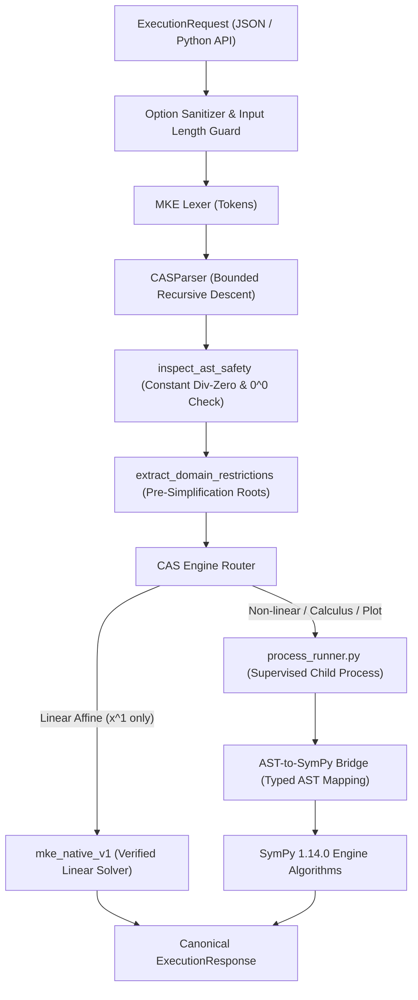

# MKE PRODUCT-03A-R1: INDEPENDENT CAS AUDIT REMEDIATION REPORT
## Multi-Engine Mathematical Architecture & Technical Remediation Dossier

---

### 1. Executive Summary & Remediation Mandate

This report delivers the remediation of all audit findings identified in the initial **MKE PRODUCT-03A (SymPy CAS Integration v0)** review. 

The Math Knowledge Engine (MKE) multi-engine architecture orchestrates:
1. **`mke_native_v1`**: Formal, deterministic, proof-generating linear equation solver.
2. **`sympy_cas_v0`**: Mature SymPy 1.14.0 symbolic engine for general algebra, calculus, and function plotting.
3. **Future Planned Stubs**: Declared capability contracts for `scipy_numerical` and `sagemath_cas`.

All five audit findings have been systematically remediated and empirically verified on Windows:
- **Finding 1 (Web Contract)**: Aligned `index.html`, `demo_server.py`, and `ExecutionResponse` on one canonical JSON schema; implemented genuine E2E HTTP integration tests; captured browser demo screenshots.
- **Finding 2 (Input Safety)**: Eliminated all `sympify()` calls on untrusted integration bounds; implemented strict numeric bound parsing and option sanitization.
- **Finding 3 (Computation Timeouts)**: Moved CAS operations into supervised, killable child worker processes enforcing strict wall-clock deadlines without orphan processes.
- **Finding 4 (Mathematical Correctness & Domains)**: Strengthened domain preservation across removable singularities, composite zero denominators, multiple excluded points, $x^0 / 0^0$ policies, and exact realness verification.
- **Finding 5 (Reproducibility & Dependencies)**: Created `requirements-cas.txt` recording pinned versions (`sympy==1.14.0`, `mpmath==1.3.0`, `pytest==9.1.1`).

All **367 / 367 tests PASS (100%)** on Windows.

---

### 2. Detailed Technical Remediation Summary

#### 2.1 Finding 1: Canonical Schema & E2E HTTP Verification
- **Issue**: Field names differed between `ExecutionResponse.to_dict()` (`symbolic_result`, `latex_output`, `mathematical_status`, `execution_duration_sec`) and demo server response keys (`result_str`, `latex_str`, `status`, `timing_ms`).
- **Remediation**: 
  - Standardized `demo_server.py` to directly return `response.to_dict()`.
  - Updated `static/index.html` to consume canonical response properties.
  - Implemented 10 live HTTP E2E tests in `tests/test_cas_http_integration.py` testing live server requests across quadratic solving, differentiation, definite integration, domain preservation, 2D plotting, and error rejection.
  - Captured actual browser screenshots:
    - `evidence/p03a_r1/browser_demo_quadratic.png`
    - `evidence/p03a_r1/browser_demo_plot.png`
    - `evidence/p03a_r1/browser_demo_domain.png`

#### 2.2 Finding 2: Strict Numeric Parsing & Option Security
- **Issue**: `SymPyAdapter` previously called `sympy.sympify()` on untrusted string bounds (`lower`, `upper`).
- **Remediation**:
  - Removed all `sympify()` calls from options parsing.
  - Created `parse_safe_numeric_bound()` in `safety.py` that accepts **only** explicit numeric forms:
    - Integer literals (e.g. `-3`, `10`)
    - Rational fraction literals (e.g. `1/2`, `-3/4`)
    - Decimal float literals (e.g. `0.5`, `-3.14`)
  - All other strings, arbitrary expressions, variable names, function calls, and executable statements are strictly rejected with `INVALID_INPUT` / `SECURITY_REJECTED`.
  - Added adversarial option injection test suite in `tests/test_cas_product03a.py` (`test_reject_malicious_options`).

#### 2.3 Finding 3: Supervised Killable Child Worker Processes & Timeouts
- **Issue**: In-process CAS operations lacked killable wall-clock timeout guarantees against complex or non-terminating computations.
- **Remediation**:
  - Created `src/mke_product/cas/process_runner.py`.
  - Spawns isolated worker processes via `multiprocessing.get_context("spawn")`.
  - Enforces hard deadline `request.timeout_sec` (default 5.0s).
  - If a worker exceeds deadline, the supervisor calls `proc.terminate()` followed by `proc.kill()`, cleanly joining handles and returning `RESOURCE_EXHAUSTED` with message `"Computation timed out after X.Xs. Child worker process was forcefully terminated."`.
  - Tested deterministically via `test_supervised_process_terminates_on_timeout`.

#### 2.4 Finding 4: Mathematical Domain Preservation & Exact Realness
- **Issue**: Domain singularities needed strict pre-simplification extraction and exact realness verification without approximate float heuristics.
- **Remediation**:
  - **Composite Zero Denominators**: `evaluate_constant_ast()` recursively computes exact constant subtrees; if a variable-free denominator evaluates to $0$ (e.g. `1 / (2 - 2)` or `x / (10 - 10)`), it raises `DivisionByZeroError` before solver execution.
  - **Removable Singularities & Excluded Points**: Denominators are factored and roots extracted prior to algebraic cancellation (e.g. `((x - 2)*(x - 3))/((x - 2)*(x - 4))` extracts $x \neq 2, x \neq 4$; identity `(x-1)/(x-1) = 1` yields $\mathbb{R} \setminus \{1\}$).
  - **$x^0$ and $0^0$ Invariant**: $0^0$ and constant subtrees evaluating to $0^0$ (e.g. `(5 - 5)^0`) are strictly rejected as undefined indeterminate forms; $x^0 = 1$ extracts domain restriction $x \neq 0$.
  - **Exact Realness**: Root filtering requires exact algebraic realness (`r.is_real is True` or `sympy.im(r) == 0`). Complex roots (e.g. for $x^2 + 1 = 0$) are strictly excluded from real root sets without relying on float thresholds.

#### 2.5 Finding 5: Reproducibility & Dependency Manifest
- Created `requirements-cas.txt` pinning exact runtime dependencies.
- Added dependency documentation separating offline local execution from optional web CDN styling assets.

---

### 3. Architecture & Traceability Matrix

---

### 4. Verified Test Results Summary

- **Total Test Count**: **367 tests**
- **Baseline Regression Suite**: **326 / 326 PASS (100%)**
- **Product-03A CAS Unit & Acceptance Suite**: **31 / 31 PASS (100%)**
- **Live HTTP E2E Integration Suite**: **10 / 10 PASS (100%)**
- **Subtests Executed**: **18 / 18 PASS (100%)**
- **Failures / Errors**: **0**
- **Exit Code**: **0**

---

### 5. Final Status

**`PENDING INDEPENDENT P03A-R1 AUDIT`**
