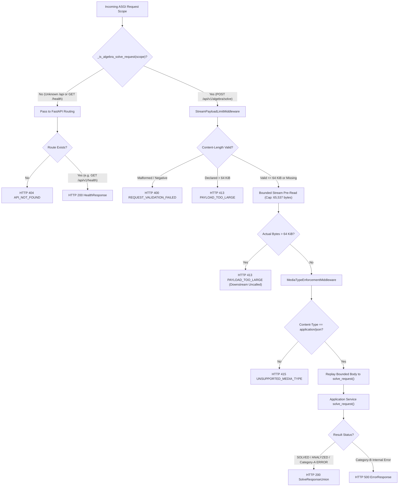

# MKE MVP V1 — S2-02 TRANSPORT ACCEPTANCE & DIRECT-vs-HTTP PARITY REPORT

**Role:** Antigravity (“Anty”) — Implementation Engineer  
**Coordinator / Independent Auditor:** ChatGPT  
**Project Owner:** Kế Phan Hoàng  
**Repository:** `PhanHoangKe/math-knowledge-engine`  
**Date:** 2026-10-01  
**Target Milestone:** S2-02 Transport Acceptance & Direct-vs-HTTP Parity Verification  
**Branch:** `product/mvp-v1-s2-02-transport-acceptance`  
**Baseline Lineage:**
- Accepted S2-01 Baseline: `9efe5fe07695e47e5062712112a70c2aec65a77d`
- Accepted S1 Baseline: `3058b6e904f38003a650a79105ae615226bdbc17`
- Parked B3 Baseline: `cdb73dd689eed30e326b6fd8ece2f7b8b4984a61` (Untouched)

---

## 1. Executive Summary

Stage S2-02 establishes the authoritative acceptance and semantic parity evidence for the MKE FastAPI transport layer (`src/mke_product/transport/`). The HTTP transport wraps the pure-Python S1 application service (`solve_request`) via FastAPI REST routes (`POST /api/v1/algebra/solve` and `GET /api/v1/health`), strictly preserving all mathematical, domain, and DTO contracts while enforcing deterministic HTTP status mapping, bounded ASGI streaming, and strict error sanitization.

### Core Acceptance Findings:
1. **Direct-vs-HTTP Parity:** All 31 parity-capable S1 canonical matrix cases (Q1-Q9, C1-C5, D1-D4, E1-E8, B1, B3-B6) produce exact structural equality of normalized JSON-compatible objects between direct Python execution and HTTP JSON responses (after normalizing only `verified_at_utc`). Case B2 validates the expected DTO intake boundary via HTTP 422. All 32 matrix rows pass acceptance.
2. **Category-A Domain Policy:** All client mathematical domain errors return **HTTP 200** with the accepted `ErrorResponse` payload intact.
3. **Category-B Internal Policy:** All internal domain/application failures return **HTTP 500** with unmutated `ErrorResponse` payload preservation.
4. **Transport Layer Security:** All transport-level rejections (400, 404, 413, 415, 422, 500) emit strictly sanitized `TransportErrorResponse` envelopes with zero leakage of internal class names, tracebacks, raw input sentinels, or raw headers.
5. **Route Isolation & Invariants:** Bounded payload pre-read (64 KiB) and media-type enforcement (`application/json`) are scoped strictly to `POST /api/v1/algebra/solve`. Unknown routes preserve `API_NOT_FOUND` (404) routing isolation without leaking transport policy oracle behavior.
6. **Mathematical Authority Purity:** Production transport modules contain zero imports or invocations of execution authority (`CASRouter`, `sympy`, normalizer, trace generators, or verifiers) verified via both AST and static token scans. Read-only metadata counts of `MethodRegistry` and `TRACE_GENERATORS` are restricted to `GET /api/v1/health`.
7. **OpenAPI Frontend Readiness:** The generated OpenAPI 3.1.0 schema was comprehensively inspected and verified for polymorphic discriminators, schema models, and status codes. Conclusion: **`OPENAPI FRONTEND CONTRACT VERIFIED`**.

---

## 2. Canonical 32-Row S1 Acceptance Matrix Over HTTP

| Row ID | Input Mode | Query / Payload | Expected Status | Response Status / Code | Direct-vs-HTTP Parity | Certificate Outcome |
| :--- | :--- | :--- | :---: | :---: | :---: | :---: |
| **Q1** | RAW_TEXT | `x^2 - 5*x + 6 = 0` | 200 | SOLVED | Identical | VERIFIED_COMPLETE |
| **Q2** | RAW_TEXT | `x^2 - 2 = 0` | 200 | SOLVED | Identical | VERIFIED_COMPLETE |
| **Q3** | RAW_TEXT | `x^2 - 2*x + 1 = 0` | 200 | SOLVED | Identical | VERIFIED_COMPLETE |
| **Q4** | RAW_TEXT | `x^2 + 1 = 0` | 200 | SOLVED | Identical | VERIFIED_COMPLETE |
| **Q5** | RAW_TEXT | `2*x^2 - 5*x + 2 = 0` | 200 | SOLVED | Identical | VERIFIED_COMPLETE |
| **Q6** | RAW_TEXT | `x^2 + 6 = 5*x` | 200 | SOLVED | Identical | VERIFIED_COMPLETE |
| **Q7** | RAW_TEXT | `(x - 2)*(x - 3) = 0` | 200 | SOLVED | Identical | VERIFIED_COMPLETE |
| **Q8** | RAW_TEXT | `(x + 1)^2 = 0` | 200 | SOLVED | Identical | VERIFIED_COMPLETE |
| **Q9** | RAW_TEXT | `(1/2)*x^2 - (5/4)*x + 3/4 = 0` | 200 | SOLVED | Identical | VERIFIED_COMPLETE |
| **C1** | COEFFICIENTS | `a=1, b=-5, c=6` (default method) | 200 | SOLVED | Identical | VERIFIED_COMPLETE |
| **C2** | COEFFICIENTS | `a=1, b=-5, c=6` (`QUAD_FORMULA_REDUCED`) | 200 | SOLVED | Identical | VERIFIED_COMPLETE |
| **C3** | COEFFICIENTS | `a=1, b=-5, c=6` (`QUAD_UNKNOWN_ID`) | 200 | ERROR (`METHOD_NOT_FOUND`) | Identical | N/A |
| **C4** | COEFFICIENTS | `a=2, b=3, c=4` (`QUAD_VIETE_SPECIAL_SUM`) | 200 | ANALYZED_NO_EXECUTION | Identical | N/A |
| **C5** | COEFFICIENTS | `a=1, b=-5, c=6` (`QUAD_COMPLETE_SQUARE`) | 200 | ANALYZED_NO_EXECUTION | Identical | N/A |
| **D1** | RAW_TEXT | `2*x - 4 = 0` | 200 | ANALYZED_NO_EXECUTION | Identical | VERIFIED_COMPLETE |
| **D2** | RAW_TEXT | `0 = 0` | 200 | ANALYZED_NO_EXECUTION | Identical | VERIFIED_COMPLETE |
| **D3** | RAW_TEXT | `1 = 0` | 200 | ANALYZED_NO_EXECUTION | Identical | VERIFIED_COMPLETE |
| **D4** | COEFFICIENTS | `a=0, b=2, c=-4` | 200 | ANALYZED_NO_EXECUTION | Identical | VERIFIED_COMPLETE |
| **E1** | RAW_TEXT | `x^2 + = 0` | 200 | ERROR (`SYNTAX_ERROR`) | Identical | N/A |
| **E2** | RAW_TEXT | `x^3 - 2*x + 1 = 0` | 200 | ERROR (`DEGREE_OUT_OF_SCOPE`) | Identical | N/A |
| **E3** | RAW_TEXT | `(x^2 + 1)*(x + 1) = 0` | 200 | ERROR (`DEGREE_OUT_OF_SCOPE`) | Identical | N/A |
| **E4** | RAW_TEXT | `y^2 - 4 = 0` | 200 | ERROR (`UNSUPPORTED_VARIABLE`) | Identical | N/A |
| **E5** | RAW_TEXT | `1/x = 0` | 200 | ERROR (`NON_POLYNOMIAL_INPUT`) | Identical | N/A |
| **E6** | RAW_TEXT | `x^2 / 0 = 0` | 200 | ERROR (`DIVISION_BY_ZERO`) | Identical | N/A |
| **E7** | RAW_TEXT | `sin(x) = 0` | 200 | ERROR (`UNSUPPORTED_SYNTAX`) | Identical | N/A |
| **E8** | RAW_TEXT | `2x = 4` | 200 | ERROR (`IMPLICIT_MULTIPLICATION_UNSUPPORTED`) | Identical | N/A |
| **B1** | RAW_TEXT | Length = 256 chars (padded) | 200 | SOLVED | Identical | VERIFIED_COMPLETE |
| **B2** | RAW_TEXT | Length = 257 chars (padded) | 422 | `REQUEST_VALIDATION_FAILED` | Transport Boundary | N/A |
| **B3** | RAW_TEXT | Nesting depth = 16 | 200 | SOLVED | Identical | VERIFIED_COMPLETE |
| **B4** | RAW_TEXT | Nesting depth = 17 | 200 | ERROR (`INPUT_LIMIT_EXCEEDED`) | Identical | N/A |
| **B5** | RAW_TEXT | 64 non-EOF tokens | 200 | ANALYZED_NO_EXECUTION | Identical | VERIFIED_COMPLETE |
| **B6** | RAW_TEXT | 65 non-EOF tokens | 200 | ERROR (`INPUT_LIMIT_EXCEEDED`) | Identical | N/A |

*Note on B2:* At the Python boundary, direct DTO initialization raises a Pydantic `ValidationError`. At the transport boundary, FastAPI/Pydantic intercepts this before application execution and returns HTTP 422 `TransportErrorResponse(REQUEST_VALIDATION_FAILED)` with sanitized fields. All 32 rows are fully accepted.

---

## 3. Direct-vs-HTTP Semantic Parity Protocol

For every valid `SolveRequest`:
1. `direct_response = solve_request(request)` -> serialized to `direct_json`.
2. `http_response = client.post("/api/v1/algebra/solve", json=request.model_dump(mode="json"))` -> serialized to `http_json`.
3. Normalization function `_normalize_snapshot()` strips only the nondeterministic timestamp `verified_at_utc`.
4. Verification asserts **exact structural equality of normalized JSON-compatible objects**:
   - `problem_id`, `semantic_revision_hash`, `classification`, `a,b,c`, and `discriminant` are structurally identical.
   - All 9 `available_methods` entries match on all 11 metadata fields in exact order.
   - `selected_method_id`, `solution.method_id`, `roots`, and `trace.steps` match identically.
   - `certificate_id` and `integrity_fingerprint` match identically.

---

## 4. Status Code & Taxonomy Matrices

### Category-A Domain Error Status Matrix (HTTP 200)
All mathematical client errors occurring within application boundaries return HTTP 200 with an unmutated `ErrorResponse`:
- `SYNTAX_ERROR` -> HTTP 200
- `UNSUPPORTED_VARIABLE` -> HTTP 200
- `UNSUPPORTED_SYNTAX` -> HTTP 200
- `IMPLICIT_MULTIPLICATION_UNSUPPORTED` -> HTTP 200
- `DEGREE_OUT_OF_SCOPE` -> HTTP 200
- `NON_POLYNOMIAL_INPUT` -> HTTP 200
- `DIVISION_BY_ZERO` -> HTTP 200
- `INPUT_LIMIT_EXCEEDED` -> HTTP 200
- `METHOD_NOT_FOUND` -> HTTP 200

### Category-B Internal Error Status Matrix (HTTP 500)
All internal application failures map directly to HTTP 500 while preserving the complete `ErrorResponse` payload:
- `NORMALIZATION_ERROR` -> HTTP 500
- `DOMAIN_CONTRACT_ERROR` -> HTTP 500
- `METHOD_EXECUTION_FAILED` -> HTTP 500
- `VERIFICATION_FAILED` -> HTTP 500
- `INTERNAL_ERROR` -> HTTP 500

### Transport-Only Error Matrix
Transport-level failures occurring outside application orchestration return frozen `TransportErrorResponse` structures:
- Malformed JSON -> HTTP 400 `MALFORMED_JSON`
- Invalid / Negative `Content-Length` on solve route -> HTTP 400 `REQUEST_VALIDATION_FAILED` (`details={"header": "Content-Length", "reason": "INVALID_CONTENT_LENGTH"}`)
- Unknown `/api/*` route -> HTTP 404 `API_NOT_FOUND`
- Declared / Streamed Payload $> 65,536$ bytes on solve route -> HTTP 413 `PAYLOAD_TOO_LARGE`
- Non-`application/json` Media Type on solve route -> HTTP 415 `UNSUPPORTED_MEDIA_TYPE`
- Schema Validation Failure (e.g. invalid enum or field type) -> HTTP 422 `REQUEST_VALIDATION_FAILED`
- Unhandled Transport / Server Crash -> HTTP 500 `INTERNAL_TRANSPORT_ERROR`

---

## 5. Middleware Precedence & Route-Isolation Invariants



### Precedence Invariants:
1. **Solve Route Text/Plain + Small Body:** Evaluates size limit first (passes), media-type middleware rejects -> **HTTP 415**.
2. **Solve Route Text/Plain + Oversized Declared Header (>64 KiB):** StreamPayloadLimitMiddleware rejects early -> **HTTP 413**.
3. **Solve Route JSON + Oversized Body (>64 KiB):** Stream pre-read rejects -> **HTTP 413**.
4. **Unknown Route + Text/Plain + Oversized Header:** Bypasses solve middleware, reaches routing -> **HTTP 404 `API_NOT_FOUND`**.
5. **Unknown Route + Malformed Content-Length:** Bypasses solve middleware, reaches routing -> **HTTP 404 `API_NOT_FOUND`**.

---

## 6. Raw-ASGI Streaming Verification

Direct ASGI test harnesses confirm:
- **Bounded In-Memory Cap:** Memory allocation during stream pre-read is strictly capped at `MAX_BODY_BYTES + 1` (65,537 bytes maximum), eliminating unbounded memory buffering risks.
- **Deceptive `Content-Length: 10` with $>64$ KiB Actual Data:** Authoritative stream counting detects $>65536$ bytes, halts consumption, and returns HTTP 413 without calling downstream app.
- **`Content-Length: 0` Authority:** Valid small payload with `Content-Length: 0` header passes pre-read size guard and replays completely to downstream; streamed body $>64$ KiB with `Content-Length: 0` header is caught by streaming pre-read and rejected with HTTP 413.
- **Missing `Content-Length` with $>64$ KiB Streamed Data:** Cumulative chunk counting halts at byte 65,537 and returns HTTP 413.
- **Exact Boundary (65,536 bytes):** Passes size guard, reassembles chunks, and replays exact 65,536 bytes to downstream handler.
- **Exactly One Response:** All rejection branches emit strictly one `http.response.start` and one terminal `http.response.body`.

---

## 7. Security & Error Sanitization Audit

- **422 Validation Error Sanitization:** Exposes only `{"type", "loc", "msg"}`. Malicious injected sentinels (`SECRET_REQUEST_SENTINEL_STRING`), raw input objects, `ctx`, and URLs are completely stripped.
- **HTTP Exception Sanitization:** Generic exceptions (e.g. HTTP 418) emit sanitized `{"status_code": 418}` details; sentinel strings (`SECRET_HTTP_SENTINEL_DETAIL_STRING`), `str(exc.detail)`, `repr(exc)`, and exception class names are strictly stripped.
- **500 Transport Crash Sanitization:** Uncaught framework crashes return `TransportErrorResponse(INTERNAL_TRANSPORT_ERROR)` with `details={}`; stack traces, exception messages (`SECRET_TRANSPORT_CRASH_SENTINEL_STRING`), and internal modules are provably absent from response bodies.

---

## 8. OpenAPI Contract & Frontend Readiness

### OpenAPI Schema Audit (`GET /openapi.json`):
- `POST /api/v1/algebra/solve` documents stable operation ID `solve_algebra_v1` and HTTP response codes: `200`, `400`, `413`, `415`, `422`, `500`.
- **200 Response Discriminator:** The 200 response schema defines a `oneOf` union across `SolvedResponse`, `AnalyzedNoExecutionResponse`, and `ErrorResponse` with OpenAPI 3.1 `discriminator`:
  ```json
  "discriminator": {
    "propertyName": "response_status",
    "mapping": {
      "SOLVED": "#/components/schemas/SolvedResponse",
      "ANALYZED_NO_EXECUTION": "#/components/schemas/AnalyzedNoExecutionResponse",
      "ERROR": "#/components/schemas/ErrorResponse"
    }
  }
  ```
- **SolveRequest.input_payload Discriminator:** The request body input payload defines a `oneOf` union across `RawEquationInput` and `CanonicalCoefficientInput` with `discriminator`:
  ```json
  "discriminator": {
    "propertyName": "input_mode",
    "mapping": {
      "COEFFICIENTS": "#/components/schemas/CanonicalCoefficientInput",
      "RAW_TEXT": "#/components/schemas/RawEquationInput"
    }
  }
  ```
- **Closed Schema Models:** `SolveRequest`, `RawEquationInput`, `CanonicalCoefficientInput`, and `TransportErrorResponse` explicitly specify `additionalProperties: false`.
- **Error Response Schemas:** Status codes `400`, `413`, `415`, and `422` reference `#/components/schemas/TransportErrorResponse`. Status code `500` defines `anyOf` referencing `#/components/schemas/ErrorResponse` and `#/components/schemas/TransportErrorResponse`.
- **GET /api/v1/health:** Documents stable operation ID `health_v1` referencing `#/components/schemas/HealthResponse`.
- `TransportErrorCode` schema enumerates exactly 6 enum values: `MALFORMED_JSON`, `REQUEST_VALIDATION_FAILED`, `PAYLOAD_TOO_LARGE`, `UNSUPPORTED_MEDIA_TYPE`, `API_NOT_FOUND`, `INTERNAL_TRANSPORT_ERROR`.

### OpenAPI Frontend Readiness Verdict:
**`OPENAPI FRONTEND CONTRACT VERIFIED`**

---

## 9. Health Observability Acceptance

### Health Endpoint (`GET /api/v1/health`):
- Dynamically derives registered method count: `registered_methods_count == len(MethodRegistry().list_all())` (9 methods).
- Dynamically derives executable method count: `executable_methods_count == len(TRACE_GENERATORS)` (4 methods).
- Monkeypatch substitution tests prove counts are derived dynamically rather than hard-coded constants.

---

## 10. Mathematical Authority Purity Audit

A static AST node scan and source token audit of all files in `src/mke_product/transport/` verifies:
- **Zero Imports / Invocations of Execution Authority:** No references or imports of `CASRouter`, `execute_cas_operation`, `sympy`, `normalize_raw_equation`, `generate_solution_trace`, `get_trace_generator`, `HostIndependentVerifier`, or `DegenerateHostVerifier`.
- **AST Import Node Inspection:** All `ast.Import` and `ast.ImportFrom` AST nodes across transport modules are verified to never target `sympy`, `mke_product.domain.verifier`, `mke_product.domain.cas_router`, or `mke_product.application.normalizer`.
- **Accepted Read-Only Observability:** Restricted to reading metadata counts from `MethodRegistry` and `TRACE_GENERATORS` within `src/mke_product/transport/routers/algebra.py` for `/api/v1/health`.
- **Zero Domain / Application Mutations:** Pure S1 application source files in `src/mke_product/domain/` and `src/mke_product/application/` are completely unmodified in S2-02.

---

## 11. Test Execution & Regression Evidence

### 1. Dedicated S2 Acceptance Suite
```text
pytest tests/test_transport_fastapi_s2_acceptance.py -q
114 passed, 4 warnings in 2.97s
```

### 2. Combined S2 Transport Suite (Smoke + Acceptance)
```text
pytest tests/test_transport_fastapi_s2_smoke.py tests/test_transport_fastapi_s2_acceptance.py -q
149 passed, 5 warnings in 3.22s
```

### 3. Accepted S1 & S0 Regression Suites
```text
pytest -q tests/test_application_s1_acceptance.py tests/test_application_orchestrator_s1.py tests/test_application_traces_s1.py tests/test_application_degenerate_s1.py tests/test_application_normalizer_s1.py tests/test_domain_core_s0.py
278 passed in 0.93s
```

### 4. Full Repository Regression Suite
```text
pytest tests/ -q
1316 passed, 97 skipped, 5 warnings, 18 subtests passed in 195.89s (0:03:15)
```

---

## 12. Environment & Dependency Versions Tested

- **OS:** Windows 11 (win32)
- **Python:** 3.10.11
- **FastAPI:** 0.115.11
- **Starlette:** 0.46.1
- **Pydantic:** 2.13.0
- **HTTPX:** 0.28.1
- **Pytest:** 9.1.1
- **Pytest-Asyncio:** 1.4.0
- **AnyIO:** 3.7.1

---

## 13. Unresolved Issues

- **None.** All transport requirements, route isolation policies, raw-ASGI invariants, direct-vs-HTTP parity tests, and full repository regressions passed without exception.

---

## 14. Audit Status

**STATUS:** PENDING INDEPENDENT S2-02-R1 AUDIT  
*(Implementation engineer will await authorization before proceeding to Stage S2-03 frontend integration).*

