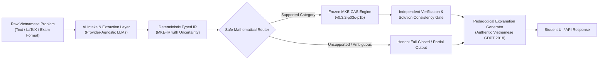
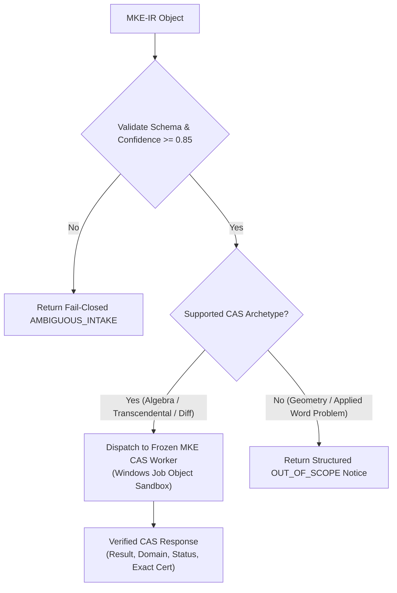

# ARCHITECTURE DESIGN PROPOSAL: P1C-01 AI-POWERED VIETNAMESE MATHEMATICS INTAKE ENGINE

- **Milestone:** `PRODUCT-03C-P1C-01`
- **Document Version:** `1.0.0-PROPOSAL`
- **Author:** Antigravity (Implementation Engineer)
- **Reviewer:** Independent Auditor (ChatGPT) & Owner (Kế Phan Hoàng)
- **Status:** `PENDING REVIEW & APPROVAL`
- **Target Repository:** `PhanHoangKe/math-knowledge-engine`
- **Frozen CAS Baseline:** `v0.3.2-p03c-p1b-accepted-limited` (`73c54f7d22fad87dc8c323c7281a18636a1d8908`)

---

## 1. Executive Summary & Objective

### 1.1 Objective
To design an enterprise-grade, student-centric AI intake and explanation pipeline capable of ingesting raw, unstructured Vietnamese high-school mathematics problems (natural language text, LaTeX, Unicode symbols, and 2025/2026 national exam question formats), converting them into deterministic typed intermediate representations, executing certified mathematical workflows against the frozen MKE CAS engine, and returning pedagogical, traceable Vietnamese explanations.

### 1.2 Core Architectural Invariant: "AI as the Semantic Router, CAS as the Certified Oracle"
The fundamental principle of MKE is that **large language models (LLMs) must NEVER be trusted to perform unverified symbolic algebra, calculus, or arithmetic**. In this architecture:
1. The **AI Pipeline** is strictly confined to natural language understanding, entity extraction, structural disambiguation, and pedagogical explanation rendering.
2. The **Frozen MKE CAS Engine** (`v0.3.2-p03c-p1b`) remains the sole, authoritative source of mathematical truth, domain certification, and solution completeness.
3. Every mathematical claim made to the student must be back-referenced to a deterministic CAS computation result or an explicit fail-closed reason.



---

## 2. Provider-Agnostic Model Adapter Architecture

### 2.1 Pluggable Adapter Interface
To avoid vendor lock-in and ensure long-term sustainability, the intake layer implements a uniform, provider-agnostic interface (`ModelProviderAdapter`).

```python
from abc import ABC, abstractmethod
from typing import Dict, Any, Optional
from pydantic import BaseModel

class ModelExtractionRequest(BaseModel):
    raw_query: str
    target_locale: str = "vi_VN"
    metadata: Dict[str, Any] = {}

class ModelProviderAdapter(ABC):
    @abstractmethod
    async def extract_math_ir(self, request: ModelExtractionRequest) -> Dict[str, Any]:
        """Extract structured MKE-IR from raw text using strict JSON schemas."""
        pass

    @abstractmethod
    async def generate_explanation(
        self,
        raw_query: str,
        math_ir: Dict[str, Any],
        cas_result: Dict[str, Any]
    ) -> str:
        """Render step-by-step pedagogical Vietnamese explanation."""
        pass
```

### 2.2 Model Selection & Multi-Provider Evaluation Matrix
Model selection is governed strictly by empirical benchmarking across five objective criteria, rejecting any unfounded claim of a "universally best" model:

1. **Vietnamese Mathematical Semantic Precision:** Accuracy in extracting implicit domain constraints (e.g. "với $m$ là tham số nguyên", "hàm số đồng biến trên khoảng $(0, +\infty)$").
2. **Schema Adherence (JSON Mode):** Zero tolerance for JSON formatting errors or schema drift.
3. **Latency & Time-to-First-Token (TTFT):** Interactive responsiveness ($\le 1.5$ seconds for extraction).
4. **Cost Efficiency:** Token economics for high-volume student access.
5. **Operational Availability & Local Deployment Option:** Capability to run locally via vLLM / Ollama (e.g. Qwen2.5-Math, Gemma 2) as well as commercial cloud APIs (Gemini, Claude, GPT-4o, DeepSeek).

| Provider Candidate | Strengths | Trade-offs | Target Role |
| :--- | :--- | :--- | :--- |
| **Google Gemini 1.5 Flash / Pro** | Native multimodal, low latency, competitive pricing | Requires prompt grounding for Vietnamese nuances | Primary Cloud Extraction & Explanation |
| **OpenAI GPT-4o / GPT-4o-mini** | High schema adherence, strong reasoning | Higher cost per token | Secondary Extraction / High-Complexity Disambiguation |
| **Anthropic Claude 3.5 Sonnet** | Excellent pedagogical prose and LaTeX formatting | Strict rate limits | Primary Quality Benchmark / Reference Judge |
| **DeepSeek-V3 / R1** | High math reasoning capabilities | Higher latency on reasoning models | Offline Complex Problem Parsing & Diagnostic Suite |
| **Local vLLM (Qwen2.5-Math 7B/72B)** | Zero API cost, strict data privacy, local confinement | Requires GPU hardware | On-Premise / Windows Local Desktop Deployment |

---

## 3. Deterministic Typed Intermediate Representation (`MKE-IR`)

The output of the AI intake layer is strictly validated against a deterministic, schema-enforced data model:

```python
from enum import Enum
from typing import List, Optional, Dict
from pydantic import BaseModel, Field

class ProblemArchetype(str, Enum):
    EQUATION_POLYNOMIAL = "EQUATION_POLYNOMIAL"
    EQUATION_RATIONAL = "EQUATION_RATIONAL"
    EQUATION_RADICAL = "EQUATION_RADICAL"
    EQUATION_EXPONENTIAL = "EQUATION_EXPONENTIAL"
    EQUATION_LOGARITHMIC = "EQUATION_LOGARITHMIC"
    EQUATION_TRIGONOMETRIC = "EQUATION_TRIGONOMETRIC"
    CALCULUS_DERIVATIVE = "CALCULUS_DERIVATIVE"
    CALCULUS_INTEGRAL = "CALCULUS_INTEGRAL"
    TRIG_SIMPLIFICATION = "TRIG_SIMPLIFICATION"
    SYSTEM_EQUATIONS = "SYSTEM_EQUATIONS"
    WORD_PROBLEM_APPLIED = "WORD_PROBLEM_APPLIED"
    GEOMETRIC_REASONING = "GEOMETRIC_REASONING"
    UNSUPPORTED_OR_AMBIGUOUS = "UNSUPPORTED_OR_AMBIGUOUS"

class QuestionFormat(str, Enum):
    FREE_FORM = "FREE_FORM"
    MULTIPLE_CHOICE_4 = "MULTIPLE_CHOICE_4"      # Trắc nghiệm 4 lựa chọn (A, B, C, D)
    TRUE_FALSE_4_PART = "TRUE_FALSE_4_PART"      # Đúng / Sai 4 ý (a, b, c, d)
    SHORT_NUMERICAL = "SHORT_NUMERICAL"          # Trả lời ngắn

class ExtractedConstraint(BaseModel):
    variable: str
    relation: str  # ">=", "<=", ">", "<", "!=", "in_set"
    bound_expression: str
    source_span: str  # Vietnamese text fragment defining this constraint

class MathIntermediateRepresentation(BaseModel):
    problem_archetype: ProblemArchetype
    question_format: QuestionFormat
    target_variables: List[str] = Field(default_factory=lambda: ["x"])
    parameters: List[str] = Field(default_factory=list)  # e.g., ["m", "k"]
    primary_equation_or_expression: str  # Canonical LaTeX / CAS string
    extracted_constraints: List[ExtractedConstraint] = Field(default_factory=list)
    given_options: Optional[Dict[str, str]] = None  # {"A": "...", "B": "..."}
    extraction_confidence: float = Field(ge=0.0, le=1.0)
    uncertainty_flags: List[str] = Field(default_factory=list)
```

---

## 4. Safe Mathematical Execution & Routing Pipeline

### 4.1 Zero Arbitrary Code Execution
The intake system is **completely prohibited from generating or executing arbitrary code** (no `exec()`, `eval()`, or dynamic script execution).

### 4.2 Deterministic Dispatch to Frozen CAS
The router maps `MKE-IR` entities directly to statically typed MKE CAS operations:
- `ProblemArchetype.EQUATION_*` $\to$ `execute_cas_operation(OperationType.SOLVE, expr)`
- `ProblemArchetype.CALCULUS_DERIVATIVE` $\to$ `execute_cas_operation(OperationType.DIFF, expr, var)`
- `ProblemArchetype.TRIG_SIMPLIFICATION` $\to$ `execute_cas_operation(OperationType.SIMPLIFY, expr)`



---

## 5. Independent Verification & Solution Consistency Gate

Before presenting any result to the student, the system executes an automated double-check:
1. **Constraint Satisfaction Check:** All roots returned by the CAS are substituted back into the extracted constraints ($x \in \mathcal{D}_{\text{extracted}}$).
2. **Extraneous Root Containment:** Evaluates whether any root violates the original Vietnamese problem conditions.
3. **Format Alignment:** If the question is multiple choice, the computed CAS result is mapped to the corresponding option (`A`, `B`, `C`, `D`) with exact mathematical identity proofs.

---

## 6. Pedagogical Vietnamese Explanation Generator

The explanation generator produces clear, structured explanations complying with the Vietnamese Ministry of Education (GDPT 2018) curriculum:

### 6.1 Explanation Structure
1. **Bước 1: Xác định điều kiện xác định (ĐKXĐ):** Explicitly stating all domain requirements derived from radicals, denominators, and log/trig arguments.
2. **Bước 2: Phương pháp giải & Biến đổi đại số:** Clear step-by-step mathematical transformations.
3. **Bước 3: Đối chiếu điều kiện & Loại nghiệm ngoại lai:** Explaining why extraneous candidates were rejected.
4. **Bước 4: Kết luận tập nghiệm:** Standard set notation (e.g. $S = \{...\}$).

### 6.2 Source-to-Step Traceability
Every mathematical statement in the explanation links back to the original clause in the student's input query.

---

## 7. Security, Confinement & Threat Modeling

1. **Prompt Injection Mitigation:** Input queries are strictly wrapped in immutable delimiter fences; extracted entities must parse through rigid Pydantic validators and the MKE CAS AST parser before reaching execution.
2. **Denial of Service & Compute Confinement:** Worker processes run with memory limits ($\le 512$ MB per worker) and timeouts ($\le 3.0$ seconds) under Windows Job Object confinement.
3. **Data Privacy:** Student queries are processed ephemerally with zero persistent storage of personal data.

---

## 8. Empirical Test & Evaluation Plan

### 8.1 100-Problem Authentic Vietnamese High School Exam Benchmark
A new evaluation dataset (`tests/benchmarks/vietnamese_math_intake_benchmark_v1.json`) will be established containing:
- 40 Grade 10 problems (Quadratic equations, systems, inequalities, radicals, coordinate geometry).
- 35 Grade 11 problems (Trigonometric equations, logs, exponents, derivatives, sequences).
- 25 Grade 12 problems (Calculus, function analysis, extrema, applied optimization).

### 8.2 Evaluation Metrics
- **Extraction Fidelity:** Percentage of problems where the primary mathematical expression and constraints are correctly extracted into `MKE-IR`.
- **Zero Hallucination Rate:** 0% tolerance for fabricated solutions not proven by the CAS.
- **Fail-Closed Precision:** 100% correct rejection of unsupported questions without deceptive partial outputs.

---

## 9. Implementation Milestones

| Milestone | Deliverable | Constraints & Gate Criteria |
| :--- | :--- | :--- |
| **P1C-01** *(Current)* | Architectural Design Proposal | Design document only. No code. Auditor approval required. |
| **P1C-02** | Provider-Agnostic Adapter & Mock Test harness | Abstract adapter interface, mock provider, schema validation tests. |
| **P1C-03** | MKE-IR Schema & Problem Parser | Strict Pydantic models, AST translation bridge, uncertainty reporting. |
| **P1C-04** | CAS Router & Verification Gate | Safe dispatch to frozen CAS, constraint consistency checker. |
| **P1C-05** | Vietnamese Pedagogical Explainer & UI Integration | Student explanation templates, Web UI math intake tab. |
| **P1C-06** | 100-Item Benchmark, Hardening & Release Freeze | $\ge 85\%$ extraction accuracy on pilot, 0 extraneous root leaks, release freeze. |

---

## 10. Explicit Boundaries & Non-Goals

- **No Implementation Code in P1C-01:** This document constitutes a formal design specification only.
- **No New Model Training:** Relies exclusively on commercial/open existing foundation models through adapters.
- **Research G4 Remains Frozen:** Academic explorations remain completely paused.
- **CAS Engine Frozen:** The CAS core is strictly locked at `v0.3.2-p03c-p1b` (`73c54f7d22fad87dc8c323c7281a18636a1d8908`).
