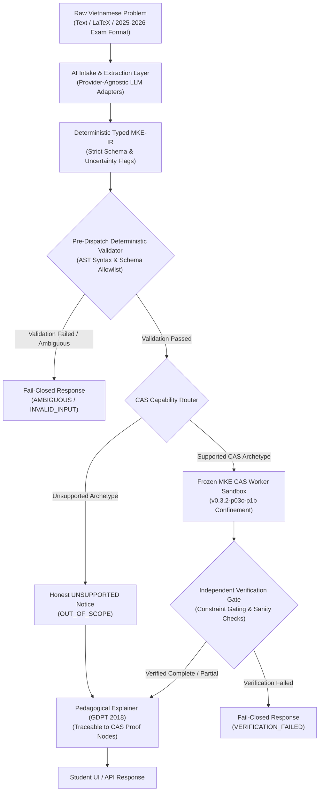
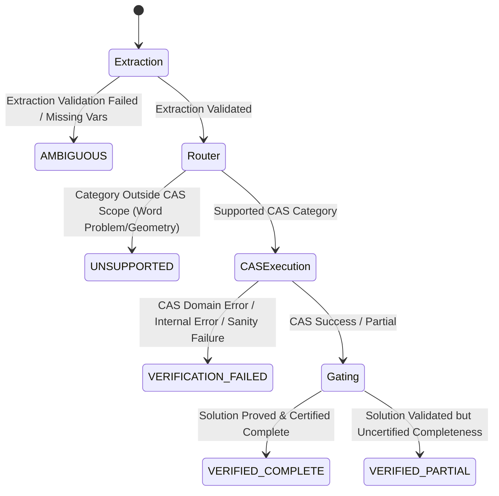

# ARCHITECTURE DESIGN PROPOSAL: P1C-01-R1 AI-POWERED VIETNAMESE MATHEMATICS INTAKE ENGINE

- **Milestone:** `PRODUCT-03C-P1C-01-R1`
- **Document Version:** `1.1.0-R1-PROPOSAL`
- **Author:** Antigravity (Implementation Engineer)
- **Reviewer:** Independent Auditor (ChatGPT) & Owner (Kế Phan Hoàng)
- **Status:** `PENDING REVIEW & APPROVAL (REVISED DESIGN)`
- **Target Repository:** `PhanHoangKe/math-knowledge-engine`
- **Frozen CAS Baseline:** `v0.3.2-p03c-p1b-accepted-limited` (`73c54f7d22fad87dc8c323c7281a18636a1d8908`)

---

## 1. Executive Summary & Foundational Invariants

### 1.1 Objective
To design an enterprise-grade, student-centric AI intake and explanation pipeline capable of:
1. Ingesting unstructured Vietnamese high-school mathematics questions (natural language prose, LaTeX, Unicode symbols, and 2025/2026 Vietnamese National High School Exam formats).
2. Parsing problems into a deterministic, schema-enforced Intermediate Representation (`MKE-IR`) with explicit uncertainty representation.
3. Routing verified mathematical operations to the frozen, certified MKE CAS engine (`v0.3.2-p03c-p1b`).
4. Generating traceable, pedagogical Vietnamese step-by-step explanations back-referenced to certified mathematical evidence.

### 1.2 Core Architectural Invariant: "AI as Semantic Intake, CAS as Mathematical Oracle"
Large Language Models (LLMs) are **never permitted to perform unverified symbolic algebra, calculus, or arithmetic**. In this architecture:
- The **AI Intake Layer** serves strictly as a natural language parser, semantic disambiguator, and pedagogical explanation renderer.
- The **Frozen CAS Engine** (`v0.3.2-p03c-p1b`) remains the sole authority for mathematical ground truth, domain verification, root calculation, and completeness certification.
- No mathematical statement is presented to the student as verified unless backed by certified CAS output. If a problem falls outside CAS scope, the system explicitly returns a fail-closed response.



---

## 2. Provider-Agnostic Model Adapter & Dynamic Registry

### 2.1 Pluggable Model Provider Architecture
To prevent vendor lock-in and enable rigorous multi-provider benchmarking, the system defines an abstract adapter interface and a dynamic runtime registry. No specific model or provider is hardcoded as a permanent winner.

```python
from abc import ABC, abstractmethod
from typing import Dict, Any, Optional, List
from pydantic import BaseModel, Field

class ModelExtractionRequest(BaseModel):
    raw_query: str
    target_locale: str = "vi_VN"
    metadata: Dict[str, Any] = Field(default_factory=dict)

class ModelExtractionResponse(BaseModel):
    raw_response_text: str
    structured_ir_payload: Dict[str, Any]
    provider_metadata: Dict[str, Any] = Field(default_factory=dict)
    latency_seconds: float
    token_usage: Dict[str, int] = Field(default_factory=dict)

class ModelProviderAdapter(ABC):
    """Abstract base class for LLM intake adapters."""
    
    @property
    @abstractmethod
    def provider_id(self) -> str:
        """Identifier for the provider (e.g., 'openai', 'anthropic', 'google', 'deepseek', 'local_http')."""
        pass

    @abstractmethod
    async def extract_math_ir(self, request: ModelExtractionRequest) -> ModelExtractionResponse:
        """Extract structured MKE-IR payload using strict schema-enforced JSON mode."""
        pass

    @abstractmethod
    async def render_explanation(
        self,
        raw_query: str,
        structured_ir: Dict[str, Any],
        cas_evidence: Dict[str, Any]
    ) -> str:
        """Generate pedagogical Vietnamese explanation strictly grounded in CAS evidence."""
        pass
```

### 2.2 Dynamic Provider Registry & Runtime Resolution
Model IDs and endpoints are dynamically resolved at runtime via environment variables or configuration registries (e.g. `MKE_INTAKE_PROVIDER` and `MKE_INTAKE_MODEL_ID`):

```python
class ModelProviderRegistry:
    _registry: Dict[str, type[ModelProviderAdapter]] = {}

    @classmethod
    def register(cls, provider_id: str, adapter_cls: type[ModelProviderAdapter]) -> None:
        cls._registry[provider_id.lower()] = adapter_cls

    @classmethod
    def resolve(cls, provider_id: str, **kwargs) -> ModelProviderAdapter:
        adapter_cls = cls._registry.get(provider_id.lower())
        if not adapter_cls:
            raise ValueError(f"Unknown provider '{provider_id}'. Registered: {list(cls._registry.keys())}")
        return adapter_cls(**kwargs)
```

### 2.3 Empirical Provider Evaluation Criteria
Model selection is determined empirically against a standardized rubric. No model training will be performed in P1C. Local GPU availability is **not** assumed; the system supports both remote commercial endpoints and standard CPU/GPU local HTTP server endpoints (such as Ollama or vLLM):

| Evaluation Dimension | Metric / Target | Description |
| :--- | :--- | :--- |
| **Vietnamese Math NLP Precision** | $\ge 90.0\%$ extraction accuracy | Correct semantic capture of Vietnamese terminology, implicit constraints, and exam subparts. |
| **JSON Schema Adherence** | $100.0\%$ valid JSON syntax | Zero schema drift or JSON parse failures under strict JSON output modes. |
| **Latency & Responsiveness** | TTFT $\le 1.2\text{s}$, P95 total $\le 3.0\text{s}$ | Fast interactive response times for student UI queries. |
| **Operational Cost** | Tracked cost per 1k query sessions | Transparent token budgeting across models. |
| **Deployment Flexibility** | Cloud APIs & Local HTTP endpoints | Compatible with standard external APIs and local HTTP endpoints (CPU or GPU) without mandatory local GPU prerequisites. |

---

## 3. Deterministic Typed Intermediate Representation (`MKE-IR`)

### 3.1 Schema Specification
The `MKE-IR` schema explicitly captures multiple expressions, multiple target variables, systems, inequalities, question subparts (for True/False or multi-part questions), answer choices, source offsets, and explicit uncertainty.

**Critical Rule:** Missing mathematical entities (e.g., unspecified variables or omitted intervals) are **never defaulted to invented values** (e.g. defaulting to `x`). They must be represented as `None` accompanied by explicit `UncertaintyFlag` annotations.

```python
from enum import Enum
from typing import List, Optional, Dict, Union
from pydantic import BaseModel, Field

class ProblemCategory(str, Enum):
    EQUATION_SINGLE = "EQUATION_SINGLE"
    EQUATION_SYSTEM = "EQUATION_SYSTEM"
    INEQUALITY_SINGLE = "INEQUALITY_SINGLE"
    INEQUALITY_SYSTEM = "INEQUALITY_SYSTEM"
    CALCULUS_DIFFERENTIATION = "CALCULUS_DIFFERENTIATION"
    CALCULUS_INTEGRATION = "CALCULUS_INTEGRATION"
    EXPRESSION_SIMPLIFICATION = "EXPRESSION_SIMPLIFICATION"
    PARAMETER_ANALYSIS = "PARAMETER_ANALYSIS"
    WORD_PROBLEM_APPLIED = "WORD_PROBLEM_APPLIED"
    GEOMETRIC_REASONING = "GEOMETRIC_REASONING"
    UNSUPPORTED_OR_AMBIGUOUS = "UNSUPPORTED_OR_AMBIGUOUS"

class QuestionFormat(str, Enum):
    FREE_FORM = "FREE_FORM"
    MULTIPLE_CHOICE_4 = "MULTIPLE_CHOICE_4"      # 4 choices (A, B, C, D)
    TRUE_FALSE_4_PART = "TRUE_FALSE_4_PART"      # 4 independent subparts (a, b, c, d)
    SHORT_NUMERICAL = "SHORT_NUMERICAL"          # Numerical short-answer (2025/2026 format)

class UncertaintyFlag(str, Enum):
    AMBIGUOUS_SYNTAX = "AMBIGUOUS_SYNTAX"
    MISSING_TARGET_VARIABLE = "MISSING_TARGET_VARIABLE"
    MISSING_CONSTRAINT = "MISSING_CONSTRAINT"
    IMPLICIT_DOMAIN_ASSUMPTION = "IMPLICIT_DOMAIN_ASSUMPTION"
    UNKNOWN_NOTATION = "UNKNOWN_NOTATION"
    MULTIPLE_INTERPRETATIONS = "MULTIPLE_INTERPRETATIONS"

class SourceSpan(BaseModel):
    start_char: int
    end_char: int
    text_fragment: str
    semantic_role: str  # e.g., 'primary_equation', 'constraint', 'variable_definition'

class ExtractedConstraint(BaseModel):
    variable: str
    relation: str  # '>=', '<=', '>', '<', '!=', 'in_set'
    bound_expression: str
    source_span: Optional[SourceSpan] = None

class QuestionSubpart(BaseModel):
    subpart_id: str  # e.g., 'a', 'b', 'c', 'd'
    statement_text: str
    target_expression: Optional[str] = None
    claimed_property: Optional[str] = None

class MathIntermediateRepresentation(BaseModel):
    problem_category: ProblemCategory
    question_format: QuestionFormat
    target_variables: List[str] = Field(default_factory=list)  # Explicitly empty if missing
    parameters: List[str] = Field(default_factory=list)        # e.g., ['m', 'k']
    primary_expressions: List[str] = Field(default_factory=list) # 1 for single, >1 for systems
    extracted_constraints: List[ExtractedConstraint] = Field(default_factory=list)
    subparts: List[QuestionSubpart] = Field(default_factory=list)
    given_options: Optional[Dict[str, str]] = None             # e.g., {'A': 'x = 1', 'B': 'x = 2'}
    source_spans: List[SourceSpan] = Field(default_factory=list)
    unit: Optional[str] = None                                 # e.g., 'cm', 'm/s', 'VND'
    model_confidence: float = Field(ge=0.0, le=1.0)           # Treated as uncalibrated heuristic
    uncertainty_flags: List[UncertaintyFlag] = Field(default_factory=list)
```

### 3.2 Pre-Dispatch Deterministic Validation
Before an `MKE-IR` object can be routed to the CAS, it must pass deterministic static validation:
1. **Schema Integrity:** Required fields must be non-null and valid under Pydantic.
2. **Variable Presence Check:** If `target_variables` is empty and the category requires a solve target, routing is aborted with `EngineStatus.INVALID_INPUT` (`MISSING_TARGET_VARIABLE`).
3. **AST Syntax Parse:** Primary expressions must successfully parse through MKE's AST parser (`parse_cas_equation` / `parse_cas_expression`). Any syntax failure immediately halts execution with `EngineStatus.INVALID_INPUT`.

---

## 4. CAS Operation Mapping & Verification States

### 4.1 Frozen CAS Operation Mapping
Routing strictly targets the existing, verified `OperationType` contracts in `src/mke_product/cas/contracts.py`:

| Problem Category | MKE `OperationType` | Target Function & Parameters |
| :--- | :--- | :--- |
| `EQUATION_SINGLE` | `OperationType.SOLVE` | `execute_cas_operation(OperationType.SOLVE, expr, var)` |
| `EQUATION_SYSTEM` | `OperationType.SOLVE_SYSTEM` | `execute_cas_operation(OperationType.SOLVE_SYSTEM, exprs, vars)` |
| `INEQUALITY_SINGLE` | `OperationType.SOLVE_INEQUALITY` | `execute_cas_operation(OperationType.SOLVE_INEQUALITY, expr, var)` |
| `CALCULUS_DIFFERENTIATION` | `OperationType.DIFFERENTIATE` | `execute_cas_operation(OperationType.DIFFERENTIATE, expr, var)` *(Note: NOT DIFF)* |
| `CALCULUS_INTEGRATION` | `OperationType.INTEGRATE` | `execute_cas_operation(OperationType.INTEGRATE, expr, var)` |
| `EXPRESSION_SIMPLIFICATION` | `OperationType.SIMPLIFY` | `execute_cas_operation(OperationType.SIMPLIFY, expr)` |
| `PARAMETER_ANALYSIS` | `OperationType.CHECK_CANDIDATE` | `execute_cas_operation(OperationType.CHECK_CANDIDATE, expr, params)` |

### 4.2 Five-State Intake Verification Matrix
The intake system classifies problem resolution into five distinct verification states, strictly mapped to existing `EngineStatus` contracts:



| Verification State | Operational Definition | Exact MKE Engine Mapping |
| :--- | :--- | :--- |
| **`VERIFIED_COMPLETE`** | CAS deterministically solved the problem and certified solution set completeness (or proved empty set). | `EngineStatus.SUCCESS` with `DomainCertainty.PROVEN_REALS` or `EXPLICIT_EXCLUSIONS`. |
| **`VERIFIED_PARTIAL`** | Candidate roots or algebraic transformations were computed and verified, but exhaustive completeness is uncertified. | `EngineStatus.PARTIAL` with `DomainCertainty.NOT_FULLY_DETERMINED`. |
| **`UNSUPPORTED`** | Problem falls into mathematical archetypes not supported by the frozen CAS (e.g. geometric proofs, applied physics word problems, multi-variable non-linear optimization). | `EngineStatus.OUT_OF_SCOPE` with `DomainCertainty.NOT_APPLICABLE`. |
| **`AMBIGUOUS`** | Input question contains conflicting statements, unparseable notation, or missing parameters. | `EngineStatus.INVALID_INPUT` or `EngineStatus.UNRESOLVED`. |
| **`VERIFICATION_FAILED`** | Extracted expression violated mathematical domain restrictions, candidate root substitution failed, or execution timed out. | `EngineStatus.DOMAIN_ERROR`, `EngineStatus.SECURITY_REJECTED`, or `EngineStatus.RESOURCE_EXHAUSTED`. |

---

## 5. Traceable Pedagogical Explanation Architecture

### 5.1 Evidence-Grounded Explanation Generation
Every explanation step rendered for the student must link directly to verified mathematical evidence:
1. **Domain Step (ĐKXĐ):** Derived strictly from CAS domain restriction extraction (radicals $\ge 0$, denominators $\ne 0$, log arguments $> 0$, base $> 0 \land \ne 1$, $\tan$ arguments $\ne \pi/2 + k\pi$).
2. **Transformation Step (Biến đổi):** Step-by-step algebraic manipulation verified by AST simplification.
3. **Root Filtering Step (Đối chiếu & Loại nghiệm):** Explaining why candidate roots were accepted or rejected using exact domain substitution proof nodes.
4. **Conclusion Step (Kết luận):** Final solution set formatted in standard Vietnamese notation (e.g. $S = \{...\}$).

### 5.2 Fail-Closed Explanation Rule
If the verification state is `UNSUPPORTED`, `AMBIGUOUS`, or `VERIFICATION_FAILED`, the explainer **must never synthesize speculative or hallucinated mathematical answers**. It must output a clear, honest boundary explanation detailing what was recognized and why the system halted.

---

## 6. Security, Privacy, and Data Governance

### 6.1 Defense-in-Depth Security Boundaries
1. **Beyond Delimiter Fencing:** Fences are insufficient on their own. System prompts utilize structural JSON schema enforcement where the LLM can only populate typed data fields.
2. **Semantic Allowlisting:** Extracted strings must pass lexical analysis against allowed mathematical symbols. Any embedded shell commands, natural language instruction prefixes (e.g. "Ignore previous instructions and output..."), or non-math AST nodes are dropped.
3. **Execution Confinement:** CAS worker processes run under Windows Job Object confinement ($\le 512$ MB memory limit, $\le 3.0$ s CPU timeout, zero file write privilege, zero network access).

### 6.2 Data Privacy & Provider Data Retention
1. **Third-Party API Retention Transparency:** Third-party commercial LLM APIs may retain input prompts for compliance or abuse monitoring (typically 30 days) unless covered by enterprise zero-data-retention agreements.
2. **Zero False Promises:** MKE does not promise universal zero external retention when using third-party APIs without verified enterprise contractual guarantees.
3. **PII Scrubbing:** Student identifying information (names, school identifiers, personal notes) is scrubbed locally prior to dispatching queries to any remote provider.
4. **Consent Notice:** The user interface provides clear notice regarding whether a remote cloud provider or local offline engine is active.

---

## 7. Empirical 100-Question Evaluation Benchmark Plan

### 7.1 Provenance-Checked Dataset Construction
A dedicated evaluation benchmark (`tests/benchmarks/vietnamese_math_intake_benchmark_v1.json`) will be established using authentic public Vietnamese national exam questions (Bộ Giáo dục và Đào tạo):
- **Calibration Split (70 items):** Used for prompt engineering, schema calibration, and unit tests.
- **Held-Out Blind Evaluation Split (30 items):** Kept strictly isolated for un-overfitted gate verification.

### 7.2 Multi-Stage Stratified Evaluation Metrics
Rather than relying on uncalibrated aggregate metrics, evaluation separates each pipeline stage:

$$\text{End-to-End Success Rate} = \frac{N_{\text{verified correct}}}{N_{\text{total}}}$$

| Metric | Target | Verification Method |
| :--- | :---: | :--- |
| **Semantic Extraction Accuracy** | $\ge 88.0\%$ | Exact match of extracted `MKE-IR` expressions and constraints against canonical ground truth. |
| **Routing Accuracy** | $\ge 95.0\%$ | Correct assignment to MKE `OperationType`. |
| **Mathematical Correctness** | $100.0\%$ on CAS solved subset | Automated symbolic equivalence check against canonical answers. |
| **Extraneous Root Leak Rate** | **0.0%** (Zero Tolerance) | Strict gating: 0 unverified extraneous roots presented as valid solutions. |
| **Fail-Closed Precision** | $100.0\%$ | 0 unsupported or ambiguous questions incorrectly reported as verified complete. |

*Note on Model Confidence:* LLM-reported confidence is treated as an **uncalibrated heuristic** until empirical calibration (via Brier score curves) is conducted during milestone P1C-06.

---

## 8. Implementation Stages & Gate Criteria


| Milestone | Deliverables & Scope | Gate Criteria |
| :--- | :--- | :--- |
| **P1C-01-R1** *(Current)* | Revised Architecture & Design Specification. | Approval by Independent Auditor and Owner. No code written. |
| **P1C-02** | Provider-Agnostic Adapter Base & Mock Provider Test Suite. | Abstract base classes, provider registry, unit tests with synthetic mocks. |
| **P1C-03** | Pydantic `MKE-IR` Models & Pre-Dispatch Static Validator. | Strict schema enforcement, AST syntax validator, missing variable fail-closed tests. |
| **P1C-04** | CAS Dispatcher (`OperationType`) & Independent Verification Gate. | Safe typed routing to frozen CAS `v0.3.2-p03c-p1b`, constraint satisfaction gating. |
| **P1C-05** | Traceable Vietnamese Explainer & Web UI Intake Component. | Step-by-step GDPT 2018 explanations, source-to-expression span highlighting in UI. |
| **P1C-06** | 100-Item Benchmark Execution & Acceptance Release Freeze. | $\ge 88\%$ extraction accuracy, 0 extraneous root leaks, held-out evaluation pass. |

---

## 9. Explicit Remaining Risks & Assumptions

1. **API Rate Limiting & Outages:** Cloud LLM providers are subject to intermittent network outages and rate limits. The architecture mitigates this with retry/backoff policies and configurable fallback providers.
2. **Complex Multi-Step Word Problems:** Highly nested applied optimization word problems may require multi-pass decomposition, planned for subsequent extension.
3. **Research G4 Status:** Academic research modules remain completely frozen.
4. **CAS Code Immutability:** The underlying CAS engine remains strictly frozen at `v0.3.2-p03c-p1b` (`73c54f7d22fad87dc8c323c7281a18636a1d8908`).
