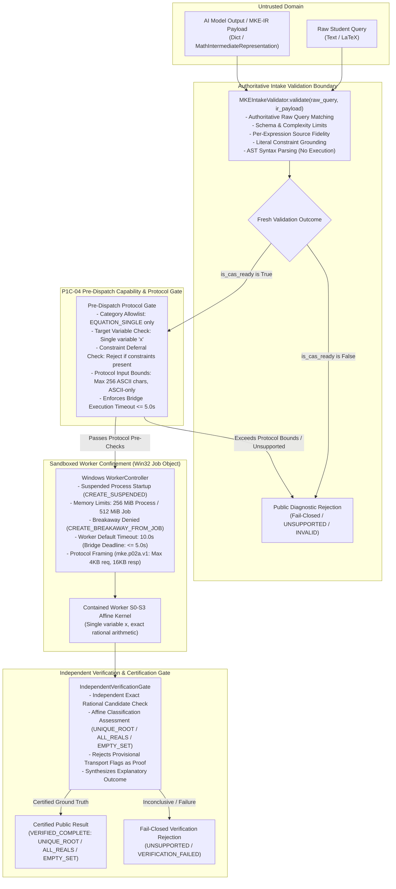
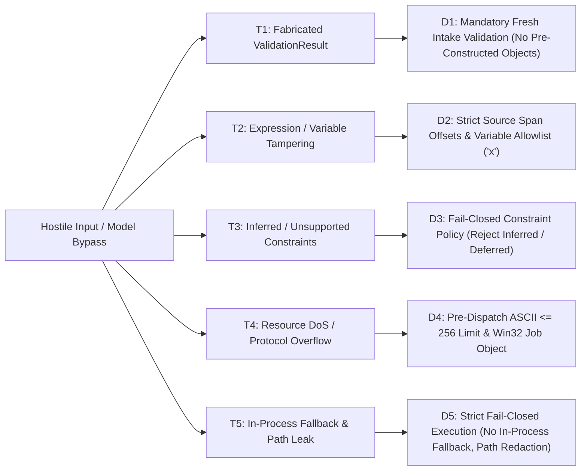

# ARCHITECTURE DESIGN & PREFLIGHT SPECIFICATION: P1C-04-A CONTROLLED CAS DISPATCH & VERIFICATION GATE

- **Milestone:** `PRODUCT-03C-P1C-04-A-R1`
- **Document Version:** `1.1.0-R1-PREFLIGHT-REVISED`
- **Author:** Antigravity (Implementation Engineer)
- **Coordinator & Independent Auditor:** ChatGPT
- **Project Owner:** Kế Phan Hoàng
- **Repository:** `PhanHoangKe/math-knowledge-engine`
- **Working Branch:** `product/p03c-p1c-04-preflight`
- **Frozen CAS Baseline:** `v0.3.3-p03c-p1c-03-accepted-limited` (`ec9e7085d17b13ab6496a52e2f4809c318939bbd`)
- **Date:** 2026-09-29

---

## 1. Executive Summary & Foundational Invariants

The objective of milestone **P1C-04** is to construct a **deterministic, fail-closed dispatch bridge and independent verification gate** connecting the validated mathematical intermediate representation (MKE-IR) produced by the AI intake layer to the frozen, sandboxed mathematical engine (`v0.3.3-p03c-p1c-03-accepted-limited`).

This document constitutes the **P1C-04-A-R1 Controlled Dispatch Preflight (Revised)**. It establishes:
1. An empirical code audit of the existing codebase, identifying the exact boundary between validated MKE-IR and contained worker execution.
2. A strict capability and trust-boundary matrix prohibiting uncontained execution of untrusted AI inputs.
3. A comprehensive threat model addressing injection, mutation, substitution, privilege escalation, and data leakage.
4. Mathematical verification contracts defining exact conditions for `UNIQUE_ROOT`, `ALL_REALS`, `EMPTY_SET`, and fail-closed rejections.
5. A minimal, bounded implementation proposal for the **P1C-04-B** prototype focusing strictly on single linear equations (`ProblemCategory.EQUATION_SINGLE` $\to$ `OperationType.SOLVE`).



---

## 2. Actual Code Audit & Inventory

An empirical audit of the actual frozen repository code reveals the following exact component boundaries:

### 2.1 AI Intake Layer (`src/mke_product/ai/`)
- **`MathIntermediateRepresentation` (`src/mke_product/ai/ir.py`):**
  - Typed Pydantic v2 model under schema version `mke.ir.v1`.
  - Captures `problem_category`, `question_format`, `primary_expressions` (up to 1000 chars, UTF-8/Unicode math symbols), `target_variables`, `parameters`, `extracted_constraints`, `subparts`, `given_options`, `source_spans`, and `uncertainty_flags`.
- **`MKEIntakeValidator` (`src/mke_product/ai/validator.py`):**
  - Authoritative pre-dispatch validator. Performs strict schema validation, bracket depth checks ($\le 20$), expression length limits ($\le 1000$ chars), variable syntax checks, source-span substring offsets, exact literal constraint binding, and per-expression provenance.
  - Parses expression syntax via frozen `parse_cas_equation`, `parse_cas_expression`, etc., **without mathematical execution**.
- **`PublicValidationDiagnostic` (`src/mke_product/ai/ir.py`):**
  - Sanitized student-facing projection isolating all raw queries, caller metadata, and internal AST details.
  - Enforces schema-based field path allowlists (`ALLOWLISTED_FIXED_PATHS`, `ALLOWLISTED_INDEXED_PATH_PATTERNS`) and authoritative issue fatality (`is_authoritative_fatal_issue`).

### 2.2 Process Confinement & Worker Layer (`src/mke_product/worker/`)
- **Worker Resource Limits (`src/mke_product/worker/constants.py`):**
  - `PROCESS_MEMORY_LIMIT_BYTES = 256 * 1024 * 1024` (**256 MiB per process**).
  - `JOB_MEMORY_LIMIT_BYTES = 512 * 1024 * 1024` (**512 MiB job-wide**).
  - `DEFAULT_WORKER_TIMEOUT_SEC = 10.0` (**10.0 seconds default worker timeout**).
  - *Bridge Execution Policy:* If the P1C-04 dispatch bridge applies a tighter 5.0-second deadline, that deadline is explicitly enforced by the caller/bridge via the IPC timeout parameter, not by default worker constants.
- **Worker Confinement Security:**
  - Suspended creation (`CREATE_SUSPENDED`) with pre-execution Job Object assignment.
  - Breakaway prevention: `JOB_OBJECT_LIMIT_BREAKAWAY_OK` and `JOB_OBJECT_LIMIT_SILENT_BREAKAWAY_OK` explicitly cleared.
  - Termination on Job close (`JOB_OBJECT_LIMIT_KILL_ON_JOB_CLOSE`).
  - Standard handle isolation via `STARTUPINFOEXW` and `PROC_THREAD_ATTRIBUTE_HANDLE_LIST`.

### 2.3 Protocol Contract (`src/mke_product/protocol/`)
- **`mke.p02a.v1` Protocol Framing (`src/mke_product/protocol/schema.py`):**
  - `SCHEMA_VERSION = "mke.p02a.v1"`.
  - `SUPPORTED_OPERATIONS = ("SOLVE", "CHECK_CANDIDATE")`.
  - `MAX_EQUATION_CHARS = 256` (**256 ASCII characters maximum**).
  - `MAX_PAYLOAD_BYTES = 4096` (**4096 bytes maximum total request**).
  - `MAX_RESPONSE_BYTES = 16384` (**16384 bytes maximum response ceiling**).
  - `CHECK_CANDIDATE` requires an exact ASCII rational candidate string (e.g. `"3/4"`, `"-5"`).
- **CRITICAL PROTOCOL DISCREPANCY & PRE-DISPATCH GATE:**
  - While MKE-IR allows up to 1000 characters and Unicode mathematical symbols, the contained worker protocol accepts **at most 256 ASCII characters** and strictly ASCII mathematical operators (`+`, `-`, `*`, `/`, `(`, `)`, `=`, digits, identifier `x`).
  - **Pre-Dispatch Rule:** The dispatch bridge must explicitly enforce the 256-character ASCII limit and ASCII charset before worker dispatch, failing closed immediately if an intake-valid MKE-IR payload exceeds worker protocol bounds.

### 2.4 Mathematical Solver Engine in Contained Worker (`src/mke_product/solver/`)
- **S0-S3 Affine Linear Solver:**
  - The worker dispatcher (`mke_product.protocol.dispatcher.dispatch_request`) invokes `mke_product.solver.solver.solve_equation`.
  - **Scope:** Single variable `x`, exact rational arithmetic ($\mathbb{Q}$), linear/affine forms $ax + b = cx + d$.
  - **Solution Classifications:**
    - `UNIQUE_ROOT`: exactly one exact rational root $x = r$.
    - `DomainSet(R)` / `ALL_REALS`: identity equation (e.g. $x = x$, all real numbers are solutions).
    - `EmptySet` / `NO_SOLUTION`: contradictory equation (e.g. $x = x + 1$, no real solutions exist).
  - **Nonlinear and Out-of-Scope Equations:** Quadratic equations ($x^2 - 4 = 0$), higher-degree polynomials, transcendental equations ($2^x = 8$, $\sin(x) = 0$), multi-variable systems, and inequalities are strictly `OUT_OF_SCOPE` and fail closed.
  - **Sturm Isolation & Trigonometric Parity:** The contained S0-S3 worker **does not execute Sturm polynomial isolation or periodic trigonometric solvers**. Those exist only in the separate P1B CAS / SymPy subsystem, which is not wired to the contained `WorkerController`.

---

## 3. Capability & Trust-Boundary Matrices

### 3.1 Contained Worker Capability Matrix

| Problem Category | Mathematical Form | Target Operation | Contained Worker Support | P1C-04-B Prototype Action |
| :--- | :--- | :--- | :--- | :--- |
| **`EQUATION_SINGLE`** | Affine Linear ($ax + b = cx + d$) | `SOLVE` | **Fully Supported** (S0-S3 Affine Solver via `WorkerController`) | **INCLUDED (Core Target)** |
| **`EQUATION_SINGLE`** | Candidate Verification ($f(r) = 0$) | `CHECK_CANDIDATE` | **Fully Supported** (`Rational` candidate check via `WorkerController`) | **INCLUDED (Candidate Gate)** |
| **`EQUATION_SINGLE`** | Quadratic / Polynomial ($x^2 - 4 = 0$) | `SOLVE` | **Not Supported in Contained Worker** | **FAIL CLOSED (`UNSUPPORTED`)** |
| **`EQUATION_SINGLE`** | Transcendental ($2^x = 8$, $\sin(x) = 0$) | `SOLVE` | **Not Supported in Contained Worker** | **FAIL CLOSED (`UNSUPPORTED`)** |
| **`EQUATION_SYSTEM`** | Linear / Nonlinear System | `SOLVE_SYSTEM` | **Not Supported in `WorkerController` Protocol** | **FAIL CLOSED (`UNSUPPORTED`)** |
| **`INEQUALITY_SINGLE`** | Linear / Rational Inequality | `SOLVE_INEQUALITY` | **Not Supported in `WorkerController` Protocol** | **FAIL CLOSED (`UNSUPPORTED`)** |
| **`EXPRESSION_SIMPLIFY`** | Algebraic Expression | `SIMPLIFY` | **Not Supported in `WorkerController` Protocol** | **FAIL CLOSED (`UNSUPPORTED`)** |
| **`DIFFERENTIATION`** | Single Variable Calculus | `DIFFERENTIATE` | **Not Supported in `WorkerController` Protocol** | **FAIL CLOSED (`UNSUPPORTED`)** |
| **`INTEGRATION`** | Indefinite / Definite Integral | `INTEGRATE` | **Not Supported in `WorkerController` Protocol** | **FAIL CLOSED (`UNSUPPORTED`)** |
| **`PARAMETER_ANALYSIS`** | Parameter-Dependent Equation | Various | **Not Supported in Contained Worker** | **FAIL CLOSED (`UNSUPPORTED`)** |
| **`WORD_PROBLEM`** | Natural Language Problem | N/A | **Not Supported in Contained Worker** | **FAIL CLOSED (`UNSUPPORTED`)** |

### 3.2 Trust Boundary Enforcement Matrix

| Boundary Layer | Input Data | Trust Level | Enforced Security Mechanism |
| :--- | :--- | :--- | :--- |
| **Intake Validation** | Raw student text & AI JSON payload | **UNTRUSTED** | `MKEIntakeValidator.validate()` checks schema, AST syntax, nesting depth ($\le 20$), identifier syntax, substring spans. |
| **Dispatch Bridge Entry** | Raw query & MKE-IR payload | **UNTRUSTED** | Bridge **never accepts pre-constructed `ValidationResult`**; executes fresh authoritative validation on every request. |
| **Pre-Dispatch Protocol Gate** | Validated MKE-IR | **RESTRICTED** | Verifies category `EQUATION_SINGLE`, variable `x`, no unhandled constraints, length $\le 256$ chars, ASCII charset. |
| **Worker Process IPC** | Length-prefixed JSON request | **SANDBOXED** | Win32 Job Object: 256MB process limit, 512MB job limit, breakaway denied, 5.0s bridge deadline. |
| **Verification Gate** | Raw worker response envelope | **UNVERIFIED OUTPUT** | `is_provisional_evidence` treated as transport metadata, not proof. Exact rational substitution check required. |
| **Public Egress** | Public result object | **SANITIZED PUBLIC** | Whitelisted public fields only. Strips raw queries, internal spans, filesystem paths, and debug traces. |

---

## 4. Security Threat Model



### Threat Analysis & Mitigations

1. **Threat T1: Fabricated or Mutated ValidationResult Bypass**
   - *Attack:* Malicious caller passes `ValidationResult(is_cas_ready=True, target_operation="SOLVE")` with hostile or ungrounded equations directly to the dispatch entry point.
   - *Mitigation D1:* The dispatch entry point (`ControlledDispatchBridge.dispatch()`) **strictly accepts only `(raw_query: str, ir_payload: Union[dict, MathIntermediateRepresentation])`**. It unconditionally invokes `MKEIntakeValidator.validate(raw_query, ir_payload)` freshly.

2. **Threat T2: Expression or Variable Substitution Attack**
   - *Attack:* Attacker extracts $x = 1$ from question text, but substitutes $x = 100$ or multi-variable expressions.
   - *Mitigation D2:* Intake validator verifies exact character offsets and semantic roles (`EQUATION`). Furthermore, the Pre-Dispatch Gate strictly verifies that `target_variables == ["x"]` and `parameters == []`.

3. **Threat T3: Inferred or Unsound Explicit Constraint Injection**
   - *Attack:* AI model invents artificial constraints or passes explicit constraints (e.g. $x > 2$) that the affine solver cannot soundly evaluate.
   - *Mitigation D3:* Inferred constraints are blocked by intake validation (`UNCONFIRMED_INFERRED_CONSTRAINT`). In the initial P1C-04-B prototype, explicit constraints are explicitly deferred: any payload with non-empty `extracted_constraints` fails closed with `UNSUPPORTED_CONSTRAINT` rather than being silently dropped.

4. **Threat T4: Protocol Overflow & Resource Exhaustion (DoS)**
   - *Attack:* Attacker sends a 1000-character nested expression to exceed the 256-character worker protocol limit, or an equation designed to consume memory.
   - *Mitigation D4:* Pre-Dispatch Gate validates `len(expression) <= 256` and ASCII charset before IPC framing. Windows Job Object enforces `256 MiB` process memory limit, `512 MiB` job limit, and a strict 5.0s wall-clock timeout.

5. **Threat T5: Unsafe In-Process Fallback & Diagnostic Data Leakage**
   - *Attack:* Worker timeout or crash causes the bridge to fall back to in-process `sympy.solve()`, risking memory corruption or filesystem path leakage.
   - *Mitigation D5:* **Zero in-process fallback permitted**. Worker failures fail closed with `RESOURCE_EXHAUSTED` or `INTERNAL_ERROR`. All worker outputs are filtered through `_sanitize_error_text()` (`[REDACTED_PATH]`).

---

## 5. Revised Mathematical Verification Contract

The system **never equates worker execution with mathematical completeness**. A dedicated independent verification contract governs all execution outcomes.

### 5.1 Outcome Taxonomy for Contained Affine Solving

1. **`UNIQUE_ROOT` (Exact Single Solution):**
   - *Condition:* Worker returns `classification = "UNIQUE_ROOT"` with an exact rational root $x = r = p/q$ ($q \neq 0$).
   - *Independent Verification:*
     - The candidate root $r$ is evaluated against the original unreduced AST equation $f_{left}(r) = f_{right}(r)$ via exact rational arithmetic (`mke_product.evaluator.evaluator.check_candidate`).
     - Residual must be strictly $0$.
   - *Public Result:* `status = "VALID"`, `is_valid = True`, `is_cas_ready = True`, `solution_type = "UNIQUE_ROOT"`, `root = {"numerator": str(p), "denominator": str(q)}`.

2. **`ALL_REALS` (Infinite Solution Set / Identity):**
   - *Condition:* Worker returns `classification = "DomainSet(R)"` (affine reduction yields $0x + 0 = 0$).
   - *Independent Verification:*
     - Left and right affine canonical forms evaluate to identical slope and intercept: $(a_{left}, b_{left}) == (a_{right}, b_{right})$.
   - *Public Result:* `status = "VALID"`, `is_valid = True`, `is_cas_ready = True`, `solution_type = "ALL_REALS"`, `solution_set = "R"`.

3. **`EMPTY_SET` (Inconsistent Contradiction / No Solutions):**
   - *Condition:* Worker returns `classification = "EmptySet"` (affine reduction yields $0x = c$ where $c \neq 0$, e.g. $x = x + 1$).
   - *Independent Verification:*
     - Slopes match ($a_{left} == a_{right}$) but intercepts differ ($b_{left} \neq b_{right}$).
   - *Mathematical Honesty:* **`EMPTY_SET` is a valid, certified mathematical outcome, NOT a verification failure.**
   - *Public Result:* `status = "VALID"`, `is_valid = True`, `is_cas_ready = True`, `solution_type = "EMPTY_SET"`, `solution_set = "{}"`.

4. **`UNSUPPORTED` (Out-of-Scope Equations):**
   - *Condition:* Equation contains non-linear terms (e.g. $x^2$, $2^x$, $\sin(x)$), multi-variable expressions, or non-affine operators.
   - *Action:* Fails closed pre-dispatch or returns `OUT_OF_SCOPE`.
   - *Public Result:* `status = "UNSUPPORTED"`, `is_valid = False`, `is_cas_ready = False`, `target_operation = None`.

5. **`VERIFICATION_FAILED` (Inconsistency / Internal Error):**
   - *Condition:* Candidate root check fails ($f(r) \neq 0$), worker times out, process memory limit is exceeded, or response payload is corrupted.
   - *Public Result:* `status = "INVALID"`, `is_valid = False`, `is_cas_ready = False`, with standardized non-sensitive error code.

### 5.2 Transport Flags vs. Independent Proof
- The `mke.p02a.v1` protocol flag `is_provisional_evidence` is an **internal transport indicator** denoting that affine step traces were attached.
- It **does not constitute independent mathematical proof**. The verification gate must independently inspect the root and affine coefficients before certifying the result.

---

## 6. Bounded Implementation Proposal (P1C-04-B Prototype)

### 6.1 Strict Scope Boundary
- **Included Problem Category:** `ProblemCategory.EQUATION_SINGLE` exclusively.
- **Included Target Operation:** `OperationType.SOLVE` exclusively.
- **Included Variable:** Exactly `x` (single variable).
- **Protocol Bounds:** Length $\le 256$ ASCII characters.
- **Explicit Deferrals:**
  - Quadratic and polynomial equations ($x^2 - 4 = 0$).
  - Transcendental and trigonometric equations.
  - Systems of equations (`EQUATION_SYSTEM`).
  - Inequalities (`INEQUALITY_SINGLE`).
  - Explicit constraints (`extracted_constraints`).
  - Multi-part and multiple-choice questions (`subparts`, `given_options`).

### 6.2 Module Design: `src/mke_product/cas/bridge.py`
```python
class ControlledDispatchBridge:
    """Deterministic pre-dispatch bridge connecting validated MKE-IR to sandboxed worker."""

    @classmethod
    def dispatch(
        cls,
        raw_query: str,
        ir_payload: Union[Dict[str, Any], MathIntermediateRepresentation],
        controller: Optional[WorkerController] = None,
        timeout_sec: float = 5.0,
    ) -> ControlledDispatchResult:
        """Execute authoritative intake validation, pre-dispatch capability checks, and contained execution.

        Invariants:
        1. Always re-runs MKEIntakeValidator.validate(); never trusts incoming ValidationResult.
        2. Fails closed if is_cas_ready is False.
        3. Enforces single-variable 'x', EQUATION_SINGLE, no explicit constraints.
        4. Enforces <= 256 ASCII character protocol limit.
        5. Dispatches strictly via Win32 Job Object contained WorkerController.
        6. Passes worker output through IndependentVerificationGate.
        """
        ...
```

---

## 7. Minimum Adversarial Test Matrix

The test suite for P1C-04-B (`tests/test_p03c_p1c_controlled_dispatch.py`) must implement and verify the following exact cases:

| # | Test Scenario | Input Query / Expression | Expected Pre-Dispatch Action | Expected Worker Outcome | Expected Public Diagnostic |
|---|---|---|---|---|---|
| **1** | Canonical Linear Equation | `x = 1` | Accepted (in scope) | `UNIQUE_ROOT` ($x = 1$) | `is_valid=True`, `is_cas_ready=True`, `solution_type="UNIQUE_ROOT"`, `root={"numerator":"1","denominator":"1"}` |
| **2** | Affine Identity (All Reals) | `x = x` | Accepted (in scope) | `DomainSet(R)` | `is_valid=True`, `is_cas_ready=True`, `solution_type="ALL_REALS"`, `solution_set="R"` |
| **3** | Affine Contradiction (Empty Set) | `x = x + 1` | Accepted (in scope) | `EmptySet` | `is_valid=True`, `is_cas_ready=True`, `solution_type="EMPTY_SET"`, `solution_set="{}"` |
| **4** | Nonlinear Quadratic Equation | `x^2 - 4 = 0` | Rejected Pre-Dispatch | N/A (Not Dispatched) | `is_valid=False`, `is_cas_ready=False`, `status="UNSUPPORTED"` |
| **5** | Protocol Character Limit Overflow | Equation $> 256$ ASCII chars | Rejected Pre-Dispatch | N/A (Not Dispatched) | `is_valid=False`, `is_cas_ready=False`, `status="INVALID"`, `code="EXPRESSION_TOO_LONG"` |
| **6** | Non-ASCII Mathematical Input | `x − 1 = 0` (Unicode minus) | Rejected Pre-Dispatch | N/A (Not Dispatched) | `is_valid=False`, `is_cas_ready=False`, `status="INVALID"`, `code="UNSUPPORTED_NOTATION"` |
| **7** | Fabricated ValidationResult Bypass | Direct invocation with mutated object | Rejected (Mandatory fresh intake) | N/A (Not Dispatched) | `is_valid=False`, `is_cas_ready=False`, `status="INVALID"` |
| **8** | Grounded Explicit Constraint | `x = 1` with `x > 2` | Rejected Pre-Dispatch (Deferred) | N/A (Not Dispatched) | `is_valid=False`, `is_cas_ready=False`, `status="UNSUPPORTED"`, `code="UNSUPPORTED_CONSTRAINT"` |
| **9** | Forged Worker Evidence | Malformed / tampered response payload | Dispatched | Worker Error | `is_valid=False`, `is_cas_ready=False`, `status="INVALID"`, `code="VERIFICATION_FAILED"` |
| **10** | Worker Timeout / Resource Limit | Infinite loop / memory exhaustion | Dispatched to Job Object | Worker Killed | `is_valid=False`, `is_cas_ready=False`, `status="INVALID"`, `code="RESOURCE_EXHAUSTED"` |
| **11** | Non-Windows Environment | Platform != `win32` | Rejected (No containment) | N/A (Not Dispatched) | `is_valid=False`, `is_cas_ready=False`, `status="UNSUPPORTED"`, `code="CONTAINMENT_UNAVAILABLE"` |

---

## 8. Acceptance & Rejection Criteria for P1C-04-B

### 8.1 Acceptance Criteria
1. **Authoritative Re-Validation:** 100% of dispatch attempts execute fresh intake validation.
2. **Strict Worker Confinement:** 100% of mathematical solving executes in a Windows Job Object process (256MB process limit, 512MB job limit, breakaway denied).
3. **Exact Mathematical Outcomes:** `UNIQUE_ROOT`, `ALL_REALS`, and `EMPTY_SET` are verified and certified with exact rational precision.
4. **Honest Fail-Closed Bounds:** Quadratic, transcendental, multi-variable, and constraint-bearing inputs fail closed cleanly as `UNSUPPORTED`.
5. **Zero Test Regressions:** All 6 existing repository test suites (651 tests, 18 subtests) pass with 100% success.

### 8.2 Rejection Criteria
1. Direct in-process invocation of SymPy or CAS engines on untrusted AI inputs.
2. Acceptance of pre-constructed `ValidationResult` objects.
3. Silent dropping of explicit constraints.
4. Classification of `EMPTY_SET` as a verification failure.
5. Modification of frozen P1B CAS code or predecessor release tags.

---

## 9. Genuine Implementation Blockers & Next Steps

### 9.1 Blockers & Constraints
- **Windows Runtime Requirement:** Contained worker tests require native Windows runtime with Win32 Job Objects. Non-Windows environments must fail closed cleanly.
- **Protocol Limitation:** Contained solving of quadratic equations ($x^2 - 4 = 0$) and systems requires extending the worker protocol (`mke.p02a.v2`), which is intentionally deferred beyond P1C-04-B.

### 9.2 Immediate Next Steps (P1C-04-B Implementation)
1. Implement `ControlledDispatchBridge` and `IndependentVerificationGate` in `src/mke_product/cas/bridge.py`.
2. Implement the 11-case adversarial test matrix in `tests/test_p03c_p1c_controlled_dispatch.py`.
3. Execute full verification and benchmark suites.
4. Publish separate source and evidence commits on `product/p03c-p1c-04-preflight`.
