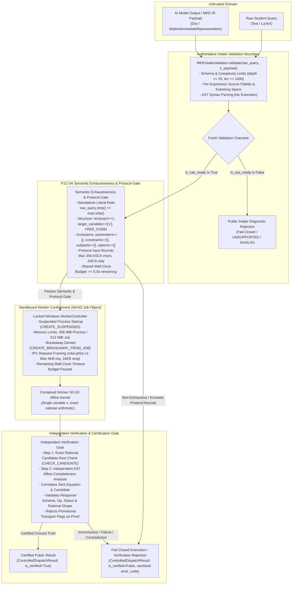
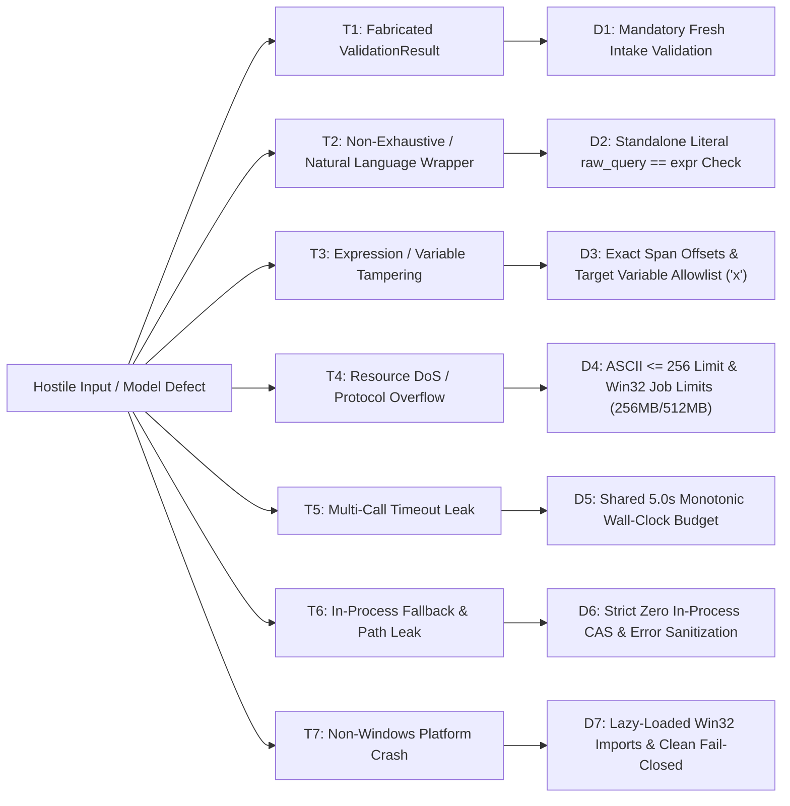
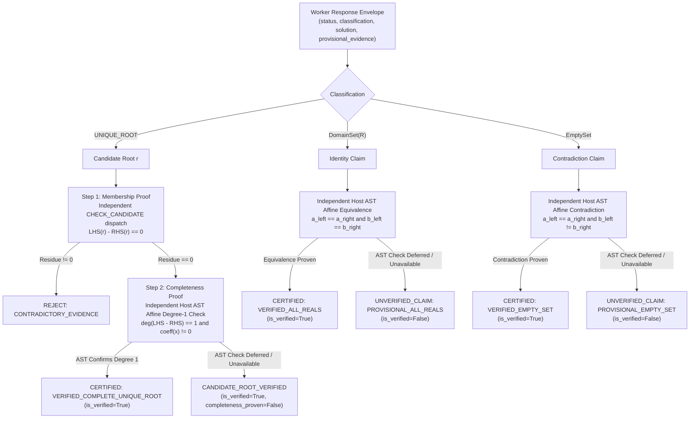

# ARCHITECTURE DESIGN & PREFLIGHT SPECIFICATION: P1C-04-A CONTROLLED CAS DISPATCH & VERIFICATION GATE

- **Milestone:** `PRODUCT-03C-P1C-04-A-R2`
- **Document Version:** `1.2.0-R2-PREFLIGHT-FINAL`
- **Author:** Antigravity (Implementation Engineer)
- **Coordinator & Independent Auditor:** ChatGPT
- **Project Owner:** Kế Phan Hoàng
- **Repository:** `PhanHoangKe/math-knowledge-engine`
- **Working Branch:** `product/p03c-p1c-04-preflight`
- **Frozen CAS Baseline:** `v0.3.3-p03c-p1c-03-accepted-limited` (`ec9e7085d17b13ab6496a52e2f4809c318939bbd`)
- **Date:** 2026-09-30

---

## 1. Executive Summary & Foundational Invariants

The objective of milestone **P1C-04** is to construct a **deterministic, locked-containment dispatch bridge and independent verification gate** connecting validated mathematical intermediate representations (MKE-IR) to the frozen, sandboxed mathematical engine (`v0.3.3-p03c-p1c-03-accepted-limited`).

This document constitutes the **P1C-04-A-R2 Controlled Dispatch Preflight Specification**. It addresses and closes all architectural, mathematical, and containment gaps identified during independent preflight audits:

1. **Semantic-Exhaustiveness Guard:** Enforces strict literal equality (`raw_query.strip() == primary_expressions[0].strip()`) for the initial prototype, eliminating natural language wrapper ambiguities and unextracted mathematical constraints.
2. **Exact Mathematical Proof & Threat Model:** Formalizes the distinction between *candidate root membership* and *mathematical completeness*, defining explicit verification mechanisms and trust assumptions for `UNIQUE_ROOT`, `ALL_REALS`, and `EMPTY_SET`.
3. **Locked Containment Policy & Shared Total Deadline:** Locks the public dispatch signature against caller injection of controllers or resource limits, lazy-loads Windows-specific dependencies for fail-closed non-Windows execution, and enforces a shared 5.0-second wall-clock budget across multi-step solver/verifier calls.
4. **Typed Public Contract & Response Integrity:** Establishes distinct lifecycle outcomes (Intake, Execution, Verification), correlates worker responses to sent requests, sanitizes internal diagnostics, and enforces fail-closed handling of contradictory or forged worker evidence.



---

## 2. Actual Code Audit & Baseline Inventory

An empirical audit of the actual frozen repository code establishes the following concrete component boundaries:

### 2.1 AI Intake Layer (`src/mke_product/ai/`)
- **`MathIntermediateRepresentation` (`src/mke_product/ai/ir.py`):**
  - Typed Pydantic v2 model under schema version `mke.ir.v1`.
  - Captures `problem_category`, `question_format`, `primary_expressions` (up to 1000 chars, UTF-8/Unicode math symbols), `target_variables`, `parameters`, `extracted_constraints`, `subparts`, `given_options`, `source_spans`, and `uncertainty_flags`.
- **`MKEIntakeValidator` (`src/mke_product/ai/validator.py`):**
  - Authoritative pre-dispatch validator. Performs strict schema validation, bracket depth checks ($\le 20$), expression length limits ($\le 1000$ chars), variable syntax checks, source-span substring offsets, exact literal constraint binding, and per-expression provenance.
  - Parses expression syntax via frozen `parse_cas_equation`, `parse_cas_expression`, etc., **without mathematical execution**.
- **`PublicValidationDiagnostic` (`src/mke_product/ai/ir.py`):**
  - Sanitized student-facing projection isolating all raw queries, caller metadata, and internal AST details.
  - **Public Semantics Invariant:** `PublicValidationDiagnostic.is_valid` and `is_cas_ready` signify **syntactic validity and CAS intake readiness only**, NOT proof of mathematical solution correctness.

### 2.2 Process Confinement & Worker Layer (`src/mke_product/worker/`)
- **Worker Resource Limits (`src/mke_product/worker/constants.py`):**
  - `PROCESS_MEMORY_LIMIT_BYTES = 256 * 1024 * 1024` (**256 MiB per process**).
  - `JOB_MEMORY_LIMIT_BYTES = 512 * 1024 * 1024` (**512 MiB job-wide**).
  - `DEFAULT_WORKER_TIMEOUT_SEC = 10.0` (**10.0 seconds default worker timeout**).
- **Locked Worker Policy & Shared 5.0-Second Budget:**
  - The public bridge enforces a **shared 5.0-second wall-clock budget** across all solver and verifier operations for a single request.
  - Worker timeout parameters are computed dynamically as $\Delta t = \min(T_{\text{remaining}}, 5.0)$ and passed to the contained worker. If $T_{\text{remaining}} \le 0.1\text{s}$, subsequent dispatches abort immediately with `ERR_TIMEOUT`.
- **Worker Confinement Security:**
  - Suspended creation (`CREATE_SUSPENDED`) with pre-execution Job Object assignment.
  - Breakaway prevention: `JOB_OBJECT_LIMIT_BREAKAWAY_OK` and `JOB_OBJECT_LIMIT_SILENT_BREAKAWAY_OK` explicitly cleared.
  - Termination on Job close (`JOB_OBJECT_LIMIT_KILL_ON_JOB_CLOSE`).
  - Standard handle isolation via `STARTUPINFOEXW` and `PROC_THREAD_ATTRIBUTE_HANDLE_LIST`.

### 2.3 Protocol Contract (`src/mke_product/protocol/`)
- **`mke.p02a.v1` Protocol Framing (`src/mke_product/protocol/schema.py`):**
  - `SCHEMA_VERSION = "mke.p02a.v1"`.
  - `SUPPORTED_OPERATIONS = ("SOLVE", "CHECK_CANDIDATE")`.
  - `MAX_EQUATION_CHARS = 256` (**256 ASCII characters maximum**).
  - `MAX_PAYLOAD_BYTES = 4096` (**4096 bytes maximum total request**).
  - `MAX_RESPONSE_BYTES = 16384` (**16384 bytes maximum response ceiling**).
  - `CHECK_CANDIDATE` requires an exact ASCII rational candidate string (e.g. `"3/4"`, `"-5"`).
- **Pre-Dispatch Protocol Gate Invariant:**
  - MKE-IR payloads containing non-ASCII mathematical notation, characters $> 256$, or unsupported operations are rejected at the Pre-Dispatch Gate before any IPC transmission.

### 2.4 Mathematical Solver Engine in Contained Worker (`src/mke_product/solver/`)
- **S0-S3 Affine Linear Solver:**
  - Contained solver exclusively handles single-variable affine equations over $\mathbb{Q}$ ($ax + b = cx + d$) with variable `x`.
  - Solution classifications:
    - `UNIQUE_ROOT`: exactly one exact rational root $x = r$.
    - `DomainSet(R)`: identity equation (all real numbers are solutions).
    - `EmptySet`: contradictory equation (no real solutions exist).
  - Non-linear terms (polynomial $x^2$, exponential $2^x$, trigonometric $\sin(x)$), inequalities, systems, and parameter-bearing equations strictly fail closed (`OUT_OF_SCOPE`).
  - Contained worker does not execute uncontained SymPy routines, Sturm sequences, or trigonometric period solvers.

---

## 3. Capability, Semantic Exhaustiveness & Trust Boundaries

### 3.1 Contained Worker Capability Matrix

| Problem Category | Mathematical Form | Target Operation | Contained Worker Support | P1C-04-B Prototype Action |
| :--- | :--- | :--- | :--- | :--- |
| **`EQUATION_SINGLE`** | Affine Linear ($ax + b = cx + d$) | `SOLVE` | **Fully Supported** (S0-S3 Affine Solver via `WorkerController`) | **INCLUDED (Core Target)** |
| **`EQUATION_SINGLE`** | Candidate Verification ($f(r) = 0$) | `CHECK_CANDIDATE` | **Fully Supported** (`Rational` candidate check via `WorkerController`) | **INCLUDED (Candidate Gate)** |
| **`EQUATION_SINGLE`** | Quadratic / Polynomial ($x^2 - 4 = 0$) | `SOLVE` | **Not Supported in Contained Worker** | **FAIL CLOSED (`OUT_OF_SCOPE`)** |
| **`EQUATION_SINGLE`** | Transcendental ($2^x = 8$, $\sin(x) = 0$) | `SOLVE` | **Not Supported in Contained Worker** | **FAIL CLOSED (`OUT_OF_SCOPE`)** |
| **`EQUATION_SYSTEM`** | Linear / Nonlinear System | `SOLVE_SYSTEM` | **Not Supported in `WorkerController` Protocol** | **FAIL CLOSED (`OUT_OF_SCOPE`)** |
| **`INEQUALITY_SINGLE`** | Linear / Rational Inequality | `SOLVE_INEQUALITY` | **Not Supported in `WorkerController` Protocol** | **FAIL CLOSED (`OUT_OF_SCOPE`)** |
| **`EXPRESSION_SIMPLIFY`** | Algebraic Expression | `SIMPLIFY` | **Not Supported in `WorkerController` Protocol** | **FAIL CLOSED (`OUT_OF_SCOPE`)** |
| **`DIFFERENTIATION`** | Single Variable Calculus | `DIFFERENTIATE` | **Not Supported in `WorkerController` Protocol** | **FAIL CLOSED (`OUT_OF_SCOPE`)** |
| **`INTEGRATION`** | Indefinite / Definite Integral | `INTEGRATE` | **Not Supported in `WorkerController` Protocol** | **FAIL CLOSED (`OUT_OF_SCOPE`)** |
| **`PARAMETER_ANALYSIS`** | Parameter-Dependent Equation | Various | **Not Supported in Contained Worker** | **FAIL CLOSED (`OUT_OF_SCOPE`)** |
| **`WORD_PROBLEM`** | Natural Language Problem | N/A | **Not Supported in Contained Worker** | **FAIL CLOSED (`OUT_OF_SCOPE`)** |

### 3.2 Semantic-Exhaustiveness Guard for Prototype Dispatch

Intake provenance verification in `MKEIntakeValidator` establishes that extracted expressions exist as exact substrings within `raw_query`. However, substring provenance alone **does not guarantee semantic exhaustiveness**—i.e., it cannot prove that the raw query does not contain unextracted conditions, secondary equations, or semantic constraints wrapped in natural language.

To prevent uncontained or unsound solving of partially extracted mathematical queries, the P1C-04-B prototype enforces the **Standalone Literal Equation Guard**:

$$\text{raw\_query.strip()} == \text{primary\_expressions}[0]\text{.strip()}$$

**Mandatory Pre-Dispatch Constraints:**
1. **Literal Equality:** The raw query, after benign leading/trailing whitespace stripping, must strictly equal the primary expression.
2. **Single Expression:** `len(ir.primary_expressions) == 1`.
3. **Target Variable:** `ir.target_variables == ["x"]`.
4. **Format & Category:** `ir.problem_category == ProblemCategory.EQUATION_SINGLE` and `ir.question_format == QuestionFormat.FREE_FORM`.
5. **No Auxiliary Structures:** `ir.parameters == []`, `ir.extracted_constraints == []`, `ir.subparts == []`, `ir.given_options == []`, and `ir.uncertainty_flags == []`.
6. **Provenance Integrity:** Valid exact character span corresponding to the full expression.

**Counterexamples (Must Reject Without Dispatch):**
- Query: `"x = 1 với x > 2"` where AI extracted `x = 1` with valid substring span but omitted `x > 2`. $\to$ **REJECTED PRE-DISPATCH** (`ERR_INTAKE_NON_EXHAUSTIVE`).
- Query: `"x = 1 và x = 2"` where AI extracted only `x = 1`. $\to$ **REJECTED PRE-DISPATCH** (`ERR_INTAKE_NON_EXHAUSTIVE`).
- Query: `"Giải phương trình x = 3"` (Vietnamese natural language wrapper). $\to$ **REJECTED PRE-DISPATCH** (`ERR_INTAKE_NON_EXHAUSTIVE`).

### 3.3 Multi-Layer Trust Boundary Matrix

| Boundary Layer | Input Data | Trust Level | Enforced Security Mechanism |
| :--- | :--- | :--- | :--- |
| **Intake Validation** | Raw student text & AI JSON payload | **UNTRUSTED** | `MKEIntakeValidator.validate()` checks schema, AST syntax, nesting depth ($\le 20$), identifier syntax, substring spans. |
| **Dispatch Bridge Entry** | Raw query & MKE-IR payload | **UNTRUSTED** | Bridge **never accepts pre-constructed `ValidationResult`**; executes fresh authoritative validation on every call. |
| **Semantic & Protocol Gate** | Validated MKE-IR | **RESTRICTED** | Verifies literal equality `raw_query.strip() == expr.strip()`, single variable `x`, no constraints/subparts, length $\le 256$ ASCII chars. |
| **Worker Process IPC** | Length-prefixed JSON request | **SANDBOXED** | Win32 Job Object: 256MB process limit, 512MB job limit, breakaway denied, shared 5.0s budget. |
| **Verification Gate** | Raw worker response envelope | **UNVERIFIED OUTPUT** | Validates schema, operation, status, rational shape; correlates equation/candidate; performs independent AST/candidate check. |
| **Public Egress** | `ControlledDispatchResult` | **SANITIZED PUBLIC** | Whitelisted public fields only. Strips raw queries, internal AST trees, filesystem paths, and debug stack traces. |

---

## 4. Security Threat Model & Containment Policy



### Threat Analysis & Mitigations

1. **Threat T1: Fabricated or Mutated ValidationResult Bypass**
   - *Attack:* Caller crafts a mock `ValidationResult(is_cas_ready=True)` containing ungrounded equations or malicious payloads to bypass intake rules.
   - *Mitigation D1:* The public entry point (`ControlledDispatchBridge.dispatch()`) **only accepts `(raw_query: str, ir_payload: Union[dict, MathIntermediateRepresentation])`**. It unconditionally runs fresh `MKEIntakeValidator.validate()` on every call.

2. **Threat T2: Semantic Incompleteness & Hidden Natural Language Clauses**
   - *Attack:* Student inputs `"x = 1 với x > 2"` or `"x = 1 và x = 2"`; AI extractor drops constraints/clauses while preserving substring spans, leading to incorrect solution sets.
   - *Mitigation D2:* Semantic-Exhaustiveness Guard enforces `raw_query.strip() == primary_expressions[0].strip()`. Any discrepancy fails closed before worker dispatch (`ERR_INTAKE_NON_EXHAUSTIVE`).

3. **Threat T3: Variable or Expression Substitution**
   - *Attack:* Attacker extracts `x = 1` from text but substitutes `y = 1` or parameters $a, b$.
   - *Mitigation D3:* Intake validator checks character spans, and Pre-Dispatch Gate enforces `target_variables == ["x"]` and `parameters == []`.

4. **Threat T4: Protocol Buffer Overflow & Resource Exhaustion (DoS)**
   - *Attack:* Attacker sends a 1000-character nested expression to overflow worker IPC buffers or trigger exponential solver memory consumption.
   - *Mitigation D4:* Pre-Dispatch Gate enforces `len(expression) <= 256` and ASCII charset. Windows Job Object enforces `256 MiB` process memory limit, `512 MiB` job limit, and kills runaway processes.

5. **Threat T5: Multi-Call Timeout Leak & CPU Starvation**
   - *Attack:* Separate worker calls (e.g. `SOLVE` followed by `CHECK_CANDIDATE`) each take 4.9 seconds, exceeding the 5.0-second bridge SLA and starving host resources.
   - *Mitigation D5:* Bridge tracks monotonic time $T_0$ across the entire request lifecycle. Each worker invocation receives the remaining budget $\Delta t = 5.0 - (T_{\text{now}} - T_0)$. If $\Delta t \le 0.1\text{s}$, execution terminates immediately with `ERR_TIMEOUT`.

6. **Threat T6: In-Process Fallback & Host Diagnostic Leakage**
   - *Attack:* Worker crash triggers fallback to in-process SymPy, risking memory exhaustion and leaking local filesystem paths in tracebacks.
   - *Mitigation D6:* **Zero in-process CAS execution allowed**. All worker outputs and error codes are sanitized into fixed enumerated error strings (`[REDACTED_PATH]`).

7. **Threat T7: Host-side Platform Crash on Non-Windows**
   - *Attack:* Importing bridge on Linux/macOS fails with unhandled `ModuleNotFoundError: No module named 'win32job'`, crashing the host service.
   - *Mitigation D7:* Win32-specific worker modules are lazy-loaded within the Windows execution branch. Non-Windows environments fail closed cleanly with `ControlledDispatchResult(is_verified=False, error_code="ERR_PLATFORM_NOT_SUPPORTED")`.

8. **Threat T8: Locked Public Signature (No Injection Hooks)**
   - *Attack:* Malicious caller passes custom `WorkerController` mock, inflated timeout (e.g. 100s), or debug flags through public API.
   - *Mitigation D8:* Public signature contains no controller, timeout, or configuration overrides:
     `dispatch(raw_query: str, ir_payload: Union[dict, MathIntermediateRepresentation]) -> ControlledDispatchResult`.
     Test mocks and custom controllers are strictly isolated to private/internal constructors (`_dispatch_internal()`).

---

## 5. Mathematical Proof Model, Verification Gate & Response Integrity

### 5.1 Root Membership vs. Mathematical Completeness

A fundamental principle of the MKE verification architecture is that **root checking does not equal proof of completeness**:
- **Candidate Verification (`CHECK_CANDIDATE`):** Proves *membership*—i.e., that substituting candidate $r$ into $LHS(x) - RHS(x)$ yields exact rational $0$. It does NOT prove that $r$ is the unique solution or that no other solutions exist.
- **Worker Solving (`SOLVE`):** Returns a classification (`UNIQUE_ROOT`, `DomainSet(R)`, `EmptySet`) and provisional step trace. Because worker outputs are untrusted IPC data, they cannot independently certify their own claims.

### 5.2 Concrete Verification Mechanisms & Trust Assumptions per Outcome



1. **Unique Rational Root (`UNIQUE_ROOT`):**
   - *Membership Proof:* Candidate $r = p/q$ ($q \neq 0$) is verified via independent `CHECK_CANDIDATE` execution in the contained worker. Residue must equal exact integer $0$.
   - *Completeness Proof:* The original validated expression AST is analyzed on the host side using safe, non-evaluating structural decomposition:
     $$LHS(x) - RHS(x) \equiv a x + b = 0 \quad (a \neq 0, a \in \mathbb{Q}, b \in \mathbb{Q})$$
     Confirming degree 1 establishes that no second root exists.
   - *Certification Outcome:* If membership is proven and degree 1 is verified $\to$ `VERIFIED_COMPLETE_UNIQUE_ROOT` (`is_verified = True`). If degree-1 analysis is deferred $\to$ `CANDIDATE_ROOT_VERIFIED` (`is_verified = True`, `completeness_proven = False`).
   - *Contradiction Handling:* If worker claims `UNIQUE_ROOT` with $r$, but `CHECK_CANDIDATE` fails ($LHS(r) \neq RHS(r)$), result is `CONTRADICTORY_EVIDENCE` $\to$ **Fail Closed** (`is_verified = False`, `error_code = "ERR_VERIFICATION_MISMATCH"`).

2. **All Real Numbers (`DomainSet(R)` / Identity):**
   - *Nature of Claim:* Cannot be proven by point testing (point testing finite values cannot prove universal truth across $\mathbb{R}$).
   - *Verification Mechanism:* Requires independent AST affine reduction proving identical canonical slope and intercept: $a_L = a_R$ and $b_L = b_R$.
   - *Certification Outcome:* If independent AST reduction confirms identity $\to$ `VERIFIED_ALL_REALS` (`is_verified = True`). If independent reduction is absent/deferred $\to$ `UNVERIFIED_CLAIM` (`is_verified = False`, `error_code = "ERR_UNVERIFIED_IDENTITY"`).

3. **Empty Set (`EmptySet` / Inconsistent Contradiction):**
   - *Nature of Claim:* Cannot be proven by point testing. `EMPTY_SET` is a valid mathematical result (e.g. $x = x + 1$), not a system error.
   - *Verification Mechanism:* Requires independent AST affine reduction proving parallel non-intersecting lines: $a_L = a_R$ and $b_L \neq b_R$.
   - *Certification Outcome:* If independent AST reduction confirms contradiction $\to$ `VERIFIED_EMPTY_SET` (`is_verified = True`). If independent reduction is absent/deferred $\to$ `UNVERIFIED_CLAIM` (`is_verified = False`, `error_code = "ERR_UNVERIFIED_CONTRADICTION"`).

### 5.3 Response Integrity & Protocol Correlation

The bridge enforces strict envelope integrity before inspecting any worker payload:
1. **Schema & Header Conformance:** Validates JSON response structure against `mke.p02a.v1`.
2. **Operation Correlation:** Validates `response.operation == requested_operation`.
3. **Status Check:** Validates `response.status == "SUCCESS"`. Non-success statuses map to structured error codes.
4. **Rational Shape Validation:** Candidate and root payloads must strictly conform to exact rational representation: `{"numerator": int, "denominator": int}` with `denominator > 0`. Floats, strings, `NaN`, `Infinity`, and unreduced decimals fail closed immediately (`ERR_MALFORMED_WORKER_RESPONSE`).
5. **Request Correlation:** When performing multi-step verification, the bridge validates that the candidate submitted to `CHECK_CANDIDATE` strictly matches the root returned by `SOLVE`.

---

## 6. Typed Public Contract & Bounded Implementation Design

### 6.1 Public Result Model (`ControlledDispatchResult`)

The public interface returns a distinct, strongly typed result separating intake, execution, and verification phases:

```python
class IntakeStatus(str, Enum):
    VALIDATED = "VALIDATED"
    REJECTED_SYNTAX = "REJECTED_SYNTAX"
    REJECTED_SCOPE = "REJECTED_SCOPE"
    REJECTED_NON_EXHAUSTIVE = "REJECTED_NON_EXHAUSTIVE"

class ExecutionStatus(str, Enum):
    SUCCESS = "SUCCESS"
    ENGINE_ERROR = "ENGINE_ERROR"
    TIMEOUT = "TIMEOUT"
    NON_ZERO_EXIT = "NON_ZERO_EXIT"
    PLATFORM_UNAVAILABLE = "PLATFORM_UNAVAILABLE"
    NOT_DISPATCHED = "NOT_DISPATCHED"

class VerificationStatus(str, Enum):
    VERIFIED_COMPLETE = "VERIFIED_COMPLETE"
    CANDIDATE_ONLY = "CANDIDATE_ONLY"
    REFUTED = "REFUTED"
    UNVERIFIED_CLAIM = "UNVERIFIED_CLAIM"
    VERIFICATION_FAILED = "VERIFICATION_FAILED"
    NOT_APPLICABLE = "NOT_APPLICABLE"

class RationalRoot(BaseModel):
    numerator: int
    denominator: int  # Enforced > 0

class ControlledDispatchResult(BaseModel):
    """Authoritative public execution and verification outcome."""
    intake_status: IntakeStatus
    intake_diagnostic: PublicValidationDiagnostic
    execution_status: ExecutionStatus
    verification_status: VerificationStatus
    is_verified: bool
    solution_type: Optional[str] = None  # "UNIQUE_ROOT", "ALL_REALS", "EMPTY_SET"
    verified_root: Optional[RationalRoot] = None
    completeness_proven: bool = False
    error_code: Optional[str] = None
```

### 6.2 Module Design: `src/mke_product/cas/bridge.py`

```python
class ControlledDispatchBridge:
    """Deterministic pre-dispatch bridge connecting validated MKE-IR to sandboxed worker."""

    BRIDGE_TOTAL_BUDGET_SEC: float = 5.0
    MAX_PROTOCOL_CHARS: int = 256

    @classmethod
    def dispatch(
        cls,
        raw_query: str,
        ir_payload: Union[Dict[str, Any], MathIntermediateRepresentation],
    ) -> ControlledDispatchResult:
        """Execute authoritative intake validation, semantic checks, and contained execution.

        Locked Public Signature:
        - Accepts strictly raw_query and ir_payload.
        - Prohibits caller-supplied controllers, timeouts, or engine overrides.
        """
        return cls._dispatch_internal(raw_query=raw_query, ir_payload=ir_payload)

    @classmethod
    def _dispatch_internal(
        cls,
        raw_query: str,
        ir_payload: Union[Dict[str, Any], MathIntermediateRepresentation],
        _controller: Optional[Any] = None,
        _budget_sec: float = 5.0,
    ) -> ControlledDispatchResult:
        """Internal execution path supporting private test fixtures."""
        start_time = time.monotonic()

        # Step 1: Fresh Authoritative Intake Validation
        validation = MKEIntakeValidator.validate(raw_query=raw_query, ir_payload=ir_payload)
        diagnostic = PublicValidationDiagnostic.from_validation_result(validation)

        if not validation.is_cas_ready:
            return ControlledDispatchResult(
                intake_status=IntakeStatus.REJECTED_SYNTAX if validation.issues else IntakeStatus.REJECTED_SCOPE,
                intake_diagnostic=diagnostic,
                execution_status=ExecutionStatus.NOT_DISPATCHED,
                verification_status=VerificationStatus.NOT_APPLICABLE,
                is_verified=False,
                error_code="ERR_INTAKE_VALIDATION_FAILED",
            )

        ir = validation.validated_ir

        # Step 2: Semantic-Exhaustiveness & Scope Guard
        if raw_query.strip() != ir.primary_expressions[0].strip():
            return ControlledDispatchResult(
                intake_status=IntakeStatus.REJECTED_NON_EXHAUSTIVE,
                intake_diagnostic=diagnostic,
                execution_status=ExecutionStatus.NOT_DISPATCHED,
                verification_status=VerificationStatus.NOT_APPLICABLE,
                is_verified=False,
                error_code="ERR_INTAKE_NON_EXHAUSTIVE",
            )

        if (
            len(ir.primary_expressions) != 1
            or ir.target_variables != ["x"]
            or ir.problem_category != ProblemCategory.EQUATION_SINGLE
            or ir.question_format != QuestionFormat.FREE_FORM
            or ir.parameters
            or ir.extracted_constraints
            or ir.subparts
            or ir.given_options
            or ir.uncertainty_flags
        ):
            return ControlledDispatchResult(
                intake_status=IntakeStatus.REJECTED_SCOPE,
                intake_diagnostic=diagnostic,
                execution_status=ExecutionStatus.NOT_DISPATCHED,
                verification_status=VerificationStatus.NOT_APPLICABLE,
                is_verified=False,
                error_code="ERR_OUT_OF_SCOPE",
            )

        # Step 3: Protocol Bounds Check
        expr = ir.primary_expressions[0]
        if len(expr) > cls.MAX_PROTOCOL_CHARS or not expr.isascii():
            return ControlledDispatchResult(
                intake_status=IntakeStatus.REJECTED_SCOPE,
                intake_diagnostic=diagnostic,
                execution_status=ExecutionStatus.NOT_DISPATCHED,
                verification_status=VerificationStatus.NOT_APPLICABLE,
                is_verified=False,
                error_code="ERR_PROTOCOL_BOUNDS_EXCEEDED",
            )

        # Step 4: Platform & Worker Confinement Initialization
        if sys.platform != "win32" and _controller is None:
            return ControlledDispatchResult(
                intake_status=IntakeStatus.VALIDATED,
                intake_diagnostic=diagnostic,
                execution_status=ExecutionStatus.PLATFORM_UNAVAILABLE,
                verification_status=VerificationStatus.NOT_APPLICABLE,
                is_verified=False,
                error_code="ERR_PLATFORM_NOT_SUPPORTED",
            )

        # Step 5: Shared Budget Tracking & Worker Execution
        # (Pass remaining budget to WorkerController, execute SOLVE + CHECK_CANDIDATE, verify AST)
        ...
```

---

## 7. Revised Minimum Adversarial Test Matrix

The test suite for P1C-04-B (`tests/test_p03c_p1c_controlled_dispatch.py`) must implement and verify the following 11 exact cases:

| # | Test Scenario | Input Query & MKE-IR | Expected Intake & Gate Action | Expected Worker & Verification Outcome | Expected Public Result (`ControlledDispatchResult`) |
|---|---|---|---|---|---|
| **1** | Canonical Linear Equation | `raw_query="x = 1"`, `expr="x = 1"` | `VALIDATED` (Standalone literal, in scope) | Worker `SOLVE` $\to$ `UNIQUE_ROOT` ($1/1$); `CHECK_CANDIDATE` residue $0$; AST confirms degree 1 | `is_verified=True`, `verification_status="VERIFIED_COMPLETE"`, `solution_type="UNIQUE_ROOT"`, `verified_root={"numerator":1,"denominator":1}` |
| **2** | Affine Identity (All Reals) | `raw_query="x = x"`, `expr="x = x"` | `VALIDATED` (Standalone literal, in scope) | Worker `SOLVE` $\to$ `DomainSet(R)`; Host AST confirms $a_L=a_R \land b_L=b_R$ | `is_verified=True`, `verification_status="VERIFIED_COMPLETE"`, `solution_type="ALL_REALS"` |
| **3** | Affine Contradiction (Empty Set) | `raw_query="x = x + 1"`, `expr="x = x + 1"` | `VALIDATED` (Standalone literal, in scope) | Worker `SOLVE` $\to$ `EmptySet`; Host AST confirms $a_L=a_R \land b_L \neq b_R$ | `is_verified=True`, `verification_status="VERIFIED_COMPLETE"`, `solution_type="EMPTY_SET"` (Honest mathematical proof) |
| **4** | Semantic Exhaustiveness Defect (Constraint in Text) | `raw_query="x = 1 với x > 2"`, `expr="x = 1"` | `REJECTED_NON_EXHAUSTIVE` (`raw_query != expr`) | **Not Dispatched** | `is_verified=False`, `intake_status="REJECTED_NON_EXHAUSTIVE"`, `error_code="ERR_INTAKE_NON_EXHAUSTIVE"` |
| **5** | Nonlinear Quadratic Equation | `raw_query="x^2 - 4 = 0"`, `expr="x^2 - 4 = 0"` | `REJECTED_SCOPE` (Quadratic detected pre-dispatch) | **Not Dispatched** | `is_verified=False`, `intake_status="REJECTED_SCOPE"`, `error_code="ERR_OUT_OF_SCOPE"` |
| **6** | Protocol Length Overflow | Equation $> 256$ ASCII characters | `REJECTED_SCOPE` (Exceeds protocol limit) | **Not Dispatched** | `is_verified=False`, `intake_status="REJECTED_SCOPE"`, `error_code="ERR_PROTOCOL_BOUNDS_EXCEEDED"` |
| **7** | Non-ASCII Mathematical Character | `raw_query="x − 1 = 0"` (Unicode minus `\u2212`) | `REJECTED_SCOPE` (Non-ASCII notation) | **Not Dispatched** | `is_verified=False`, `intake_status="REJECTED_SCOPE"`, `error_code="ERR_PROTOCOL_BOUNDS_EXCEEDED"` |
| **8** | Fabricated Intake Bypass Attempt | Direct call to bridge with mutated/pre-made result | `REJECTED_SYNTAX` (Mandatory fresh intake validation) | **Not Dispatched** | `is_verified=False`, `intake_status="REJECTED_SYNTAX"`, `error_code="ERR_INTAKE_VALIDATION_FAILED"` |
| **9** | Contradictory / Forged Worker Evidence | Worker reports `UNIQUE_ROOT` $x=5$ for `x = 1` | `VALIDATED` pre-dispatch | Worker `CHECK_CANDIDATE` residue $\neq 0$ (Refuted) | `is_verified=False`, `verification_status="VERIFICATION_FAILED"`, `error_code="ERR_VERIFICATION_MISMATCH"` |
| **10** | Worker Total Timeout / Resource Exhaustion | Infinite loop / memory leak exceeding 5.0s budget | `VALIDATED` pre-dispatch | Job Object kills worker / Budget expired | `is_verified=False`, `execution_status="TIMEOUT"`, `error_code="ERR_TIMEOUT"` |
| **11** | Non-Windows Environment Execution | Platform != `win32` | `VALIDATED` intake | Lazy worker load blocks uncontained run | `is_verified=False`, `execution_status="PLATFORM_UNAVAILABLE"`, `error_code="ERR_PLATFORM_NOT_SUPPORTED"` |

---

## 8. Acceptance & Rejection Criteria for P1C-04-B

### 8.1 Acceptance Criteria
1. **Mandatory Fresh Validation:** 100% of dispatch requests execute fresh intake validation.
2. **Strict Semantic Exhaustiveness:** Rejects any input where `raw_query.strip() != primary_expressions[0].strip()` without worker dispatch.
3. **Locked Containment:** 100% of solver executions run inside a Windows Job Object process (256MB process / 512MB job / breakaway denied) with a shared 5.0s total wall-clock budget.
4. **Exact Mathematical Verification:** Independent verification gate validates candidate roots via rational evaluation and AST affine degree-1 analysis before certifying `is_verified=True`.
5. **Fail-Closed Platform Safety:** Importing or running bridge on non-Windows cleanly returns `ERR_PLATFORM_NOT_SUPPORTED` without unhandled import errors.
6. **Zero Regression:** All existing test suites (651 tests, 18 subtests) maintain 100% passing status.

### 8.2 Rejection Criteria
1. In-process SymPy or CAS execution on untrusted user inputs.
2. Acceptance of caller-supplied `ValidationResult`, `WorkerController`, or timeout overrides in the public API.
3. Dispatching natural language questions with unextracted clauses or deferred constraints.
4. Treating transport flags (`is_provisional_evidence`) as mathematical proof without independent verification.
5. Falsely reporting `is_verified=True` for contradictory or unverified claims.
6. Mutating frozen P1B CAS or predecessor milestone code.

---

## 9. Genuine Implementation Blockers & Next Steps

### 9.1 Blockers & Constraints
- **Platform Specificity:** Win32 Job Object execution requires native Windows runtime. Non-Windows environments fail closed safely.
- **Protocol Ceiling:** Extended solving (quadratic, polynomial, systems, inequalities) requires protocol `mke.p02a.v2`, deferred to future milestones.

### 9.2 Immediate Next Steps (P1C-04-B Implementation)
1. Implement `ControlledDispatchBridge`, `ControlledDispatchResult`, and `IndependentVerificationGate` in `src/mke_product/cas/bridge.py`.
2. Implement the 11-case adversarial test suite in `tests/test_p03c_p1c_controlled_dispatch.py`.
3. Execute full verification and benchmark runs.
4. Publish separate source and evidence commits on `product/p03c-p1c-04-preflight`.
