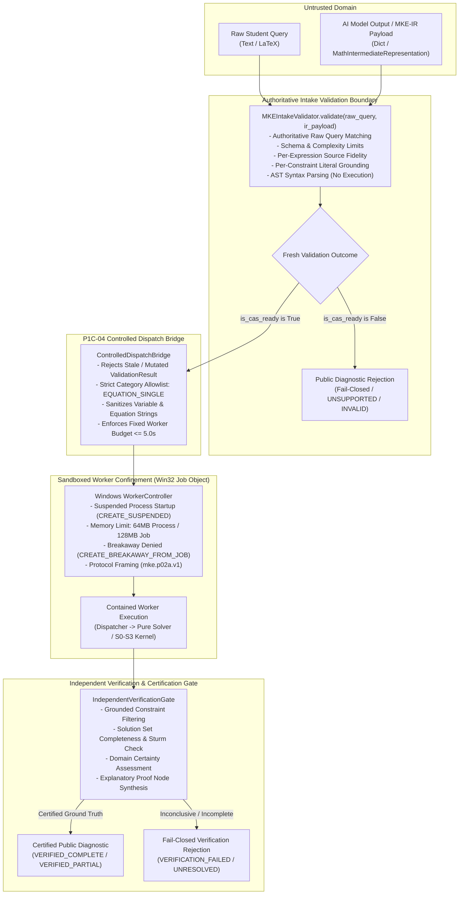
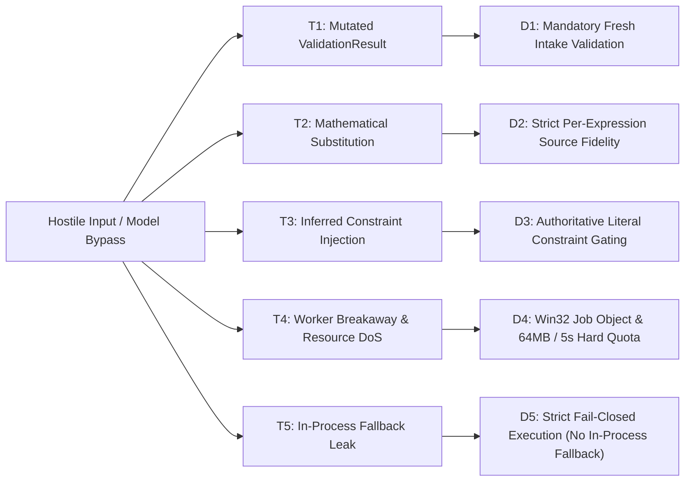
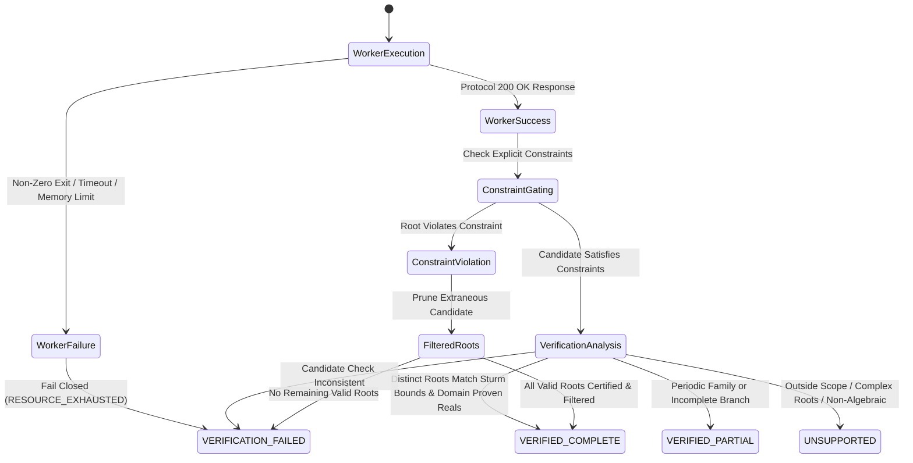

# ARCHITECTURE DESIGN & PREFLIGHT SPECIFICATION: P1C-04-A CONTROLLED CAS DISPATCH & VERIFICATION GATE

- **Milestone:** `PRODUCT-03C-P1C-04-A`
- **Document Version:** `1.0.0-PREFLIGHT`
- **Author:** Antigravity (Implementation Engineer)
- **Coordinator & Independent Auditor:** ChatGPT
- **Project Owner:** Kế Phan Hoàng
- **Repository:** `PhanHoangKe/math-knowledge-engine`
- **Working Branch:** `product/p03c-p1c-04-preflight`
- **Frozen CAS Baseline:** `v0.3.3-p03c-p1c-03-accepted-limited` (`ec9e7085d17b13ab6496a52e2f4809c318939bbd`)
- **Date:** 2026-09-29

---

## 1. Executive Summary & Objective

The primary objective of milestone **P1C-04** is to construct a **deterministic, fail-closed dispatch bridge and independent verification gate** connecting the validated mathematical intermediate representation (MKE-IR) produced by the AI intake layer to the frozen, sandboxed mathematical engine (`v0.3.3-p03c-p1c-03-accepted-limited`).

This document constitutes the **P1C-04-A Controlled Dispatch Preflight**. It establishes:
1. An empirical code audit of the existing codebase, identifying the exact boundary between validated MKE-IR and contained worker execution.
2. A strict capability and trust-boundary matrix prohibiting uncontained execution of untrusted AI inputs.
3. A comprehensive threat model addressing injection, mutation, substitution, privilege escalation, and data leakage.
4. Mathematical verification contracts defining exact conditions for `VERIFIED_COMPLETE`, `VERIFIED_PARTIAL`, and fail-closed rejections.
5. A minimal, bounded implementation proposal for the **P1C-04-B** prototype focusing strictly on single equations (`ProblemCategory.EQUATION_SINGLE` $\to$ `OperationType.SOLVE`).



---

## 2. Actual Code Audit & Inventory

An exhaustive audit of the actual repository code reveals the following component state and boundaries:

### 2.1 AI Intake Layer (`src/mke_product/ai/`)
- **`MathIntermediateRepresentation` (`src/mke_product/ai/ir.py`):**
  - Typed Pydantic v2 model under schema version `mke.ir.v1`.
  - Captures `problem_category`, `question_format`, `primary_expressions`, `target_variables`, `parameters`, `extracted_constraints`, `subparts`, `given_options`, `source_spans`, and `uncertainty_flags`.
- **`MKEIntakeValidator` (`src/mke_product/ai/validator.py`):**
  - Authoritative pre-dispatch validator. Performs strict schema validation, bracket depth checks ($\le 20$), expression length limits ($\le 1000$ chars), variable syntax checks, source-span substring offsets, exact literal constraint binding, and per-expression provenance.
  - Parses expression syntax via frozen `parse_cas_equation`, `parse_cas_expression`, etc., **without mathematical execution**.
- **`PublicValidationDiagnostic` (`src/mke_product/ai/ir.py`):**
  - Sanitized student-facing projection isolating all raw queries, caller metadata, and internal AST details.
  - Enforces schema-based field path allowlists (`ALLOWLISTED_FIXED_PATHS`, `ALLOWLISTED_INDEXED_PATH_PATTERNS`) and authoritative issue fatality (`is_authoritative_fatal_issue`).

### 2.2 Process Confinement & Worker Layer (`src/mke_product/worker/`)
- **`WorkerController` (`src/mke_product/worker/controller.py`):**
  - Windows-native process containment using Win32 Job Objects (and AppContainer isolation when available).
  - Enforces:
    - Suspended creation (`CREATE_SUSPENDED`) with pre-execution Job Object assignment.
    - Memory limits: `PROCESS_MEMORY_LIMIT_BYTES = 64 * 1024 * 1024` (64 MiB), `JOB_MEMORY_LIMIT_BYTES = 128 * 1024 * 1024` (128 MiB).
    - Breakaway prevention: `JOB_OBJECT_LIMIT_BREAKAWAY_OK` and `JOB_OBJECT_LIMIT_SILENT_BREAKAWAY_OK` explicitly cleared.
    - Termination on Job close (`JOB_OBJECT_LIMIT_KILL_ON_JOB_CLOSE`).
    - Standard handle isolation via `STARTUPINFOEXW` and `PROC_THREAD_ATTRIBUTE_HANDLE_LIST`.
    - Hard IPC timeout: default `5.0` seconds (wall-clock deadline).
- **`mke_product.worker.entrypoint` (`src/mke_product/worker/entrypoint.py`):**
  - Minimal isolated CLI worker communicating exclusively via length-prefixed stdin/stdout IPC (`IPC_HEADER_SIZE = 4` bytes, max `4096` bytes request, max `16384` bytes response).

### 2.3 Protocol & Dispatch Subsystem (`src/mke_product/protocol/`)
- **`mke.p02a.v1` Protocol Contract (`src/mke_product/protocol/schema.py`):**
  - Defines `SCHEMA_VERSION = "mke.p02a.v1"`.
  - **CRITICAL AUDIT FINDING:** `SUPPORTED_OPERATIONS = ("SOLVE", "CHECK_CANDIDATE")`.
  - **`WorkerController` strictly allowlists only `SOLVE` and `CHECK_CANDIDATE`**.
  - `dispatch_request()` in `src/mke_product/protocol/dispatcher.py` executes requests against the verified S0-S3 polynomial/rational kernel (`mke_product.solver.solver.solve_equation` and `mke_product.evaluator.evaluator.check_candidate`).

### 2.4 Multi-Engine CAS Subsystem (`src/mke_product/cas/`)
- **`EngineRouter` (`src/mke_product/cas/router.py`):**
  - Declares `OperationType` enum with 8 operations: `SOLVE`, `SIMPLIFY`, `DIFFERENTIATE`, `INTEGRATE`, `PLOT_2D`, `CHECK_CANDIDATE`, `SOLVE_SYSTEM`, `SOLVE_INEQUALITY`.
  - Routes requests across `native_algebra` (P02A S0-S3 kernel) and `sympy_cas_v0` (SymPy transcendental engine).
  - Includes `process_runner.py` with `multiprocessing.Process` supervision.
  - **CRITICAL ARCHITECTURAL CONSTRAINT:** The general `EngineRouter` cannot be invoked directly in-process for untrusted AI queries. Doing so would bypass the Windows Job Object memory/breakaway sandbox provided by `WorkerController`.

---

## 3. Capability & Trust-Boundary Matrices

### 3.1 Contained Worker Capability Matrix

| Problem Category | Target Operation | Engine Backend | Contained Worker Support | P1C-04-B Prototype Action |
| :--- | :--- | :--- | :--- | :--- |
| **`EQUATION_SINGLE`** | `SOLVE` | S0-S3 Pure Solver / Contained CAS | **Fully Supported** (via `WorkerController`) | **INCLUDED (Core Target)** |
| **`EQUATION_SINGLE`** (Validation) | `CHECK_CANDIDATE` | Evaluator / Contained CAS | **Fully Supported** (via `WorkerController`) | **INCLUDED (Candidate Gate)** |
| **`EQUATION_SYSTEM`** | `SOLVE_SYSTEM` | SymPy Adapter | **Not Supported in `WorkerController`** | **DEFERRED (Fail Closed)** |
| **`INEQUALITY_SINGLE`** | `SOLVE_INEQUALITY` | SymPy Adapter | **Not Supported in `WorkerController`** | **DEFERRED (Fail Closed)** |
| **`EXPRESSION_SIMPLIFY`** | `SIMPLIFY` | Native / SymPy Adapter | **Not Supported in `WorkerController`** | **DEFERRED (Fail Closed)** |
| **`DIFFERENTIATION`** | `DIFFERENTIATE` | SymPy Adapter | **Not Supported in `WorkerController`** | **DEFERRED (Fail Closed)** |
| **`INTEGRATION`** | `INTEGRATE` | SymPy Adapter | **Not Supported in `WorkerController`** | **DEFERRED (Fail Closed)** |
| **`PARAMETER_ANALYSIS`** | `CHECK_CANDIDATE` / `SOLVE` | Specialized Gate | **Not Supported in `WorkerController`** | **DEFERRED (Fail Closed)** |
| **`WORD_PROBLEM`** | N/A | None | **Not Supported** | **DEFERRED (Fail Closed)** |

### 3.2 Trust Boundary Enforcement Matrix

| Pipeline Stage | Input Artifact | Trust Level | Enforced Security Mechanism |
| :--- | :--- | :--- | :--- |
| **Intake Parsing** | Raw student text / JSON payload | **UNTRUSTED** | `MKEIntakeValidator.validate()` checks schema, lengths, nesting depth ($\le 20$), identifier syntax, substring spans. |
| **Dispatch Gate** | `ValidationResult` | **CONDITIONAL** | Bridge rejects any caller-supplied `ValidationResult`; always executes fresh validation against authoritative `raw_query`. |
| **Worker Dispatch** | IPC Payload (`mke.p02a.v1`) | **RESTRICTED** | `WorkerController` enforces Win32 Job Object, 64MB memory cap, 5.0s timeout, single-operation framing. |
| **Execution** | Child Worker Process | **SANDBOXED** | Isolated disposable process; breakaway denied; kill on close. |
| **Verification** | Worker Response Envelope | **UNVERIFIED OUTPUT** | `IndependentVerificationGate` evaluates solution set against explicit constraints and Sturm completeness. |
| **Public Egress** | `PublicValidationDiagnostic` / Public Result | **SANITIZED PUBLIC** | All raw queries, model messages, metadata, and filesystem paths stripped. |

---

## 4. Security Threat Model



### Threat Breakdown & Mitigations

1. **Threat T1: Fabricated or Mutated ValidationResult Bypass**
   - *Attack:* Caller instantiates `ValidationResult(is_cas_ready=True, target_operation="SOLVE")` with ungrounded expressions and invokes dispatch directly.
   - *Mitigation D1:* The dispatch entry point (`ControlledDispatchBridge.dispatch()`) **does not accept pre-constructed `ValidationResult` objects**. It accepts only `(raw_query: str, ir_payload: Union[dict, MathIntermediateRepresentation])` and always executes `MKEIntakeValidator.validate()` fresh.

2. **Threat T2: Expression or Variable Substitution Attack**
   - *Attack:* Attacker extracts $x^2 - 4 = 0$ from question text, but substitutes $x = 100$ in `primary_expressions`.
   - *Mitigation D2:* Intake validator verifies exact character start/end offsets and semantic roles (`EQUATION`). Any discrepancy marks `is_source_faithful = False` and `is_cas_ready = False`.

3. **Threat T3: Unconfirmed Inferred Constraint Bypass**
   - *Attack:* Model invents artificial constraint $x > 2$ to eliminate negative roots without student text grounding.
   - *Mitigation D3:* Inferred constraints receive `is_inferred = True` and trigger `UNCONFIRMED_INFERRED_CONSTRAINT` (severity `ERROR`), authoritatively blocking `is_cas_ready`.

4. **Threat T4: Worker Breakaway & Resource Exhaustion (DoS)**
   - *Attack:* Hostile algebraic expression designed to consume gigabytes of memory or infinite CPU loops (e.g. nested exponential towers).
   - *Mitigation D4:* Windows Job Object enforces `PROCESS_MEMORY_LIMIT_BYTES = 64MB`, `JOB_MEMORY_LIMIT_BYTES = 128MB`, and `CREATE_BREAKAWAY_FROM_JOB` is stripped. Hard wall-clock timeout of 5.0 seconds terminates the process tree with `RESOURCE_EXHAUSTED`.

5. **Threat T5: Unsafe In-Process Fallback & Data Leakage**
   - *Attack:* If worker IPC fails, system falls back to running `eval()` or in-process `sympy.solve()`, exposing master process memory.
   - *Mitigation D5:* **Zero in-process fallback permitted**. Worker failures fail closed with `EngineStatus.RESOURCE_EXHAUSTED` or `EngineStatus.INTERNAL_ERROR`. All error text is sanitized with `_sanitize_error_text()` (`[REDACTED_PATH]`).

---

## 5. Mathematical Verification Contract

The system must **never equate a worker `SUCCESS` response with mathematical completeness**. A separate verification stage is required.



### 5.1 Verification Outcome Classification

1. **`VERIFIED_COMPLETE`:**
   - Worker returned successful discrete solution set $S = \{r_1, r_2, \dots, r_k\}$.
   - All $r_i$ independently pass `CHECK_CANDIDATE` against the original AST equation ($f(r_i) = 0$).
   - Real-root completeness is verified via Sturm sequence isolation or degree-matching for polynomial/rational systems.
   - All explicit constraints (e.g. $x > 1$) are satisfied by all $r \in S$, and extraneous roots outside the domain were mathematically eliminated.
   - `domain_certainty` is `PROVEN_REALS` or `EXPLICIT_EXCLUSIONS`.

2. **`VERIFIED_PARTIAL`:**
   - Solution set represents a valid infinite periodic family (e.g. $x = \pi/6 + 2k\pi$) where only principal branches are enumerated, or conditional solutions dependent on parameter non-degeneracy.
   - Requires explicit `DomainCertainty.EXPLICIT_EXCLUSIONS`.

3. **`UNSUPPORTED`:**
   - Problem category is outside supported single-equation scope (e.g. systems, inequalities, word problems).
   - Fails closed immediately without executing CAS. `status = "UNSUPPORTED"`, `target_operation = None`.

4. **`AMBIGUOUS`:**
   - Target variable missing or multiple variables without explicit solve target.
   - Fails closed at intake validation. `status = "AMBIGUOUS"`.

5. **`VERIFICATION_FAILED`:**
   - Worker process timed out, crashed, or exceeded memory limits.
   - Candidate root failed check ($f(r) \neq 0$).
   - Solution set empty due to unresolved mathematical singularity.

---

## 6. Bounded Implementation Proposal (P1C-04-B Prototype)

### 6.1 Scope Boundary of P1C-04-B
- **Included Category:** `ProblemCategory.EQUATION_SINGLE` exclusively.
- **Included Operation:** `OperationType.SOLVE` and `OperationType.CHECK_CANDIDATE`.
- **Target Backend:** Contained Windows Worker (`WorkerController` dispatching `mke.p02a.v1` protocol).
- **Explicit Deferrals:**
  - `EQUATION_SYSTEM`, `INEQUALITY_SINGLE`, `EXPRESSION_SIMPLIFY`, `DIFFERENTIATION`, `INTEGRATION` (deferred to P1C-04-C / P1C-05).
  - Multi-part question solving automation (deferred to multi-stage pipeline).
  - External AI model calls (mock adapter only).

### 6.2 Module Design: `src/mke_product/cas/bridge.py`
The P1C-04-B prototype will introduce `ControlledDispatchBridge`:

```python
class ControlledDispatchBridge:
    """Deterministic pre-dispatch bridge connecting MKE-IR to sandboxed worker execution."""

    @classmethod
    def dispatch(
        cls,
        raw_query: str,
        ir_payload: Union[Dict[str, Any], MathIntermediateRepresentation],
        controller: Optional[WorkerController] = None,
        timeout_sec: float = 5.0,
    ) -> ControlledDispatchResult:
        """Execute authoritative intake validation followed by contained worker execution.

        Invariants:
        1. Always re-validates intake; never trusts caller-supplied ValidationResult.
        2. Fails closed immediately if is_cas_ready is False.
        3. Restricts dispatch strictly to ProblemCategory.EQUATION_SINGLE.
        4. Dispatches exclusively through Windows Job Object contained WorkerController.
        5. Performs post-execution verification gating on candidate roots.
        """
        ...
```

### 6.3 Post-Execution Verification Gate: `IndependentVerificationGate`
```python
class IndependentVerificationGate:
    """Verifies worker execution outputs against mathematical domain constraints and AST criteria."""

    @classmethod
    def verify_solution(
        cls,
        equation_ast: ASTNode,
        worker_response: Dict[str, Any],
        constraints: List[ExtractedConstraint],
    ) -> VerificationOutcome:
        ...
```

---

## 7. Acceptance & Rejection Criteria for P1C-04-B

### 7.1 Acceptance Criteria
1. **Intake Integrity:** 100% of dispatch attempts re-run `MKEIntakeValidator.validate()`. Substituted raw queries or fabricated validation results are unconditionally rejected.
2. **Worker Confinement:** 100% of mathematical solving occurs inside a Windows Job Object process with active memory ($\le 64$MB) and timeout ($\le 5.0$s) limits.
3. **Constraint Fidelity:** Roots violating explicit grounded constraints (e.g. $x = -2$ for $x > 0$) are pruned; if no roots remain or domain is violated, outcome is certified `DOMAIN_ERROR` / `VERIFICATION_FAILED`.
4. **Clean Serialization:** Public diagnostic output contains zero filesystem paths, no PII, no unapproved codes, and valid JSON.
5. **Zero Regression:** All 6 existing test suites (651 tests, 18 subtests) pass with 100% success.

### 7.2 Rejection Criteria
1. Direct in-process invocation of `sympy.solve()` or general `EngineRouter` on untrusted AI input.
2. Acceptance of pre-computed `ValidationResult` without fresh intake validation.
3. Inference of mathematical completeness merely from a worker `status = "SUCCESS"` response.
4. Modification of frozen P1B CAS or release tags.
5. Introduction of external AI provider network calls.

---

## 8. Risks, Unsupported Capabilities & Unresolved Questions

### 8.1 Identified Risks & Mitigations
- **Risk 1: Worker Protocol Payload Limit (4096 bytes):**
  - *Analysis:* Complex LaTeX expressions with many parentheses might approach byte limits.
  - *Mitigation:* Intake validator limits raw expressions to 1000 characters and bracket depth to 20, well below 4096 bytes.
- **Risk 2: Multi-Part Subpart Interaction:**
  - *Analysis:* Multi-part stems with shared initial conditions require stateful stage propagation.
  - *Mitigation:* P1C-04-B strictly handles single equations. Multi-part questions fail closed with `MULTI_PART_AWAITING_STAGE`.

### 8.2 Current Unsupported Capabilities Inventory
- Systems of equations (`EQUATION_SYSTEM`) in contained worker.
- Inequalities (`INEQUALITY_SINGLE`) in contained worker.
- Calculus operations (`DIFFERENTIATION`, `INTEGRATION`) in contained worker.
- Vietnamese natural-language word problem solving.

---

## 9. Next Steps (P1C-04-B Milestone)

Upon approval of this preflight document by the Project Owner and Independent Auditor:
1. Implement `ControlledDispatchBridge` and `IndependentVerificationGate` in `src/mke_product/cas/bridge.py`.
2. Add dedicated adversarial dispatch unit tests in `tests/test_p03c_p1c_controlled_dispatch.py`.
3. Execute the full repository verification suite and benchmark evidence runner.
4. Publish separate source and evidence commits on `product/p03c-p1c-04-preflight`.
