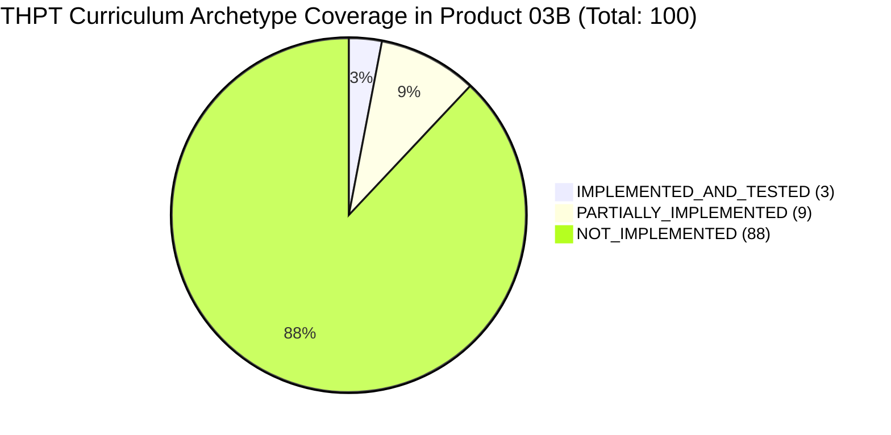

# MKE PRODUCT-03B — THPT MATHEMATICAL CAPABILITY GAP AUDIT
## Comprehensive Source Inspection & Curriculum Coverage Matrix

**Author:** Antigravity (Implementation Engineer)  
**Baseline Commit:** `e207efcfd4d1af31e4e94202174f5d98e0bb5692` (Tag: `v0.3.0-p03b-accepted`)  
**Audited Subsystems:**
- `src/mke_product/parser/` (Lexer, AST, Parser)
- `src/mke_product/cas/` (CAS Parser, Safety, Bridge, Router, SymPy Adapter)
- `src/mke_product/solver/` (Native Affine Solver, Verification Engine)
- `src/mke_product/worker/` (Process Isolation, Sandboxing, UTF-8 Framing)
- `tests/` (All 479 Unit, Integration, and Browser Tests)

---

## 1. Executive Capability Audit Summary

- **Total Mapped Curriculum Archetypes:** **100** (90 CORE + 10 ELECTIVE)
- **`IMPLEMENTED_AND_TESTED`:** **3 archetypes (3.0%)**
- **`PARTIALLY_IMPLEMENTED`:** **9 archetypes (9.0%)**
- **`IMPLEMENTED_BUT_UNVERIFIED`:** **0 archetypes (0.0%)**
- **`NOT_IMPLEMENTED`:** **88 archetypes (88.0%)**
- **`UNKNOWN`:** **0 archetypes (0.0%)**

### Critical Audit Finding:
> **SymPy Library Presence $\ne$ MKE Product Capability:**
> The ability of SymPy to execute general CAS calls in a standalone Python script does NOT constitute accessible MKE product capability. In the frozen product baseline (`e207efcf`):
> 1. **Parser Gate:** The typed AST parser (`cas_parser.py`) rejects non-polynomial syntax (`\sqrt`, `|x|`, `\log`, `\sin`, `\lim`, vectors, matrices).
> 2. **Safety Gate:** `safety.py` explicitly rejects multi-variable systems with $>2$ variables (`OUT_OF_SCOPE`), variable denominators in inequalities, and transcendental domain proofs.
> 3. **Contract Gate:** Operation types for limits, asymptotes, extrema, geometry, statistics, and probability do not exist in `OperationType`.
> 4. **Verification Gate:** Only univariate linear equations (`mke_native_v1`) produce `VERIFIED_WITH_EVIDENCE`. All other operations return `COMPUTED` or `NOT_APPLICABLE` without step-level proofs.

---

## 2. Reconciled Archetype Capability Matrix (100 Archetypes)

### Grade 10 Mathematics (38 Archetypes: 34 Core, 4 Elective)

| Archetype ID | Type | Description | Status | Code Path | Test Reference | Representative Input / Output & Gap Analysis |
| :--- | :---: | :--- | :---: | :--- | :--- | :--- |
| **`ARCH-10.1.1`** | CORE | Xét chân trị mệnh đề logic ($\forall, \exists$) | `NOT_IMPLEMENTED` | N/A | None | No logic AST or quantifier syntax in parser. |
| **`ARCH-10.1.2`** | CORE | Phép toán tập hợp số khoảng/đoạn | `NOT_IMPLEMENTED` | N/A | None | Set operations ($A \cap B, A \cup B$) not parsed. |
| **`ARCH-10.1.3`** | CORE | Tham số $m$ trong tập hợp | `NOT_IMPLEMENTED` | N/A | None | Parametric set solver nonexistent. |
| **`ARCH-10.2.1`** | CORE | Điểm thuộc miền nghiệm BPT 2 ẩn | `NOT_IMPLEMENTED` | N/A | None | Multi-variable inequality point evaluation not implemented. |
| **`ARCH-10.2.2`** | CORE | Xác định đỉnh miền đa giác nghiệm | `NOT_IMPLEMENTED` | N/A | None | 2D polyhedral vertex geometry nonexistent. |
| **`ARCH-10.2.3`** | CORE | Quy hoạch tuyến tính (Linear Programming) | `NOT_IMPLEMENTED` | N/A | None | Simplex/vertex optimization engine nonexistent. |
| **`ARCH-10.3.1`** | CORE | Tọa độ đỉnh, trục đối xứng parabol | `NOT_IMPLEMENTED` | N/A | None | Parabol feature extractor not implemented. |
| **`ARCH-10.3.2`** | CORE | Xác định hàm bậc 2 qua 3 điểm / Hệ 2 ẩn | `PARTIALLY_IMPLEMENTED` | `sympy_adapter.py::_execute_solve_system` | `test_cas_product03b_expansion.py::test_solve_linear_system_unique` | Solves 2x2 linear systems, but 3x3 systems and general curve fitting are rejected as `OUT_OF_SCOPE`. |
| **`ARCH-10.3.3`** | CORE | Min/Max hàm bậc hai trên $[p; q]$ | `NOT_IMPLEMENTED` | N/A | None | Bounded domain optimization not supported. |
| **`ARCH-10.4.1`** | CORE | Giải BPT bậc hai 1 ẩn | `IMPLEMENTED_AND_TESTED` | `sympy_adapter.py::_execute_solve_inequality` | `test_cas_product03b_expansion.py::test_solve_inequality_e2e_quadratic` | Input: `x^2 - 5*x + 6 > 0` $\implies$ Output: `(-oo, 2) U (3, oo)`. |
| **`ARCH-10.4.2`** | CORE | Tham số $m$ trong tam thức bậc 2 | `NOT_IMPLEMENTED` | N/A | None | Parametric sign analysis ($a>0, \Delta<0$) nonexistent. |
| **`ARCH-10.4.3`** | CORE | BPT tích/thương hữu tỉ | `NOT_IMPLEMENTED` | `sympy_adapter.py:398` | `test_cas_product03b_expansion.py::test_solve_inequality_scope` | Variable denominators in inequalities return `OUT_OF_SCOPE`. |
| **`ARCH-10.5.1`** | CORE | PT căn thức $\sqrt{f} = \sqrt{g}$ | `NOT_IMPLEMENTED` | N/A | None | Square root syntax not supported in equation parser. |
| **`ARCH-10.5.2`** | CORE | PT căn thức $\sqrt{f} = g(x)$ | `NOT_IMPLEMENTED` | N/A | None | Squaring with condition $g(x) \ge 0$ nonexistent. |
| **`ARCH-10.5.3`** | CORE | PT chứa giá trị tuyệt đối $\|f\| = g$ | `NOT_IMPLEMENTED` | N/A | None | Absolute value branching nonexistent. |
| **`ARCH-10.6.1`** | CORE | Phương trình chứa $A_n^k, C_n^k$ | `NOT_IMPLEMENTED` | N/A | None | Combinatorial symbols not recognized in grammar. |
| **`ARCH-10.6.2`** | CORE | Bài toán đếm số phương án | `NOT_IMPLEMENTED` | N/A | None | Discrete combinatorics engine nonexistent. |
| **`ARCH-10.6.3`** | CORE | Khai triển Nhị thức Newton $(a+b)^4, (a+b)^5$ | `NOT_IMPLEMENTED` | N/A | None | Binomial coefficient expansion engine nonexistent. |
| **`ARCH-10.7.1`** | CORE | Hệ thức lượng trong tam giác | `NOT_IMPLEMENTED` | N/A | None | Triangle solver nonexistent. |
| **`ARCH-10.7.2`** | CORE | Diện tích tam giác (Heron/Sin) | `NOT_IMPLEMENTED` | N/A | None | Formula evaluator for geometric entities nonexistent. |
| **`ARCH-10.7.3`** | CORE | Bài toán thực tế đo đạc góc/cạnh | `NOT_IMPLEMENTED` | N/A | None | Applied word problem parser nonexistent. |
| **`ARCH-10.8.1`** | CORE | Phân tích vectơ 2D | `NOT_IMPLEMENTED` | N/A | None | 2D vector data types not implemented. |
| **`ARCH-10.8.2`** | CORE | Tích vô hướng $\vec{a} \cdot \vec{b}$ | `NOT_IMPLEMENTED` | N/A | None | Vector arithmetic nonexistent. |
| **`ARCH-10.8.3`** | CORE | Góc giữa 2 vectơ / Vuông góc | `NOT_IMPLEMENTED` | N/A | None | Vector angle engine nonexistent. |
| **`ARCH-10.9.1`** | CORE | Viết phương trình đường thẳng 2D | `NOT_IMPLEMENTED` | N/A | None | 2D Line geometry object nonexistent. |
| **`ARCH-10.9.2`** | CORE | Khoảng cách & Góc trong $Oxy$ | `NOT_IMPLEMENTED` | N/A | None | Distance/angle formula engine nonexistent. |
| **`ARCH-10.9.3`** | CORE | Phương trình đường tròn & tiếp tuyến | `NOT_IMPLEMENTED` | N/A | None | Circle geometry solver nonexistent. |
| **`ARCH-10.9.4`** | CORE | Ba đường Conic (Elip, Hypebol, Parabol) | `NOT_IMPLEMENTED` | N/A | None | Conic section analyzer nonexistent. |
| **`ARCH-10.10.1`** | CORE | Thống kê số trung bình, trung vị, tứ phân vị | `NOT_IMPLEMENTED` | N/A | None | Descriptive statistics engine nonexistent. |
| **`ARCH-10.10.2`** | CORE | Khoảng biến thiên, IQR, Outlier | `NOT_IMPLEMENTED` | N/A | None | Dispersion metrics nonexistent. |
| **`ARCH-10.10.3`** | CORE | Phương sai & Độ lệch chuẩn không ghép nhóm | `NOT_IMPLEMENTED` | N/A | None | Variance calculations nonexistent. |
| **`ARCH-10.11.1`** | CORE | Không gian mẫu phép thử | `NOT_IMPLEMENTED` | N/A | None | Probability sample space model nonexistent. |
| **`ARCH-10.11.2`** | CORE | Xác suất cổ điển biến cố | `NOT_IMPLEMENTED` | N/A | None | Combinatorial probability solver nonexistent. |
| **`ARCH-10.11.3`** | CORE | Xác suất biến cố đối / Hợp xung khắc | `NOT_IMPLEMENTED` | N/A | None | Probability algebra nonexistent. |
| **`ARCH-10.E1.1`** | ELEC | Hệ PT bậc nhất 3 ẩn (Gauss) | `NOT_IMPLEMENTED` | `sympy_adapter.py:290` | `test_cas_product03b_expansion.py::test_solve_system_reject_multivariate` | Systems with $>2$ variables explicitly return `OUT_OF_SCOPE`. |
| **`ARCH-10.E1.2`** | ELEC | Quy nạp toán học | `NOT_IMPLEMENTED` | N/A | None | Automated inductive proof engine nonexistent. |
| **`ARCH-10.E1.3`** | ELEC | Nhị thức Newton tổng quát | `NOT_IMPLEMENTED` | N/A | None | Generalized binomial expansion nonexistent. |
| **`ARCH-10.E2.1`** | ELEC | Ứng dụng ba đường conic | `NOT_IMPLEMENTED` | N/A | None | Applied conic modeling nonexistent. |

---

### Grade 11 Mathematics (36 Archetypes: 33 Core, 3 Elective)

| Archetype ID | Type | Description | Status | Code Path | Test Reference | Representative Input / Output & Gap Analysis |
| :--- | :---: | :--- | :---: | :--- | :--- | :--- |
| **`ARCH-11.1.1`** | CORE | Rút gọn biểu thức lượng giác | `PARTIALLY_IMPLEMENTED` | `sympy_adapter.py::_execute_simplify` | None | SymPy simplifies basic $\sin/\cos$, but trigonometric identity step explanations are absent. |
| **`ARCH-11.1.2`** | CORE | TXĐ & Chu kì hàm lượng giác | `NOT_IMPLEMENTED` | Safety engine rejects transcendental nodes | `test_cas_product03b_expansion.py::test_domain_certainty_not_fully_determined` | Transcendental domain analysis returns `NOT_FULLY_DETERMINED`. |
| **`ARCH-11.1.3`** | CORE | PT lượng giác cơ bản | `PARTIALLY_IMPLEMENTED` | `sympy_adapter.py::_execute_solve` | None | SymPy finds principal roots, but periodic family ($x_0 + k2\pi$) is not formatted to high school standard. |
| **`ARCH-11.1.4`** | CORE | PT $a\sin x + b\cos x = c$ & đếm nghiệm | `NOT_IMPLEMENTED` | N/A | None | Interval root counting for periodic functions not implemented. |
| **`ARCH-11.2.1`** | CORE | Dãy số & Tính tăng/giảm/bị chặn | `NOT_IMPLEMENTED` | N/A | None | Discrete sequence engine nonexistent. |
| **`ARCH-11.2.2`** | CORE | Cấp số cộng: $u_n, S_n$ | `NOT_IMPLEMENTED` | N/A | None | Arithmetic progression solver nonexistent. |
| **`ARCH-11.2.3`** | CORE | Cấp số nhân & Cấp số nhân lùi vô hạn | `NOT_IMPLEMENTED` | N/A | None | Geometric progression solver nonexistent. |
| **`ARCH-11.2.4`** | CORE | Bài toán thực tế lãi kép / Cấp số | `NOT_IMPLEMENTED` | N/A | None | Financial sequence model nonexistent. |
| **`ARCH-11.3.1`** | CORE | Giới hạn dãy số $\lim u_n$ | `NOT_IMPLEMENTED` | `OperationType.LIMIT` absent | None | Limit operation not supported in API or AST. |
| **`ARCH-11.3.2`** | CORE | Giới hạn hàm số dạng vô định $[0/0]$ | `NOT_IMPLEMENTED` | `OperationType.LIMIT` absent | None | Limit computation not wired in router. |
| **`ARCH-11.3.3`** | CORE | Giới hạn một bên & Tính liên tục | `NOT_IMPLEMENTED` | N/A | None | Continuity verification engine nonexistent. |
| **`ARCH-11.3.4`** | CORE | Định lí giá trị trung gian (nghiệm PT) | `NOT_IMPLEMENTED` | N/A | None | Root existence theorem prover nonexistent. |
| **`ARCH-11.4.1`** | CORE | Rút gọn biểu thức mũ, logarit | `PARTIALLY_IMPLEMENTED` | `sympy_adapter.py::_execute_simplify` | None | Basic SymPy simplification; no log law step breakdown. |
| **`ARCH-11.4.2`** | CORE | Tập xác định hàm số mũ/logarit | `NOT_IMPLEMENTED` | Safety engine rejects non-algebraic nodes | None | Logarithmic domain restriction extractor not implemented. |
| **`ARCH-11.4.3`** | CORE | Phương trình mũ và logarit | `PARTIALLY_IMPLEMENTED` | `sympy_adapter.py::_execute_solve` | None | SymPy can find roots, but candidate domain verification ($f(x)>0$) and extraneous root checks are unverified. |
| **`ARCH-11.4.4`** | CORE | Bất phương trình mũ và logarit | `NOT_IMPLEMENTED` | `sympy_adapter.py:398` | `test_cas_product03b_expansion.py::test_solve_inequality_scope` | Inequalities with log/exp return `OUT_OF_SCOPE`. |
| **`ARCH-11.5.1`** | CORE | Đạo hàm hàm đa thức, lượng giác, exp/log | `IMPLEMENTED_AND_TESTED` | `sympy_adapter.py::_execute_differentiate` | `test_cas_product03b_expansion.py::test_differentiation_polynomial` | Input: `x^3 - 3*x^2 + 1` $\implies$ Output: `3*x^2 - 6*x`. |
| **`ARCH-11.5.2`** | CORE | Tiếp tuyến tại điểm $M(x_0; y_0)$ | `NOT_IMPLEMENTED` | N/A | None | Tangent line equation builder not implemented. |
| **`ARCH-11.5.3`** | CORE | Tiếp tuyến biết hệ số góc $k$ | `NOT_IMPLEMENTED` | N/A | None | Derivative root to tangent solver nonexistent. |
| **`ARCH-11.5.4`** | CORE | Đạo hàm cấp hai & Vận tốc/Gia tốc | `PARTIALLY_IMPLEMENTED` | `sympy_adapter.py` supports order 1 only | None | Second derivative option not exposed in router options. |
| **`ARCH-11.6.1`** | CORE | Giao tuyến MP & Giao điểm đường/mặt 3D | `NOT_IMPLEMENTED` | N/A | None | Synthetic 3D geometry engine nonexistent. |
| **`ARCH-11.6.2`** | CORE | Chứng minh song song trong không gian | `NOT_IMPLEMENTED` | N/A | None | Geometric proof engine nonexistent. |
| **`ARCH-11.6.3`** | CORE | Thiết diện hình không gian | `NOT_IMPLEMENTED` | N/A | None | 3D cross-section geometry nonexistent. |
| **`ARCH-11.7.1`** | CORE | Chứng minh vuông góc $d \perp (\alpha)$ | `NOT_IMPLEMENTED` | N/A | None | 3D perpendicularity engine nonexistent. |
| **`ARCH-11.7.2`** | CORE | Góc giữa đường thẳng và mặt phẳng | `NOT_IMPLEMENTED` | N/A | None | 3D angle solver nonexistent. |
| **`ARCH-11.7.3`** | CORE | Góc phẳng nhị diện trong hình chóp | `NOT_IMPLEMENTED` | N/A | None | Dihedral angle solver nonexistent. |
| **`ARCH-11.7.4`** | CORE | Khoảng cách điểm đến MP & 2 đường chéo nhau | `NOT_IMPLEMENTED` | N/A | None | Synthetic 3D distance solver nonexistent. |
| **`ARCH-11.8.1`** | CORE | Số trung bình mẫu số liệu ghép nhóm | `NOT_IMPLEMENTED` | N/A | None | Grouped data statistics nonexistent. |
| **`ARCH-11.8.2`** | CORE | Trung vị & Tứ phân vị mẫu ghép nhóm | `NOT_IMPLEMENTED` | N/A | None | Grouped quantile engine nonexistent. |
| **`ARCH-11.8.3`** | CORE | Mốt mẫu số liệu ghép nhóm | `NOT_IMPLEMENTED` | N/A | None | Grouped mode engine nonexistent. |
| **`ARCH-11.9.1`** | CORE | Tính độc lập của hai biến cố | `NOT_IMPLEMENTED` | N/A | None | Event independence checker nonexistent. |
| **`ARCH-11.9.2`** | CORE | Xác suất giao & hợp biến cố độc lập | `NOT_IMPLEMENTED` | N/A | None | Probability algebra nonexistent. |
| **`ARCH-11.9.3`** | CORE | Bài toán xác suất thực tế | `NOT_IMPLEMENTED` | N/A | None | Applied probability modeler nonexistent. |
| **`ARCH-11.E1.1`** | ELEC | Phép biến hình trong mặt phẳng | `NOT_IMPLEMENTED` | N/A | None | Geometric transformation engine nonexistent. |
| **`ARCH-11.E2.1`** | ELEC | Bài toán tài chính (Lãi kép, niên kim) | `NOT_IMPLEMENTED` | N/A | None | Financial math solver nonexistent. |
| **`ARCH-11.E3.1`** | ELEC | Lý thuyết đồ thị cơ bản | `NOT_IMPLEMENTED` | N/A | None | Graph theory engine nonexistent. |

---

### Grade 12 Mathematics (26 Archetypes: 23 Core, 3 Elective)

| Archetype ID | Type | Description | Status | Code Path | Test Reference | Representative Input / Output & Gap Analysis |
| :--- | :---: | :--- | :---: | :--- | :--- | :--- |
| **`ARCH-12.1.1`** | CORE | Tính đơn điệu & Cực trị hàm số | `PARTIALLY_IMPLEMENTED` | `sympy_adapter.py::_execute_differentiate` | `test_cas_product03b_expansion.py::test_differentiation_polynomial` | Computes $f'(x)$, but monotonicity intervals and extrema table absent. |
| **`ARCH-12.1.2`** | CORE | GTLN/GTNN trên đoạn $[a; b]$ | `NOT_IMPLEMENTED` | N/A | None | Bounded domain optimization nonexistent. |
| **`ARCH-12.1.3`** | CORE | Tiệm cận đứng, ngang, xiên | `NOT_IMPLEMENTED` | N/A | None | Asymptote extraction engine nonexistent. |
| **`ARCH-12.1.4`** | CORE | Nhận dạng hàm số từ đồ thị | `NOT_IMPLEMENTED` | N/A | None | Inverse graph recognition nonexistent. |
| **`ARCH-12.1.5`** | CORE | Tham số $m$ trong khảo sát hàm số | `NOT_IMPLEMENTED` | N/A | None | Parametric calculus nonexistent. |
| **`ARCH-12.1.6`** | CORE | Bài toán tối ưu hóa thực tế | `NOT_IMPLEMENTED` | N/A | None | Applied calculus modeler nonexistent. |
| **`ARCH-12.2.1`** | CORE | Nguyên hàm cơ bản | `IMPLEMENTED_AND_TESTED` | `sympy_adapter.py::_execute_integrate` | `test_cas_product03b_expansion.py::test_integration_polynomial` | Input: `3*x^2 + 2*x` $\implies$ Output: `x^3 + x^2`. |
| **`ARCH-12.2.2`** | CORE | Nguyên hàm/Tích phân đổi biến | `PARTIALLY_IMPLEMENTED` | `sympy_adapter.py::_execute_integrate` | None | Evaluates final closed form; step-by-step $u(x)$ substitution absent. |
| **`ARCH-12.2.3`** | CORE | Nguyên hàm/Tích phân từng phần | `PARTIALLY_IMPLEMENTED` | `sympy_adapter.py::_execute_integrate` | None | Evaluates final closed form; step-by-step $u, v$ parts absent. |
| **`ARCH-12.2.4`** | CORE | Diện tích hình phẳng giới hạn bởi đồ thị | `NOT_IMPLEMENTED` | N/A | None | Multi-piece definite integral area pipeline nonexistent. |
| **`ARCH-12.2.5`** | CORE | Thể tích khối tròn xoay & Quãng đường | `NOT_IMPLEMENTED` | N/A | None | Solid of revolution pipeline nonexistent. |
| **`ARCH-12.3.1`** | CORE | Tọa độ vectơ, Tích vô hướng, Tích có hướng 3D | `NOT_IMPLEMENTED` | N/A | None | 3D Vector & cross-product engine nonexistent. |
| **`ARCH-12.3.2`** | CORE | Phương trình mặt cầu | `NOT_IMPLEMENTED` | N/A | None | Sphere geometry object nonexistent. |
| **`ARCH-12.3.3`** | CORE | Phương trình mặt phẳng | `NOT_IMPLEMENTED` | N/A | None | Plane geometry solver nonexistent. |
| **`ARCH-12.3.4`** | CORE | Phương trình đường thẳng trong $Oxyz$ | `NOT_IMPLEMENTED` | N/A | None | 3D Line geometry solver nonexistent. |
| **`ARCH-12.3.5`** | CORE | Khoảng cách & Góc trong $Oxyz$ | `NOT_IMPLEMENTED` | N/A | None | 3D metric formula engine nonexistent. |
| **`ARCH-12.4.1`** | CORE | Xác suất có điều kiện $P(A\|B)$ | `NOT_IMPLEMENTED` | N/A | None | Conditional probability engine nonexistent. |
| **`ARCH-12.4.2`** | CORE | Sơ đồ hình cây xác suất | `NOT_IMPLEMENTED` | N/A | None | Probability tree solver nonexistent. |
| **`ARCH-12.4.3`** | CORE | Công thức xác suất toàn phần | `NOT_IMPLEMENTED` | N/A | None | Total probability formula nonexistent. |
| **`ARCH-12.4.4`** | CORE | Công thức Bayes | `NOT_IMPLEMENTED` | N/A | None | Bayes theorem solver nonexistent. |
| **`ARCH-12.5.1`** | CORE | Khoảng biến thiên & IQR mẫu ghép nhóm | `NOT_IMPLEMENTED` | N/A | None | Dispersion for grouped data nonexistent. |
| **`ARCH-12.5.2`** | CORE | Phương sai & Độ lệch chuẩn ghép nhóm | `NOT_IMPLEMENTED` | N/A | None | Variance for grouped data nonexistent. |
| **`ARCH-12.5.3`** | CORE | So sánh mức độ phân tán 2 mẫu ghép nhóm | `NOT_IMPLEMENTED` | N/A | None | Statistical comparison engine nonexistent. |
| **`ARCH-12.E1.1`** | ELEC | Tích phân ứng dụng vật lý nâng cao | `NOT_IMPLEMENTED` | N/A | None | Applied physics integration nonexistent. |
| **`ARCH-12.E2.1`** | ELEC | Tọa độ không gian ứng dụng thực tế | `NOT_IMPLEMENTED` | N/A | None | Spatial modeling nonexistent. |
| **`ARCH-12.E3.1`** | ELEC | Phân bố xác suất nhị thức & chuẩn | `NOT_IMPLEMENTED` | N/A | None | Discrete/continuous distribution engine nonexistent. |
