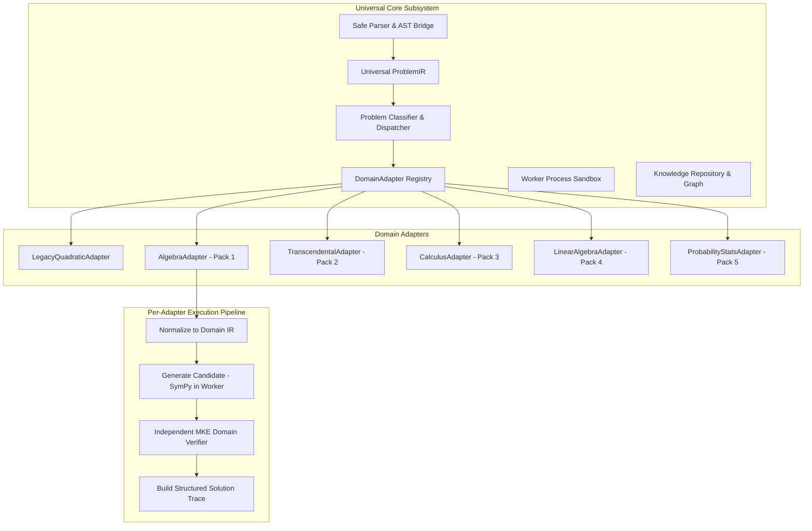
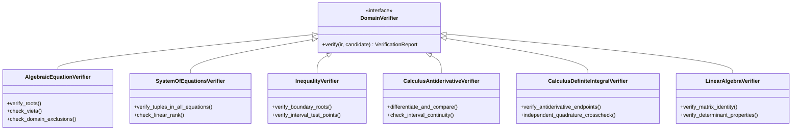
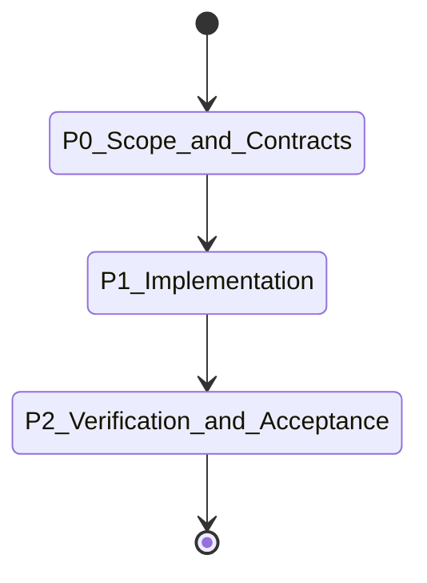

# MKE PRODUCT — THPT-COV-P0 UNIVERSAL PROBLEM IR, DOMAIN ADAPTER & COVERAGE BENCHMARK PREFLIGHT SPECIFICATION

**Document ID:** `MVP_V1_THPT_COV_P0_UNIVERSAL_COVERAGE_PREFLIGHT`  
**Revision:** R1 (Exact Contract & Source-Truth Closeout)  
**Status:** DRAFT / PROPOSED FOR INDEPENDENT AUDIT  
**Date:** 2026-10-03  
**Role:** Antigravity (“Anty”) — Implementation Engineer / Architecture Analyst  
**Coordinator / Independent Auditor:** ChatGPT  
**Project Owner:** Kế Phan Hoàng  
**Repository:** `PhanHoangKe/math-knowledge-engine`  
**Base Commit SHA:** `d0557197c84c7c7c48d62dee4433bb9eb2e62870`  
**Target Branch:** `product/thpt-cov-p0-r1-contract-closeout`  

---

## 1. Executive Decision & Strategic Context

### 1.1 Strategic Pivot
The MKE Product is expanding from a single-domain quadratic demonstrator to the **MKE THPT Hybrid Verified Coverage Engine**. The primary objective is to maximize reliable, syllabus-aligned Vietnamese high-school mathematics (THPT grades 10, 11, 12) coverage over the next 8 weeks.

### 1.2 Core Architectural Principle
> **"Reuse the mathematical breadth of SymPy; retain MKE control of mathematical trust."**

- **SymPy Role:** A fast, broad **candidate-solution generation and algebraic transformation engine**. SymPy is treated strictly as an *untrusted computational oracle*.
- **MKE Role:** The **authoritative gateway** governing safe parsing, problem classification, domain boundary enforcement, independent mathematical verification, method/pedagogical traces, knowledge linkage (theorems, formulas, tips, forms), source provenance, and fail-closed security.
- **Verification Guarantee:** No candidate solution returned by SymPy (or an LLM) is ever granted `EXACT_VERIFIED` or `SYMBOLIC_VERIFIED` status without deterministic, independent proof obligations verified by MKE.

---

## 2. Source-Truth Capability Inventory

A rigorous audit of the accepted baseline at `ebcded7234cbefdeded3276fe812f30af7ef9daa` yields the following component-level assessment:

| Component / Subsystem | Current File Path | Current Responsibility | Reusability Classification | Disposition in THPT Architecture |
| :--- | :--- | :--- | :--- | :--- |
| **AST Lexer & Parser** | `src/mke_product/parser/lexer.py`, `parser.py`, `ast.py`, `tokens.py` | Recursive descent lexer/parser for polynomial & algebraic expressions, equations, groups, powers, radicals, absolute values. | **Reusable Secure Foundation with Current Syntax Limits** | **Keep & Extend**: Exponent power currently bounded to $\{0, 1, 2\}$; functions limited to $\{\sin, \cos, \tan, \exp, \log, \ln\}$. Calculus/matrix/vector grammar to be extended incrementally in future packs. |
| **CAS AST Bridge** | `src/mke_product/cas/ast_bridge.py` | Converts validated immutable MKE AST directly into SymPy expressions via safe constructors without `eval()`/`sympify()`. | Generic / Highly Reusable | **Keep & Extend**: Extend safely to cover calculus, matrices, piecewise, trigonometric, and transcendental AST nodes. |
| **CAS Safety & Bounds** | `src/mke_product/cas/safety.py` | Input length (4096 chars), AST depth, integer bit limits (256 digits), division by zero detection, structural equality. | Generic / Highly Reusable | **Keep & Expand**: Reusable across all domain adapters. |
| **SymPy CAS Adapter** | `src/mke_product/cas/sympy_adapter.py` | Direct execution of SymPy algorithms (`SOLVE`, `SIMPLIFY`, `DIFFERENTIATE`, `INTEGRATE`, `SOLVE_SYSTEM`, `SOLVE_INEQUALITY`). | Domain-Agnostic Algorithm Set | **Refactor into Modular Candidate Engines**: Candidate routines called by DomainAdapters; output parsed into typed entities. |
| **CAS Contracts** | `src/mke_product/cas/contracts.py` | `OperationType`, `EngineStatus`, `VerificationStatus`, `ExecutionRequest`, `ExecutionResponse`. | Generic | **Keep & Modernize**: Evolve into universal `CandidateSolution` and `VerificationReport` contracts. |
| **Worker Process Controller** | `src/mke_product/worker/controller.py`, `appcontainer.py`, `win32.py`, `constants.py` | Windows Job Object & AppContainer sandbox for isolated out-of-process computation with handle quarantine. | **Accepted Windows Containment Foundation** | **Reuse Containment Implementation**: Extend protocol/allowlist incrementally under dedicated tests. |
| **Quadratic Normalizer** | `src/mke_product/application/normalizer.py` | Canonical expansion and coefficient extraction in $\mathbb{Q}[x]$ for quadratic/linear polynomials. | Quadratic/Polynomial-Specific | **Encapsulate in LegacyQuadraticAdapter**: Preserved for polynomial algebra; new normalizers operate per `ProblemKind`. |
| **Host Independent Verifier** | `src/mke_product/domain/verifier.py` | Exact rational and surd $\mathbb{Q}(\sqrt{d})$ verification for quadratics (residuals, Viète, derivative multiplicity). | Quadratic-Specific | **Keep as Quadratic Verifier**: Reference implementation for first-principles domain verifiers. |
| **Degenerate Solver/Verifier** | `src/mke_product/application/degenerate.py` | Exact solve and verification for $ax+b=0$ and $0x=c$. | Linear/Degenerate Specific | **Encapsulate in Legacy Adapter**: Preserved for $a=0$ fallback. |
| **Quadratic Orchestrator** | `src/mke_product/application/orchestrator.py` | End-to-end pipeline for quadratic equations (RAW_TEXT/COEFFICIENTS -> SolvedResponse). | Quadratic-Specific | **Wrap behind LegacyQuadraticAdapter**: Preserves existing `/api/v1/algebra/solve` routing without disruption. |
| **Method Registry & Traces** | `src/mke_product/domain/registry.py`, `src/mke_product/application/traces/` | Method assessment and step-by-step trace generation (`QUAD_FORMULA_STANDARD`, `VIETE_SUM`, etc.). | Framework Generic, Catalog Quadratic | **Keep Framework, Generalize Registry**: Extend method registry to multi-domain method catalogs. |
| **AI Intake & MKE-IR** | `src/mke_product/ai/contracts.py`, `ir.py`, `adapter.py` | Pydantic v2 schemas for raw Vietnamese student queries, problem categories, source spans, metadata. | Generic / Pedagogical | **Align with Universal ProblemIR**: Bridge validated MKE-IR into the universal `ProblemIR` pipeline. |
| **K1 Knowledge Layer** | `src/mke_product/knowledge/k1_schemas.py`, `k1_loader.py`, `data/*.json` | Immutable, verified Quick Tips and Related Problem Forms with S3 graph referential integrity. | Generic Schema Pattern | **Preserve & Park**: Retain byte-frozen datasets; design future additive domain metadata. |
| **Transport / API Routers** | `src/mke_product/transport/routers/algebra.py`, `knowledge.py` | FastAPI endpoints for `/api/v1/algebra/solve` and `/api/v1/knowledge/*`. | Protocol Generic | **Preserve Unchanged**: Zero route changes in P0/P1. |

---

## 3. Reusable-vs-Domain-Specific Matrix



| Architecture Layer | Core / Shared Components | Domain-Specific Components |
| :--- | :--- | :--- |
| **Intake & AST** | Tokenizer, recursive-descent parser, AST data classes, AST-to-SymPy bridge, input bounds check. | Domain-specific notation extensions (e.g. $\int$, $\lim$, $\det$, vectors $\vec{u}$). |
| **Intermediate Representation** | `ProblemIR` envelope, metadata, provenance, typed assumptions, variable bindings. | Discriminated problem payloads (`SingleEquationPayload`, `CalculusOperationPayload`, etc.). |
| **Classification & Dispatch** | `AdapterRegistry`, `ProblemClassifier`, capability matching, fallback policies. | Domain predicate matchers, heuristic form detectors. |
| **Candidate Generation** | Windows Job Object worker controller, IPC framing, timeout/memory bounds, SymPy safe wrapper. | SymPy algorithm invocation routines (`solveset`, `diff`, `integrate`, `linsolve`). |
| **Verification & Trust** | `VerificationReport`, `VerificationLevel`, `VerificationDisposition`, deterministic certificate hash. | Domain verifiers (e.g. residual checker, derivative/antiderivative verifier, interval sign prover). |
| **Trace & Knowledge** | `SolutionTrace`, `TraceStep`, `MethodRegistry`, `QuickTipKnowledge`, `RelatedProblemFormKnowledge`. | Domain-specific trace generators and pedagogical rules. |
| **Transport & API** | FastAPI application, rate-limiting, error sanitization, standard response serializers. | Domain-specific DTO projections (if any). |

---

## 4. Universal ProblemIR Specification

### 4.1 Root Envelope Structure
The `ProblemIR` is a typed, deeply immutable Pydantic v2 model representing an unambiguous, parsed, and validated mathematical problem. It contains a mandatory discriminated `payload` field:

```python
class ProblemIR(BaseModel):
    """Authoritative Universal Mathematical Problem Intermediate Representation."""
    model_config = ConfigDict(frozen=True, extra="forbid")

    problem_id: str = Field(..., description="Unique deterministic content-hash or UUID")
    ir_version: str = Field(default="mke.problem_ir.v1", description="Schema version")
    problem_kind: ProblemKind = Field(..., description="Discriminated mathematical problem family")
    source_input_kind: SourceInputKind = Field(..., description="Origin format: RAW_TEXT, LATEX, AST, AI_EXTRACTED")
    target: ProblemTarget = Field(..., description="Objective: SOLVE, SIMPLIFY, PROVE, COMPUTE_EXTREMA, EVALUATE")
    variables: Tuple[str, ...] = Field(default_factory=tuple, description="Primary unknown variables, e.g. ('x', 'y')")
    parameters: Tuple[str, ...] = Field(default_factory=tuple, description="Constant parameters, e.g. ('m', 'k')")
    domain_spec: DomainSpecification = Field(default_factory=DomainSpecification, description="Assumed domain: REAL, COMPLEX, INTEGER, POSITIVE_REALS")
    assumptions: Tuple[AssumptionSpec, ...] = Field(default_factory=tuple, description="Typed mathematical assumptions")
    payload: ProblemPayload = Field(..., description="Discriminated mathematical payload matching problem_kind")
    ast_payload: Optional[ASTNode] = Field(default=None, description="Typed AST tree if available")
    raw_source_text: str = Field(default="", description="Original text for provenance/display only (never parsed by math authority)")
    provenance: Optional[SourceProvenance] = Field(default=None, description="Origin citation metadata")
    normalization_trace: Tuple[str, ...] = Field(default_factory=tuple, description="Auditable record of intake transformations")
```

### 4.2 Typed Assumption Specification
Assumptions are strictly structured and never represented as free-form strings that bypass parser validation:

```python
class ConstraintRelation(str, Enum):
    EQ = "EQ"
    NEQ = "NEQ"
    LT = "LT"
    LE = "LE"
    GT = "GT"
    GE = "GE"
    IN_SET = "IN_SET"
    NOT_IN_SET = "NOT_IN_SET"


class AssumptionSpec(BaseModel):
    """Deeply immutable typed mathematical assumption/constraint."""
    model_config = ConfigDict(frozen=True, extra="forbid")

    variable: str = Field(..., min_length=1, description="Target variable or parameter identifier")
    relation: ConstraintRelation = Field(..., description="Constraint relation operator")
    bound_expression: Optional[ASTNode] = Field(default=None, description="Bound expression AST")
    target_domain: Optional[DomainCategory] = Field(default=None, description="Target set: REALS, INTEGERS, POSITIVE_REALS")
    description_vi: str = Field(default="", description="Human-readable Vietnamese description for display only")
```

### 4.3 Discriminated Payload Variants
Payloads are strongly typed with an explicit `payload_kind` discriminator. Arbitrary dictionaries (`Dict[str, Any]`) are strictly prohibited:

```python
class PayloadKind(str, Enum):
    SINGLE_EQUATION = "SINGLE_EQUATION"
    SYSTEM_OF_EQUATIONS = "SYSTEM_OF_EQUATIONS"
    SINGLE_INEQUALITY = "SINGLE_INEQUALITY"
    FUNCTION_ANALYSIS = "FUNCTION_ANALYSIS"
    CALCULUS_OPERATION = "CALCULUS_OPERATION"
    MATRIX_OPERATION = "MATRIX_OPERATION"
    GEOMETRY_COORDINATE = "GEOMETRY_COORDINATE"


class SingleEquationPayload(BaseModel):
    model_config = ConfigDict(frozen=True, extra="forbid")
    payload_kind: Literal[PayloadKind.SINGLE_EQUATION] = PayloadKind.SINGLE_EQUATION
    left: ASTNode
    right: ASTNode
    target_variable: str


class SystemOfEquationsPayload(BaseModel):
    model_config = ConfigDict(frozen=True, extra="forbid")
    payload_kind: Literal[PayloadKind.SYSTEM_OF_EQUATIONS] = PayloadKind.SYSTEM_OF_EQUATIONS
    equations: Tuple[ASTNode, ...]
    target_variables: Tuple[str, ...]


class SingleInequalityPayload(BaseModel):
    model_config = ConfigDict(frozen=True, extra="forbid")
    payload_kind: Literal[PayloadKind.SINGLE_INEQUALITY] = PayloadKind.SINGLE_INEQUALITY
    left: ASTNode
    right: ASTNode
    relation: ConstraintRelation
    target_variable: str


class FunctionAnalysisPayload(BaseModel):
    model_config = ConfigDict(frozen=True, extra="forbid")
    payload_kind: Literal[PayloadKind.FUNCTION_ANALYSIS] = PayloadKind.FUNCTION_ANALYSIS
    expression: ASTNode
    variable: str
    target_interval: Optional[IntervalSpec] = None


class CalculusOperationPayload(BaseModel):
    model_config = ConfigDict(frozen=True, extra="forbid")
    payload_kind: Literal[PayloadKind.CALCULUS_OPERATION] = PayloadKind.CALCULUS_OPERATION
    expression: ASTNode
    operation: CalculusOpKind  # DERIVATIVE, LIMIT, ANTIDERIVATIVE, DEFINITE_INTEGRAL
    variable: str
    point_or_lower_bound: Optional[ASTNode] = None
    upper_bound: Optional[ASTNode] = None


class MatrixOperationPayload(BaseModel):
    model_config = ConfigDict(frozen=True, extra="forbid")
    payload_kind: Literal[PayloadKind.MATRIX_OPERATION] = PayloadKind.MATRIX_OPERATION
    matrix_elements: Tuple[Tuple[ASTNode, ...], ...]
    operation: MatrixOpKind  # INVERSE, DETERMINANT, RANK, TRANSPOSE


class GeometryCoordinatePayload(BaseModel):
    model_config = ConfigDict(frozen=True, extra="forbid")
    payload_kind: Literal[PayloadKind.GEOMETRY_COORDINATE] = PayloadKind.GEOMETRY_COORDINATE
    dimension: int  # 2 or 3
    elements: Tuple[GeometricElementSpec, ...]
    query_target: str


ProblemPayload = Annotated[
    Union[
        SingleEquationPayload,
        SystemOfEquationsPayload,
        SingleInequalityPayload,
        FunctionAnalysisPayload,
        CalculusOperationPayload,
        MatrixOperationPayload,
        GeometryCoordinatePayload,
    ],
    Field(discriminator="payload_kind"),
]
```

---

## 5. ProblemKind Taxonomy (Vietnamese THPT Curriculum)

The conceptual taxonomy encompasses the complete scope of Vietnamese High School Mathematics (Grades 10–12):

```
ProblemKind
├── ALGEBRA
│   ├── ALGEBRA_EQUATION (Linear, Quadratic, Polynomial, Rational, Radical, Absolute Value)
│   ├── ALGEBRA_INEQUALITY (Polynomial, Rational, Radical, Absolute Value)
│   └── ALGEBRA_SYSTEM (Linear Systems, Non-linear Symmetric, Substitution Systems)
├── TRANSCENDENTAL
│   ├── EXPONENTIAL_EQUATION / EXPONENTIAL_INEQUALITY
│   ├── LOGARITHMIC_EQUATION / LOGARITHMIC_INEQUALITY
│   └── TRIGONOMETRIC_EQUATION / TRIGONOMETRIC_INEQUALITY
├── CALCULUS & ANALYSIS
│   ├── FUNCTION_ANALYSIS (Domain, Monotonicity, Extrema, Asymptotes, Convexity)
│   ├── DERIVATIVE (Rules, Chain Rule, Tangent Line Equations)
│   ├── LIMIT (At Point, One-sided, Infinite, Sequences)
│   ├── ANTIDERIVATIVE (Indefinite Integrals, Integration by Parts, Substitution)
│   ├── DEFINITE_INTEGRAL (Riemann Integrals, Fundamental Theorem of Calculus)
│   └── OPTIMIZATION (Constrained Min/Max, Word Problem Modeling)
├── LINEAR ALGEBRA & VECTORS
│   ├── COMPLEX_NUMBER (Algebraic Form, Polar/Trigonometric Form, Roots of Unity)
│   ├── MATRIX (Determinant, Inverse, Matrix Equations, Rank)
│   └── VECTOR (2D & 3D Vectors, Dot Product, Cross Product, Collinearity)
├── COORDINATE GEOMETRY
│   ├── COORDINATE_GEOMETRY_2D (Oxy: Lines, Circles, Conics)
│   └── COORDINATE_GEOMETRY_3D (Oxyz: Lines, Planes, Spheres, Distances, Angles)
├── DISCRETE MATH & DATA
│   ├── COMBINATORICS (Permutations, Combinations, Binomial Theorem)
│   ├── PROBABILITY (Classical, Conditional, Total Probability, Bayes Theorem)
│   └── STATISTICS (Mean, Variance, Standard Deviation, Quartiles)
├── HIGHER ORDER & TEXT
│   ├── WORD_PROBLEM (Real-world modeling requiring structured extraction)
│   └── GEOMETRY_TEXT (Synthetic geometry described in natural language)
└── UNKNOWN
```

---

## 6. DomainAdapter Contract

Each mathematical domain is encapsulated behind an immutable, stateless, or lifecycle-managed `DomainAdapter`:

```python
class DomainAdapter(ABC):
    """Universal contract for mathematical domain handling."""

    @property
    @abstractmethod
    def adapter_id(self) -> str:
        """Unique identifier, e.g. 'mke.adapter.calculus.v1'."""
        pass

    @property
    @abstractmethod
    def supported_problem_kinds(self) -> Set[ProblemKind]:
        """Declared problem kinds supported by this adapter."""
        pass

    @abstractmethod
    def can_handle(self, ir: ProblemIR) -> bool:
        """Predicate checking if this adapter can process the given ProblemIR."""
        pass

    @abstractmethod
    def normalize(self, ir: ProblemIR) -> ProblemIR:
        """Perform domain-specific canonical normalization on the ProblemIR."""
        pass

    @abstractmethod
    def classify(self, ir: ProblemIR) -> DomainClassification:
        """Classify sub-form, difficulty, and applicable methods."""
        pass

    @abstractmethod
    def solve_candidates(self, ir: ProblemIR, options: ExecutionOptions) -> Tuple[CandidateSolution, ...]:
        """Generate candidate solutions using SymPy/CAS via worker containment."""
        pass

    @abstractmethod
    def verify(self, ir: ProblemIR, candidate: CandidateSolution) -> VerificationReport:
        """Independently verify candidate solution using deterministic MKE logic."""
        pass

    @abstractmethod
    def build_trace(
        self,
        ir: ProblemIR,
        candidate: CandidateSolution,
        verification: VerificationReport,
        selected_method_id: Optional[str] = None
    ) -> SolutionTrace:
        """Construct structured, pedagogically sound, step-by-step solution trace."""
        pass

    @abstractmethod
    def supported_methods(self, ir: ProblemIR) -> Tuple[MethodAssessment, ...]:
        """List available pedagogical methods for this problem."""
        pass

    @abstractmethod
    def limitations(self) -> Tuple[str, ...]:
        """Document known mathematical boundaries and edge cases."""
        pass
```

*Note:* `DomainAdapter` implementations have **zero UI dependencies** and produce strictly pure data models.

---

## 7. CandidateSolution & Verification Separation

### 7.1 CandidateSolution Contract (Deeply Immutable)
`CandidateSolution` represents untrusted output generated by SymPy or an algorithmic engine. It explicitly **does not imply truth**.

```python
class CandidateMetadata(BaseModel):
    """Deeply immutable typed metadata for candidate generation."""
    model_config = ConfigDict(frozen=True, extra="forbid")
    engine_version: str = ""
    transformation_steps: Tuple[str, ...] = Field(default_factory=tuple)
    flags: Tuple[Tuple[str, str], ...] = Field(default_factory=tuple)


class CandidateSolution(BaseModel):
    """Untrusted candidate solution generated by CAS or computational oracle."""
    model_config = ConfigDict(frozen=True, extra="forbid")

    candidate_id: str
    generator_engine: str  # e.g. "sympy.solveset", "sympy.integrate"
    raw_symbolic_output: str = Field(..., description="Diagnostic/audit log string ONLY. NEVER reparsed as authoritative math input.")
    parsed_entities: Tuple[SymbolicEntity, ...] = Field(..., description="Authoritative structured roots, intervals, matrices consumed by verifier.")
    assumptions_used: Tuple[str, ...] = Field(default_factory=tuple)
    execution_time_ms: float = Field(default=0.0, ge=0.0)
    metadata: CandidateMetadata = Field(default_factory=CandidateMetadata)
```

**Diagnostic-Only Raw CAS Output Rule:**  
`CandidateSolution.raw_symbolic_output` exists purely for auditing, diagnostics, and debugging.  
**STRICT PROHIBITION:** Downstream verifiers MUST NEVER call `sympy.sympify(raw_symbolic_output)` or `parse_expr(raw_symbolic_output)`. Verification routines strictly inspect `parsed_entities`.

### 7.2 VerificationReport Contract & Explicit Disposition
To eliminate boolean ambiguity and prevent contradictions, `VerificationReport` uses an explicit `VerificationDisposition`:

```python
class VerificationDisposition(str, Enum):
    ACCEPTED = "ACCEPTED"        # Result passed all required obligations
    PARTIAL = "PARTIAL"          # Valid partial/subdomain claim; incomplete
    REJECTED = "REJECTED"        # Candidate proved mathematically false or invalid
    UNSUPPORTED = "UNSUPPORTED"  # System cannot verify obligations


class VerificationReport(BaseModel):
    """Deterministic, independent verification outcome produced by MKE."""
    model_config = ConfigDict(frozen=True, extra="forbid")

    verification_id: str
    verifier_name: str  # e.g. "MKE_ALGEBRAIC_RESIDUAL_VERIFIER_V1"
    verification_level: VerificationLevel
    disposition: VerificationDisposition
    proof_obligations: Tuple[ProofObligationResult, ...]
    identities_checked: Tuple[str, ...] = Field(default_factory=tuple)
    counterexamples: Tuple[str, ...] = Field(default_factory=tuple)
    residual_evaluations: Tuple[ResidualCheck, ...] = Field(default_factory=tuple)
    domain_boundary_checks: Tuple[DomainCheck, ...] = Field(default_factory=tuple)
    certificate_hash: str = Field(..., description="Deterministic unkeyed SHA-256 integrity fingerprint")
    details: str = ""
```

### 7.3 SolutionTrace Contract
```python
class SolutionTrace(BaseModel):
    """Pedagogical, step-by-step explanation trace."""
    model_config = ConfigDict(frozen=True, extra="forbid")

    trace_id: str
    method_id: str
    method_name: I18nText
    steps: Tuple[TraceStep, ...]
    conclusion: I18nText
    verification_summary: VerificationSummary
```

---

## 8. VerificationLevel Semantics & Legal Truth Table

### 8.1 Exact Verification Level Definitions
The verification taxonomy consists of exactly 5 levels (no `UNRESOLVED` level):

| Level | Formal Definition | Criteria for Assignment |
| :--- | :--- | :--- |
| `EXACT_VERIFIED` | Exact mathematical truth over exact algebraic field (e.g. $\mathbb{Q}, \mathbb{Q}(\sqrt{d})$) with full completeness proof. | 1. All candidate roots satisfy exact residual $\equiv 0$.<br>2. Multiplicities verified via derivatives or factorization.<br>3. Completeness proven (degree bound / Fundamental Theorem of Algebra).<br>4. Domain boundary conditions strictly satisfied. |
| `SYMBOLIC_VERIFIED` | Symbolic equivalence verified via exact algebraic or calculus identities. | 1. Indefinite integrals: $\frac{d}{dx} F(x) \equiv f(x)$ over common domain.<br>2. Derivatives: $g(x) - f'(x) \equiv 0$ via canonical zero-testing.<br>3. Matrix inverses: $A \cdot A^{-1} = I$ and $A^{-1} \cdot A = I$.<br>4. Trig identities: exact reduction to zero. |
| `CROSS_CHECKED` | Candidate reproduced across multiple distinct deterministic algorithms or symbolic/numeric checks. | 1. Dual-method consistency (e.g. algebraic solve + numerical interval bisection).<br>2. No formal completeness proof available, but candidate points verified without contradiction. |
| `PARTIAL` | Result is mathematically valid over a sub-domain, or partial roots/branches found, but full completeness/boundary proof is missing. | 1. Candidate is a valid root/antiderivative on an open interval, but boundary points or secondary branches remain unproved.<br>2. Never presented as complete truth. |
| `UNSUPPORTED` | System cannot make a mathematically sound, verifiable claim. | 1. Problem outside domain boundary.<br>2. Resource limit exceeded.<br>3. Solver timed out or verification failed closed. |

### 8.2 Legal Verification Combinations (Truth Table)
The following state combinations are strictly enforced:

| Verification Level | Permitted Dispositions | Meaning / User-Facing Presentation | Contradictory / Forbidden Combinations |
| :--- | :--- | :--- | :--- |
| `EXACT_VERIFIED` | `ACCEPTED` | Complete exact proof; fully verified solution. | `EXACT_VERIFIED` + `REJECTED`, `EXACT_VERIFIED` + `UNSUPPORTED` |
| `SYMBOLIC_VERIFIED`| `ACCEPTED` | Complete symbolic equivalence verified. | `SYMBOLIC_VERIFIED` + `REJECTED`, `SYMBOLIC_VERIFIED` + `UNSUPPORTED` |
| `CROSS_CHECKED` | `ACCEPTED` | Weaker cross-checked claim (reproduced across oracles). If oracles disagree, candidate is `REJECTED`. | `CROSS_CHECKED` + `REJECTED` (must drop to `UNSUPPORTED` / `REJECTED`) |
| `PARTIAL` | `PARTIAL` | Valid sub-domain result; unproved obligations explicitly listed. | `PARTIAL` + `ACCEPTED` (cannot claim full acceptance) |
| `UNSUPPORTED` | `UNSUPPORTED`, `REJECTED` | No claim made; capability boundary or rejected candidate. | `UNSUPPORTED` + `ACCEPTED`, `UNSUPPORTED` + `PARTIAL` |

---

## 9. False-Verified Safety Gate

$$\text{FALSE\_VERIFIED\_COUNT} = 0 \quad \text{on all locked benchmark suites (Release Blocker)}$$

- **Explicit Definition:**
  $$\text{FALSE\_VERIFIED\_COUNT} = \text{COUNT}\left( \text{level} \in \{\text{EXACT\_VERIFIED}, \text{SYMBOLIC\_VERIFIED}\} \land \text{is\_incorrect\_or\_incomplete}(\text{response}) \right)$$
- **Enforcement:** If any benchmark run or test suite produces $\text{FALSE\_VERIFIED\_COUNT} > 0$, CI/CD fails immediately and release is blocked.

---

## 10. SymPy Capability & Reliability Matrix

| SymPy Module / Function | Candidate Use Case | Known Failure Modes / Risks | Expected Result Classes | Resource Risk | Required MKE Verifier |
| :--- | :--- | :--- | :--- | :--- | :--- |
| `solveset` | Univariate algebraic & transcendental equations | Returns unevaluated `ConditionSet`; may miss periodic roots if domain not set. | `FiniteSet`, `Interval`, `Union`, `ConditionSet` | Medium | Exact algebraic substitution + domain boundary check. |
| `solve` | Systems, algebraic equations | May introduce extraneous roots through squaring; may drop roots in non-polynomial cases. | `list[Expr]`, `list[dict]` | High | Substitute all candidate solutions into *every* original equation. |
| `linsolve` | Linear systems ($n \times m$) | Rank deficiency handling may return parametric sets that need domain restriction. | `FiniteSet` of tuples | Low | Matrix residual $A x - b = 0$ + rank verification. |
| `nonlinsolve` | Non-linear systems | High risk of timeout or complex-field extraneous roots. | `FiniteSet` of tuples | Critical | Strict time budget + multivariate substitution verifier. |
| `reduce_inequalities` | Univariate inequalities | Branch cuts on radical/logarithmic expressions can be fragile. | `Or`, `And`, `Relational` | Medium | Boundary point verification + test point evaluation in open intervals. |
| `diff` | Differentiation | Relatively robust; can produce unsimplified expressions. | `Expr` | Low | Canonical algebraic zero-testing against candidate. |
| `limit` | Limits of functions | Can fail or oscillate on essential singularities; Gruntz algorithm can hang. | `Expr`, `oo`, `-oo` | Medium | Dual-sided limit evaluation + series expansion cross-check. |
| `integrate` | Antiderivatives & Definite Integrals | Risch algorithm may fail on elementary functions; definite integrals may miss branch singularities. | `Expr`, `Integral` | High | Differentiate candidate $\frac{d}{dx}F(x) - f(x) \equiv 0$; check continuity over interval. |
| `Matrix` ops | Inverses, determinants, eigenvalues | Polynomial characteristic equations can blow up for $n \ge 4$. | `Matrix`, `Expr` | Low | $A \cdot A^{-1} = I$, $\det(A)$ via cofactor/Gaussian reduction double-check. |
| `stats` / `combinatorics` | Permutations, combinations, distributions | Combinatorial explosion on large integers. | `Integer`, `Rational` | Low | Bit-length checks, exact factorial arithmetic. |

---

## 11. Safe CAS Boundary & Security Architecture

### 11.1 Absolute Prohibition of Untrusted Evaluation
```python
# STRICT SECURITY PROHIBITION — ZERO EXCEPTIONS
# The following calls are completely forbidden on untrusted text:
# eval(user_text)
# exec(user_text)
# sympy.sympify(user_text)
# sympy.parsing.sympy_parser.parse_expr(user_text)
```

### 11.2 Validated Pipeline
```
User String / Math Input
  │
  ▼
1. Lexer & Parser (Strict Grammar, Character & Depth Bounded)
  │
  ▼
2. Validated MKE AST (Immutable, Strongly Typed)
  │
  ▼
3. Safe AST Bridge (`ast_to_sympy` with explicit object constructors: `sympy.Add`, `sympy.Symbol(real=True)`, etc.)
  │
  ▼
4. Windows Job Object Isolated Worker (Process/Memory Sandbox)
```

---

## 12. Resource Bounding & Process Isolation (Worker Source Truth)

### 12.1 Accepted Source-Truth Constants (`src/mke_product/worker/constants.py`)
- **Process Memory Limit:** `PROCESS_MEMORY_LIMIT_BYTES = 256 * 1024 * 1024` (256 MB per process)
- **Job Object Memory Limit:** `JOB_MEMORY_LIMIT_BYTES = 512 * 1024 * 1024` (512 MB per job object)
- **Default Worker Timeout:** `DEFAULT_WORKER_TIMEOUT_SEC = 10.0` (10.0 seconds)
- **IPC Max Request Buffer:** `IPC_MAX_REQUEST_BYTES = 4096` (4 KB)
- **IPC Max Response Buffer:** `IPC_MAX_RESPONSE_BYTES = 16384` (16 KB)

### 12.2 Operation Allowlist & Extension Plan
- **Current Worker Controller Allowlist (`controller.py`):**
  $$\text{ALLOWED\_OPERATIONS} = \{\text{"SOLVE"}, \text{"CHECK\_CANDIDATE"}, \text{"SOLVE\_QUADRATIC"}, \text{"SOLVE\_QUADRATIC\_SURD"}\}$$
- **SymPy Adapter Vocabulary:** Exposes `SIMPLIFY`, `DIFFERENTIATE`, `INTEGRATE`, `SOLVE_SYSTEM`, `SOLVE_INEQUALITY`.
- **Architectural Policy:** The worker containment implementation is an *accepted Windows containment foundation*. It will be reused directly, and its protocol/operation allowlist will be **extended incrementally under dedicated tests** as each coverage pack is implemented.

---

## 13. Domain-Specific Verification Matrix



### Verification Obligations by Family
1. **Algebraic Equations ($P(x) = 0$):**
   - Candidate roots $r_i$ substituted into exact AST; residual $P(r_i) == 0$.
   - Check $r_i$ against original domain restrictions (denominators $\ne 0$, radicands $\ge 0$).
   - Degree bound checking for completeness proof.
2. **Algebraic Systems ($\{f_i(x_1, \dots, x_n) = 0\}$):**
   - Substitute candidate solution tuple $(v_1, \dots, v_n)$ into every equation $f_i$; verify all residuals $\equiv 0$.
   - For linear systems, check $\text{rank}(A) == \text{rank}(A|b) == n$.
3. **Inequalities ($f(x) \ge 0$):**
   - Verify boundary points solve $f(x) = 0$ or are domain poles.
   - Sample deterministic test points within each partitioned open interval $(a_k, a_{k+1})$ to prove sign constancy.
4. **Derivatives ($g(x) = \frac{d}{dx}f(x)$):**
   - Compute formal derivative via internal rule engine; test algebraic zero equivalence $g(x) - f'(x) \equiv 0$.
5. **Antiderivatives ($\int f(x)dx = F(x) + C$):**
   - Compute $\frac{d}{dx}F(x)$ and prove $\frac{d}{dx}F(x) - f(x) \equiv 0$ over maximal continuity domain.
6. **Definite Integrals ($\int_a^b f(x)dx = I$):**
   - Verify antiderivative $F(x)$; verify $F(b) - F(a) == I$.
   - Verify $f(x)$ has no essential singularities/poles in $[a, b]$.
7. **Matrix Inversion ($B = A^{-1}$):**
   - Compute exact matrix products $A \cdot B$ and $B \cdot A$; assert both equal Identity matrix $I_n$.

---

## 14. Word Problem & LLM Policy

```
Natural Language Math Problem (Vietnamese)
  │
  ▼
[Optional LLM Extraction Service]
  │ (Extracts: target_vars, constraints, equations, problem_kind)
  ▼
Structured MKE-IR Payload
  │
  ▼
[Authoritative MKE Validator]
  ├── Syntax & Grammar Check
  ├── Variable Consistency Check
  ├── Constraint Disjointness Check
  └── Provenance Span Alignment Check
  │
  ├─ Valid? ──► Forwarded to Universal ProblemIR -> MKE Solver & Verifier
  │
  └─ Invalid / Ambiguous? ──► Fail closed; emit PARTIAL / UNSUPPORTED
```

- **LLM is Strictly an Extraction & Explanation Assistant:** LLM output is untrusted input.
- **Zero Required Runtime Dependency:** Core text-symbolic mathematics executes 100% deterministically without an LLM when inputs are structured mathematical expressions or equations.
- **Verification Rule:** If an extracted `ProblemIR` cannot be validated against the raw text or requires unverified assumptions, verification level cannot exceed `PARTIAL`.

---

## 15. Secondary Oracle Policy

- **P0 / Pack 0 Scope:** SymPy is the sole primary candidate engine. Zero additional CAS runtime dependencies are added.
- **Future Oracles (Evaluation Only):**
  - *Maxima:* Potential future benchmark audit/cross-checking oracle (Pack 7+).
  - *Lean 4 / Mathlib:* Reserved for formal theorem proving research; not a production dependency.
  - *GeoGebra:* Deferred to dynamic geometry evaluation.

---

## 16. MKE THPT Coverage Benchmark Schema

```python
class ExpectedAnswerType(str, Enum):
    FINITE_SET = "FINITE_SET"
    INTERVAL_SET = "INTERVAL_SET"
    EXPRESSION = "EXPRESSION"
    SCALAR = "SCALAR"
    TUPLE_SET = "TUPLE_SET"
    MATRIX = "MATRIX"
    BOOLEAN = "BOOLEAN"
    STATISTICAL_VALUE = "STATISTICAL_VALUE"
    STRUCTURED = "STRUCTURED"


class BenchmarkRightsStatus(str, Enum):
    PROJECT_AUTHORED = "PROJECT_AUTHORED"
    OPEN_LICENSED = "OPEN_LICENSED"
    PUBLIC_DOMAIN_CONFIRMED = "PUBLIC_DOMAIN_CONFIRMED"
    PERMISSION_GRANTED = "PERMISSION_GRANTED"
    SOURCE_LOCATOR_ONLY = "SOURCE_LOCATOR_ONLY"


class BenchmarkCase(BaseModel):
    """Authoritative schema for THPT coverage benchmark evaluation."""
    model_config = ConfigDict(frozen=True, extra="forbid")

    case_id: str = Field(..., description="Unique case identifier, e.g. 'THPT_ALG_POLY_0042'")
    benchmark_version: str = Field(default="1.0.0")
    grade_band: GradeBand  # GRADE_10, GRADE_11, GRADE_12, NATIONAL_EXAM
    domain: BenchmarkDomain  # ALGEBRA, CALCULUS, GEOMETRY, DISCRETE, TRANSCENDENTAL
    family: str  # e.g. "RADICAL_EQUATION"
    subfamily: str  # e.g. "SQRT_LINEAR_EQ_LINEAR"
    source_type: BenchmarkSourceType  # OFFICIAL_PUBLIC, OPEN_LICENSED, PROJECT_AUTHORED, DERIVED_METAMORPHIC
    source_locator: str  # Exact citation (e.g. "De_Thi_TN_THPT_2024_Ma_101_Cau_35")
    rights_status: BenchmarkRightsStatus
    input_mode: InputMode  # RAW_TEXT, LATEX, STRUCTURED_IR
    problem_text: str
    structured_problem: Optional[ProblemIR] = None
    expected_answer: ExpectedAnswerSpec
    expected_answer_type: ExpectedAnswerType
    expected_domain: str
    required_verification_obligations: Tuple[str, ...]
    split: BenchmarkSplit  # DEV, HOLDOUT, ADVERSARIAL
    difficulty: DifficultyLevel  # EASY, MEDIUM, HARD, OLYMPIAD
    tags: Tuple[str, ...]
```

---

## 17. Benchmark Split & Sourcing Policy

### 17.1 Splits
- **`DEV` Split (~40% of cases):** Open for iterative engineering, regression testing, and local adapter development.
- **`HOLDOUT` Split (~40% of cases):** Hash-locked and immutable. **Never inspected during prompt or algorithm tuning.** Used solely for blind evaluation.
- **`ADVERSARIAL` Split (~20% of cases):** Dedicated stress tests targeting edge cases:
  - Extraneous root traps (squaring equations without domain checks).
  - Non-real roots and branch singularities.
  - Rational function poles ($0/0$ or $c/0$).
  - High degree polynomial explosions ($x^{100} - 1 = 0$).
  - Undefined operations ($\log(x)$ at $x \le 0$).

### 17.2 Sourcing & Rights Policy
- **Permitted Sources:** Official public national exams (BGD&ĐT đề thi công khai), open educational repositories, project-authored parametric generators, and metamorphic permutations.
- **Rights Separation:** Source availability is strictly separated from licensing. If reuse rights are uncertain, the benchmark stores `SOURCE_LOCATOR_ONLY` and uses project-authored or metamorphic structured representations rather than claiming an open license.

---

## 18. Benchmark Metrics & Success Criteria

### 18.1 Formal Metric Definitions
All rates are calculated with the denominator equal to the **total count of eligible benchmark cases ($N$)**:

$$\text{OVERALL\_CORRECT\_RATE} = \frac{\text{Count of Correct Responses}}{N}$$

$$\text{VERIFIED\_CORRECT\_RATE} = \frac{\text{Count of Correct Responses with level } \in \{\text{EXACT\_VERIFIED}, \text{SYMBOLIC\_VERIFIED}\}}{N}$$

$$\text{EXACT\_VERIFIED\_RATE} = \frac{\text{Count with level } == \text{EXACT\_VERIFIED}}{N}$$

$$\text{SYMBOLIC\_VERIFIED\_RATE} = \frac{\text{Count with level } == \text{SYMBOLIC\_VERIFIED}}{N}$$

$$\text{CROSS\_CHECKED\_RATE} = \frac{\text{Count with level } == \text{CROSS\_CHECKED}}{N}$$

$$\text{PARTIAL\_RATE} = \frac{\text{Count with level } == \text{PARTIAL}}{N}$$

$$\text{UNSUPPORTED\_RATE} = \frac{\text{Count with level } == \text{UNSUPPORTED}}{N}$$

$$\text{COVERAGE\_RATE} = \frac{N - \text{COUNT}(\text{level} == \text{UNSUPPORTED})}{N}$$

$$\text{FALSE\_VERIFIED\_COUNT} = \text{COUNT}\left( \text{level} \in \{\text{EXACT\_VERIFIED}, \text{SYMBOLIC\_VERIFIED}\} \land \text{is\_incorrect\_or\_incomplete}(\text{response}) \right)$$

### 18.2 8-Week Benchmark Targets (Computational THPT Suite)
- **Overall Correctness Target:** $\ge 90\%$
- **Verified Correctness Stretch Target:** $\ge 80\%$
- **Safety Gate:** $\text{FALSE\_VERIFIED\_COUNT} = 0$ (Zero tolerance / Release blocker)
- **Latency Budget:** $\text{Median} \le 150\text{ms}$, $\text{P95} \le 800\text{ms}$.

---

## 19. 8-Week Coverage Pack Roadmap

```
Week 1       Week 2-3      Week 4        Week 5-6      Week 7        Week 8
[PACK 0] ──► [PACK 1] ──► [PACK 2] ──► [PACK 3] ──► [PACK 4-5] ──► [PACK 6-7]
Core &       Algebra &     Transcen-     Calculus &    Linear Alg &  Word Problems
Harness      Systems       dental        Analysis      Probability   & Review
```

- **PACK 0 (Week 1): Universal Core & Benchmark Skeleton**
  - Universal `ProblemIR` and `DomainAdapter` interfaces.
  - `LegacyQuadraticAdapter` facade preserving current functionality.
  - Benchmark runner and harness models.
- **PACK 1 (Weeks 2–3): Comprehensive THPT Algebra**
  - Polynomials, rational equations, radical equations, absolute values, systems, polynomial/rational inequalities.
- **PACK 2 (Week 4): Transcendental Equations & Inequalities**
  - Exponential ($a^{f(x)} = b$), logarithmic ($\log_a f(x) = b$), basic trigonometric equations.
- **PACK 3 (Weeks 5–6): THPT Calculus & Function Analysis**
  - Limits, derivatives, monotonicity, extrema, asymptotes, antiderivatives, definite integrals.
- **PACK 4 (Week 7): Complex Numbers, Linear Algebra & Geometry (Oxy/Oxyz)**
  - Complex arithmetic, $2\times 2$ and $3\times 3$ matrices, vectors, plane and line equations.
- **PACK 5 (Week 7): Combinatorics, Probability & Statistics**
  - Combinations, permutations, binomial theorem, standard probability models.
- **PACK 6 (Week 8): Word Problem Structured Extraction**
  - Validation bridge from natural-language word problems to `ProblemIR`.
- **PACK 7 (Week 8): Synthetic Text Geometry & Residual Coverage**
  - Text-based geometric solvers and final 8-week benchmark audit.

---

## 20. Three-Stage Domain Expansion Template

Every future pack executes a standard 3-stage lifecycle:



1. **Phase P0 (Preflight & Contract):**
   - Scope definition, `ProblemKind` sub-types, benchmark case dataset (DEV + locked HOLDOUT).
2. **Phase P1 (Implementation):**
   - Implement `DomainAdapter`, safe AST conversions, candidate solver routines, and independent MKE verifier.
3. **Phase P2 (Verification & Benchmark Acceptance):**
   - Execute benchmark suite, audit $\text{FALSE\_VERIFIED} == 0$, verify latency metrics, and freeze pack release.

---

## 21. Existing Quadratic & Knowledge Layer Migration

### 21.1 Legacy Quadratic Facade
The existing quadratic engine in `src/mke_product/application/orchestrator.py`, `normalizer.py`, `verifier.py`, and `traces/` will remain completely functional:
- A `LegacyQuadraticAdapter` will implement `DomainAdapter` and delegate directly to `QuadraticOrchestrator`.
- `/api/v1/algebra/solve` will remain 100% backward compatible without breaking changes.

### 21.2 K1 Knowledge Layer Integration
- The accepted K1 datasets (`tips.json`, `problem_forms.json`) and loader (`k1_loader.py`) remain locked and frozen.
- In future packs, `QuickTipKnowledge` and `RelatedProblemFormKnowledge` will gain multi-domain categorization fields (e.g. `domain: DomainCategory`, `problem_kinds: Tuple[ProblemKind, ...]`) through non-breaking additive updates.

---

## 22. API Strategy & Frontend Policy

### 22.1 API Strategy Comparison & Recommendation
- **Option A:** Legacy `POST /api/v1/algebra/solve` + new `POST /api/v1/math/solve`.
- **Option B:** New versioned `POST /api/v2/math/solve`.
- **Option C:** Internal universal application service first; transport route introduced in later coverage packs.
- **Recommendation:** **Option C $\to$ Option A Strategy**. In P1, build the pure internal `UniversalApplicationService` without altering transport routes. In Pack 1, expose `POST /api/v1/math/solve` alongside legacy `/api/v1/algebra/solve`. Zero public routes will be added or modified in P0 or P1.

### 22.2 Frontend Freeze
- `src/frontend/` remains **100% frozen**.
- Coverage engine expansion is backend-first. The user interface will not be modified during Pack 0 through early coverage packs.

---

## 23. Risks & Mitigations

| Risk Identified | Severity | Mitigation Strategy |
| :--- | :--- | :--- |
| **SymPy Performance Explosion** | High | Strict Windows Job Object memory (512MB job / 256MB process) and timeout (10.0s default / tighter per-operation) bounds; immediate process kill and fallback to `UNSUPPORTED`. |
| **Extraneous Roots from CAS** | High | Mandatory independent substitution of candidate solutions into the *original unsimplified* equation AST. |
| **Domain Boundary Violations** | High | Static domain restrictions extracted from AST (denominators, logarithms, radicals) checked before verification. |
| **LLM Hallucinations** | Medium | LLM is strictly an intake parser; extracted IR is mathematically validated and deterministically solved. |
| **Benchmark Overfitting** | High | Strict cryptographic hash locking of `HOLDOUT` split prior to pack implementation; zero tuning on holdouts. |

---

## 24. Explicit Non-Goals (P0 Guardrails)

The following anti-patterns are explicitly rejected:
1. ❌ **"Solve all THPT math in one generic SymPy call"** — Rejected because SymPy lacks domain context, pedagogical traces, and Vietnamese curriculum alignment.
2. ❌ **"LLM answers are verified because they look correct"** — Rejected because LLMs hallucinate calculations; MKE verification requires deterministic proof.
3. ❌ **"SymPy output equals authoritative truth"** — Rejected; SymPy is strictly an untrusted candidate solver.
4. ❌ **"One universal verifier works for every domain"** — Rejected; each mathematical domain requires specific algebraic/analytic proof obligations.
5. ❌ **"Support claim based on a single happy-path example"** — Rejected; coverage requires comprehensive benchmark pass rates.
6. ❌ **"Accuracy measured only among attempted cases"** — Rejected; unsupported problems count toward the total denominator.
7. ❌ **"Rewrite all accepted quadratic infrastructure"** — Rejected; existing quadratic code is preserved via adapter facade.

---

## 25. Scope Boundary & Invariants for THPT-COV-P1

### 25.1 Exact P1 Implementation Scope
**THPT-COV-P1 is strictly scoped to Core Infrastructure:**
- Create `ProblemIR` with discriminated `ProblemPayload` variants.
- Create `ProblemKind` and common core enums (`ExpectedAnswerType`, `VerificationDisposition`, `VerificationLevel`).
- Create deeply immutable `CandidateSolution` (with typed metadata).
- Create `VerificationReport` with disposition truth table enforcement.
- Create `SolutionTrace` transport-neutral contracts.
- Create `DomainAdapter` interface and `AdapterRegistry`.
- Implement `LegacyQuadraticAdapter` facade wrapping existing quadratic services.
- Create `BenchmarkCase` schema and runner harness skeleton.
- **NO new mathematical domains in P1.**
- **NO public universal API in P1.**
- **NO worker operation expansion in P1.**
- **NO parser grammar expansion in P1.**
- **NO SymPy feature expansion in P1.**
- **NO K1 dataset modifications in P1.**
- **NO frontend changes in P1.**

### 25.2 Mandatory P1 Immutability & Safety Test Invariants
P1 test suites must prove:
1. Tuple collections cannot be mutated in place after construction.
2. Zero mutable `dict` or `list` instances inside frozen authoritative models.
3. `ProblemIR` discriminator consistency: mismatched `problem_kind` and `payload.payload_kind` are rejected fail-closed.
4. Raw CAS output is never parsed as authoritative math input.
5. Contradictory verification level/disposition pairs are rejected.
6. `BenchmarkCase` structured input is strongly typed and frozen.
7. `LegacyQuadraticAdapter` produces identical outputs to `QuadraticOrchestrator` on baseline test matrices.

---

**END OF SPECIFICATION — READY FOR INDEPENDENT AUDIT**
