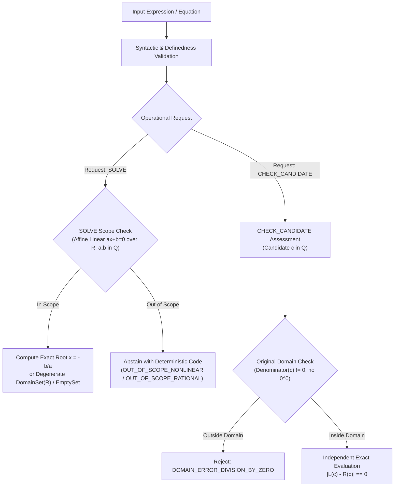

# PRODUCT-01 Product Requirements Document: Math Knowledge Engine (MKE)

**Document Version:** 0.3.1 (Targeted Remediation - Final Specification Freeze)  
**Status:** Under Review  
**Author:** Anty (Implementation Agent)  
**Reviewer:** ChatGPT (Chief Architect & Independent Reviewer)  
**Approval Authority:** Project Owner  
**Date:** September 2026  

---

## 1. Executive Summary & Vision

The Math Knowledge Engine (MKE) is an educational and symbolic mathematics engine designed to provide verifiable, step-by-step problem-solving and exact algebraic reasoning. 

### Core Product Tenets
1. **Mathematical Soundness:** Exact algebraic reasoning over the real domain $\mathbb{R}$ with rational coefficients $\mathbb{Q}$.
2. **Explicit Syntax:** Ambiguity is rejected at the boundary; implicit multiplication is forbidden.
3. **Independent Verification:** Candidate validation (`CHECK_CANDIDATE`) is an independent evaluation branch decoupled from solver heuristics, capable of assessing linear, bounded $x^2$, and rational expressions against original-domain constraints.
4. **Hardened Local Isolation:** Zero-trust process execution on host platforms using OS-level containment.

---

## 2. Mathematical Domain & Authoritative Scope

### 2.1 Domain & Number Systems
- **Equation Domain:** Real numbers $\mathbb{R}$. Unknown variables represent values in $\mathbb{R}$.
- **Coefficient Domain:** Rational numbers $\mathbb{Q}$ represented as arbitrary-precision fractions $p/q$ ($p, q \in \mathbb{Z}, q \neq 0, \gcd(p, q) = 1$).
- **Candidate Input Domain:** Exact rational numbers $\mathbb{Q}$.
- **Identity Solution:** For the degenerate equation $0 \cdot x = 0$, the engine returns `DomainSet(R)` (the full real domain), not $\mathbb{Q}$. For $0 \cdot x = c$ ($c \neq 0$), the engine returns `EmptySet` ($\emptyset$).

### 2.2 Authoritative P02A Grammar & Exponent Policy
- **Variable Symbol:** Strictly single variable `x`.
- **Operators:** Binary `+`, `-`, `*`, `/`; unary `-`; grouping `(`, `)`.
- **Explicit Multiplication:** Multiplication must be explicit via `*`. Expressions such as `2x`, `x y`, `(x)(x+1)`, or `1/2x` are strictly rejected with error `AMBIGUOUS_IMPLICIT_MULTIPLICATION_REJECTED`.
- **Exponent Policy:** Non-negative integer constant exponents $\in \{0, 1, 2\}$.
  - Constant or variable bases raised to `^0` (e.g. `x^0`) evaluate to 1 on their original domain of definition (with $0^0$ treated as `UNDEFINED`).
  - Bounded quadratic terms $x^2$ and rational expressions (e.g. fractions with variable denominators) are parsed to permit independent candidate checking.

### 2.3 Independent Operational Branches
Processing forks into two independent branches after parsing and general definedness validation:

---

## 3. Product Release Roadmap

1. **Phase P02A (Current Specification):** Narrow exact linear foundation over $\mathbb{R}$ with coefficients in $\mathbb{Q}$. Local CLI and loopback HTTP testbed. Independent `CHECK_CANDIDATE` evaluating linear, bounded $x^2$, and rational equations. Hardened Win32 Job Object sandbox (256 MiB per-process, 512 MiB job-wide).
2. **Release 1 (R1):** Verified algebra workbench adding quadratic equations ($ax^2 + bx + c = 0$), distinct solution methods (factoring, quadratic formula, completing the square), local web UI, and single-user desktop packaging.
3. **Release 2 (R2):** Optional linear systems (2 and 3 variables), piecewise linear equations, and separately gated manual PDF/image document ingestion.
4. **Future Extensions (Long-term Proposal Only):** Automated OCR pipelines require a separate future gate. Multi-user and cloud deployments remain non-committed architectural proposals.

---

## 4. Protected Paths & Repository Protection

To ensure zero mutation of the core accepted codebase, all development is proposed to occur in the external sibling workspace `../mke-product`. The existing repository contains:
- `src/mke/`, `data/`, `config/`, `schema/`, `tests/g4p1/`, historical evidence archives (`evidence_archive/`, audit logs, freeze records).
- Tracked and untracked local research files.
GitHub cannot establish that a dirty local working tree is untouched; hence sibling workspace isolation is non-negotiable.
