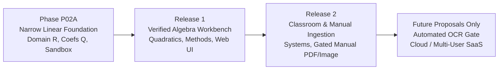

# PRODUCT-01 Roadmap & Acceptance Gates: Math Knowledge Engine (MKE)

**Document Version:** 0.3.1 (Targeted Remediation - Final Specification Freeze)  
**Status:** Under Review  
**Author:** Anty (Implementation Agent)  
**Reviewer:** ChatGPT (Chief Architect & Independent Reviewer)  
**Approval Authority:** Project Owner  
**Date:** September 2026  

---

## 1. Reconciled Product Roadmap

### Phase P02A: Narrow Exact Linear Foundation
- Exact linear solving ($ax + b = 0$) over Real domain $\mathbb{R}$ with rational coefficients $\mathbb{Q}$.
- Degenerate identity ($0x=0 \implies \text{DomainSet(R)}$) and contradiction ($0x=c \implies \emptyset$).
- Independent `CHECK_CANDIDATE` branch evaluating linear, bounded $x^2$, and rational equations over $\mathbb{Q}$, with strict original-domain checks.
- Local CLI and loopback HTTP testbed.
- Hardened Win32 Job Object sandbox (256 MiB per-process, 512 MiB job-wide).

### Release 1 (R1): Verified Algebra Workbench
- Quadratic equations ($ax^2 + bx + c = 0$).
- Distinct solution methods (factoring, quadratic formula, completing the square).
- Step-by-step LaTeX rendering.
- Local Web UI and single-user desktop packaging (Tauri/Electron).

### Release 2 (R2): Classroom & Separately Gated Manual Ingestion
- Linear systems (2 and 3 variables), piecewise linear equations.
- Separately gated manual PDF/image document ingestion.
- Pedagogical diagnostic feedback and batch grading.

### Long-Term Architectural Proposals Only
- Automated OCR pipelines require their own separate gate.
- Multi-user and cloud deployments remain non-committed proposals.

---

## 2. Acceptance Gates & Verification Milestones

| Gate ID | Milestone Name | Gate Criteria & Deliverables | Verification Authority | Gate Status |
| :--- | :--- | :--- | :--- | :--- |
| **GATE-P02A-01** | **Specification Freeze** | All 7 documents updated to Rev 0.3.1; unanimous sign-off by Project Owner & Chief Architect. | Project Owner & ChatGPT | **Pending Approval** |
| **GATE-P02A-02** | **Workspace Authorization** | Project Owner explicitly approves external sibling workspace `../mke-product`. Core repo remains frozen. | Project Owner | **Pending Gate 01** |
| **GATE-P02A-03** | **Dev Suite Verification** | 100% pass on 80 Development test cases; exact arithmetic and domain handling verified. | ChatGPT (Independent Auditor) | Planned |
| **GATE-P02A-04** | **Holdout Verification** | Blind execution on 80 Sealed Holdout test cases; zero failures. | Project Owner & ChatGPT | Planned |
| **GATE-P02A-05** | **Resource & Security Gate** | Independent verification of 256 MiB proc / 512 MiB job limits, breakaway denial, and egress blocks. | Independent Security Review | Planned |
