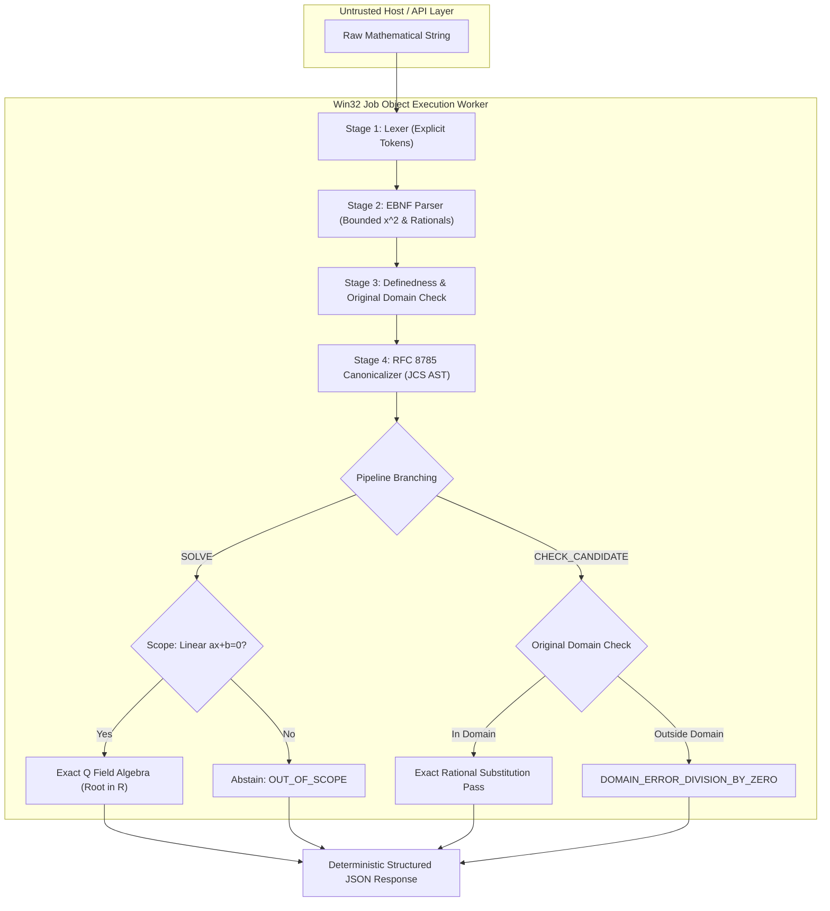

# PRODUCT-01 System Architecture: Math Knowledge Engine (MKE)

**Document Version:** 0.3.1 (Targeted Remediation - Final Specification Freeze)  
**Status:** Under Review  
**Author:** Anty (Implementation Agent)  
**Reviewer:** ChatGPT (Chief Architect & Independent Reviewer)  
**Approval Authority:** Project Owner  
**Date:** September 2026  

---

## 1. Architectural Principles & Pipeline

The MKE architecture enforces absolute decoupling between untrusted input handling, deterministic algebraic transformation, candidate verification, and OS-level execution.

---

## 2. Hardened Win32 Execution Architecture

### 2.1 Process Lifecycle & Isolation Contract
All worker processes execute within a constrained Win32 Job Object configured with dual resource limits:
- **Per-Process Memory Limit:** Hard cap of 256 MiB (`ProcessMemoryLimit`).
- **Job-Wide Memory Limit:** Hard cap of 512 MiB (`JobMemoryLimit`).
- **Breakaway Prohibition:** `JOB_OBJECT_LIMIT_BREAKAWAY_OK` is strictly cleared. Child processes cannot escape the job container.
- **Process Creation Order:**
  1. `CreateJobObjectW`
  2. `SetInformationJobObject` (apply 256 MiB process / 512 MiB job limits, clear breakaway, set `KILL_ON_JOB_CLOSE`)
  3. `CreateProcessW` with `CREATE_SUSPENDED`
  4. `AssignProcessToJobObject`
  5. `ResumeThread`

### 2.2 Security Status & Verification Directives
All security controls are classified as **PLANNED / UNVERIFIED** until an independent execution audit in Phase P02A tests and verifies them against the runtime harness.

| Control Area | Security Mechanism | Status | Target Error Code / Handling |
| :--- | :--- | :--- | :--- |
| **Process Quota** | 256 MiB proc / 512 MiB job limits | **PLANNED / UNVERIFIED** | Kernel termination $\implies$ `ERR_WORKER_RESOURCE_EXHAUSTED` |
| **Process Escape** | Breakaway revoked | **PLANNED / UNVERIFIED** | Win32 access denied on unauthorized spawn attempts |
| **Network Egress** | Loopback binding only (`127.0.0.1`), outbound blocked | **PLANNED / UNVERIFIED** | Socket connection rejected $\implies$ `ERR_NETWORK_DISALLOWED` |
| **DNS Rebinding** | Strict `Host` header validation | **PLANNED / UNVERIFIED** | Return HTTP `403 Forbidden` on mismatched host |

---

## 3. Workspace Isolation & Protected Repositories

### 3.1 Repository Protection Invariant
The core repository working tree (`PhanHoangKe/math-knowledge-engine`) contains protected paths:
- `src/mke/`, `data/`, `config/`, `schema/`, `tests/g4p1/`, historical evidence archives (`evidence_archive/`, audit logs, freeze records).
- Untracked and tracked local research and adversarial files.
Because remote git/GitHub cannot verify whether a dirty local working tree is modified, the architecture mandates an **external sibling workspace (`../mke-product`)** for all Phase P02A code, ensuring the root repository is 100% frozen.
