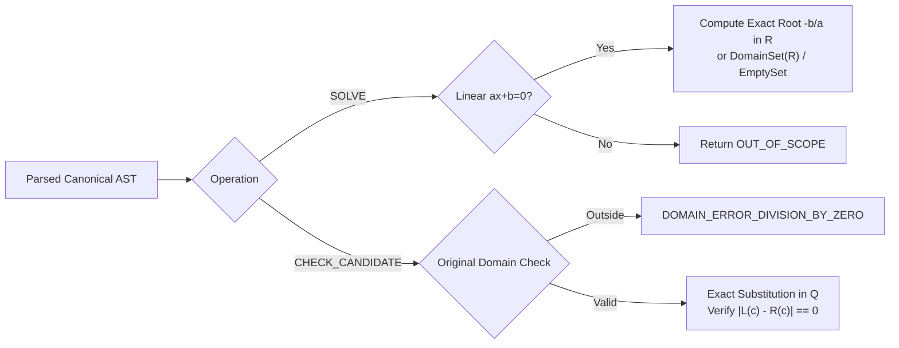

# PRODUCT-01 Verification Contract: Math Knowledge Engine (MKE)

**Document Version:** 0.3.1 (Targeted Remediation - Final Specification Freeze)  
**Status:** Under Review  
**Author:** Anty (Implementation Agent)  
**Reviewer:** ChatGPT (Chief Architect & Independent Reviewer)  
**Approval Authority:** Project Owner  
**Date:** September 2026  

---

## 1. Authoritative P02A Grammar Specification

The following EBNF grammar is the single authoritative syntactic standard across all Phase P02A modules:

```ebnf
equation        ::= expression "=" expression ;

expression      ::= [ add_op ] term { add_op term } ;
add_op          ::= "+" | "-" ;

term            ::= factor { mul_op factor } ;
mul_op          ::= "*" | "/" ;

factor          ::= power ;
power           ::= primary [ "^" exponent ] ;
exponent        ::= "0" | "1" | "2" ;

primary         ::= integer_literal | variable | "(" expression ")" ;
variable        ::= "x" ;
integer_literal ::= digit { digit } ;
digit           ::= "0" | "1" | "2" | "3" | "4" | "5" | "6" | "7" | "8" | "9" ;
```

### Syntactic & Semantic Invariants
1. **Explicit Multiplication Only:** Juxtaposition is forbidden. `2*x` is required; `2x` triggers `AMBIGUOUS_IMPLICIT_MULTIPLICATION_REJECTED`.
2. **Exponent Semantics:**
   - Exponents are restricted to constant integers `0`, `1`, `2`.
   - `x^0` evaluates to 1 on the domain where $x$ is defined. If $x=0$, $0^0$ triggers `UNDEFINED_ZERO_TO_ZERO`.
   - Bounded quadratic powers `x^2` and rational fractions are parsed to support `CHECK_CANDIDATE`.
3. **Domain Representation:** Unknown $x \in \mathbb{R}$; coefficients and candidate values $\in \mathbb{Q}$. $0*x = 0$ yields `DomainSet(R)`.

---

## 2. Independent Branching & Evaluation Logic



---

## 3. Stratified Evaluation Suite Specification

The test harness specifies a stratified collection of **160 planned test cases** (80 Development Cases, 80 Sealed Holdout Cases). 

> [!NOTE]
> The 160 cases are **planned test specifications**; they are not claimed to exist as authored test fixtures until formally supplied and independently inspected.

### 3.1 Stratified Test Case Families (80 Dev / 80 Holdout)
1. **Family 1: Exact Rational Linear Solving (20 Dev / 20 Holdout):** Unique roots in $\mathbb{R}$, arbitrary precision integers, signs, and fractions.
2. **Family 2: Degenerate & Boundary Solving (15 Dev / 15 Holdout):** Identities ($0*x = 0 \implies \text{DomainSet(R)}$), contradictions ($0*x = 5 \implies \emptyset$), large numerators/denominators.
3. **Family 3: Candidate Verification & Domain Exclusions (15 Dev / 15 Holdout):** Verification of exact roots across linear, bounded $x^2$, and rational equations. Rigorous testing of original-domain exclusions (candidates causing division by zero in original unreduced expressions) and detection of tiny non-zero rational residuals.
4. **Family 4: Syntax & Ambiguity Handling (15 Dev / 15 Holdout):** Rejection of implicit multiplication (`2x`, `1/2x`), exponent violations (`^3`), multi-character variables, unbalanced parentheses.
5. **Family 5: Semantic Definedness & Indeterminacy (15 Dev / 15 Holdout):** Literal division by zero ($1/0$), indeterminate forms ($0^0$), nested zero denominators.

### 3.2 Explicit Additional Gate Suites (Non-Algebraic)
Resource and security testing are handled via **explicit additional gate suites**:
- **Resource Limits Gate Suite:** Verification of 256 MiB per-process and 512 MiB job-wide memory ceiling enforcement under memory stress.
- **Process Isolation Gate Suite:** Verification that child process breakaway is denied.
- **Network Egress Gate Suite:** Verification that loopback-only binding is enforced and outbound connection attempts fail closed.
- **Security & Rebinding Gate Suite:** Verification of Host header validation and startup token checks.
