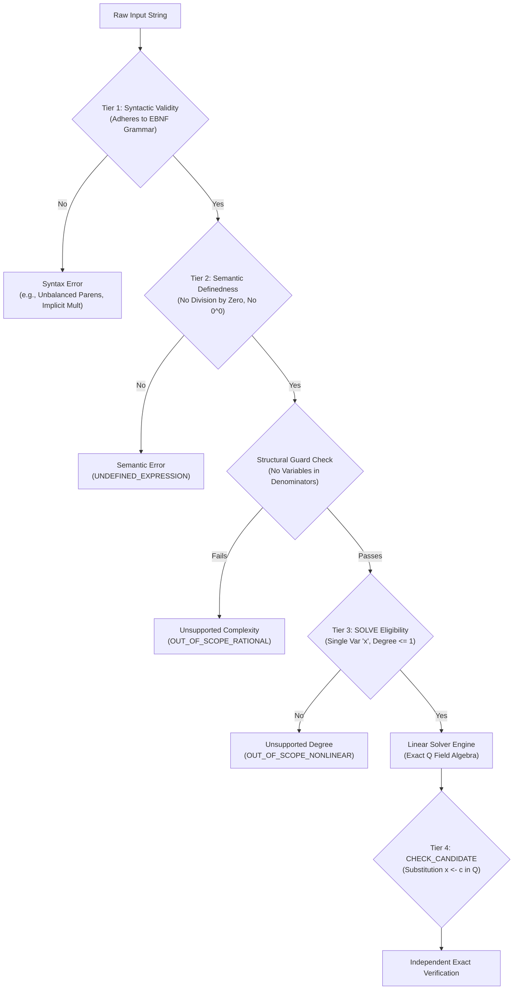

# PRODUCT-01 Capability Matrix: Math Knowledge Engine (MKE)

**Document Version:** 0.3 (Review Draft - Contract Freeze Remediation)  
**Status:** Under Review (Remediated per R1-R7 Directives)  
**Author:** Anty (Implementation Agent)  
**Reviewer:** ChatGPT (Chief Architect & Independent Reviewer)  
**Approval Authority:** Project Owner  
**Date:** September 2026  

---

## 1. Executive Summary & Purpose

This document defines the formal capability boundary of the Math Knowledge Engine across developmental phases. In strict compliance with **Remediation Directives R1, R3, and R7**, this document establishes:
1. An unambiguous 4-tier classification for mathematical expressions: **Syntactically Valid**, **Semantically Defined**, **SOLVE Eligible**, and **CHECK_CANDIDATE Eligible**.
2. Pre-simplification structural guards to prevent improper classification of rational or transcendent expressions.
3. An authoritative, release-by-release functional delivery matrix delineating Phase P02A, Release 1, Release 2, and Release 3+.
4. Multi-domain schema regression contracts ensuring strict semantic versioning across all solver domains.

---

## 2. Mathematical Capability Tiers (Directive R1)

To eliminate semantic conflation between well-formedness, mathematical definedness, and solver capability, every input expression processed by MKE is classified into exactly one hierarchical tier.

### 2.1 Tier 1: Syntactic Validity
An expression is **Syntactically Valid** if and only if it strictly conforms to the authoritative Phase P02A EBNF grammar:
- Contains only permitted tokens: integer literals, the single variable symbol `x`, binary operators `+`, `-`, `*`, `/`, exponentiation `^`, unary minus `-`, explicit parentheses `(`, `)`, and optional equation equality `=`.
- Explicit rejection of implicit multiplication: Tokens such as `2x`, `x y`, or `(x)(x+1)` are strictly rejected with error code `AMBIGUOUS_IMPLICIT_MULTIPLICATION_REJECTED`.
- Exponent restrictions: Exponentiation is restricted strictly to non-negative integer constants `^0` and `^1`. Exponents on non-atomic expressions or variables (`x^2`, `(x+1)^2`) are rejected at the parsing boundary.

### 2.2 Tier 2: Semantic Definedness
An expression is **Semantically Defined** if and only if it is syntactically valid and contains no mathematically undefined operations under standard field theory over $\mathbb{R}$:
- **Division by Zero:** Any sub-expression $\frac{E}{0}$ or $\frac{E_1}{E_2}$ where $E_2 \equiv 0$ evaluates to `UNDEFINED_DIVISION_BY_ZERO`.
- **Indeterminate Forms ($0^0$):** The expression $0^0$ is explicitly treated as **UNDEFINED** in accordance with Directive R1. Expressions containing $0^0$ are rejected with error code `UNDEFINED_ZERO_TO_ZERO`.
- Expressions that are syntactically valid but semantically undefined terminate immediately with deterministic error responses without solver invocation.

### 2.3 Tier 3: SOLVE Eligibility (P02A Scope)
An equation $L = R$ is eligible for the **SOLVE** pipeline in Phase P02A if and only if:
1. Both $L$ and $R$ are semantically defined.
2. The equation contains exactly one variable identifier: `x`.
3. **Pre-simplification Structural Guard:** No variable occurs within any denominator, quotient sub-tree, or exponent. Equations such as $\frac{x^2 - 1}{x - 1} = 0$, $\frac{x}{x} = 1$, or $\frac{2x}{x} = 2$ are rejected *prior to algebraic reduction* as `OUT_OF_SCOPE_RATIONAL_FRACTION`.
4. Upon canonical reduction to affine form $ax + b = 0$, the coefficients satisfy $a, b \in \mathbb{Q}$.
5. Exact Classification:
   - **Unique Solution:** $a \neq 0 \implies x = -\frac{b}{a}$.
   - **Trivially Inconsistent:** $a = 0 \land b \neq 0 \implies \emptyset$ (No Solution).
   - **Identity / Indeterminate:** $a = 0 \land b = 0 \implies \mathbb{Q}$ (All Rational Numbers).

### 2.4 Tier 4: CHECK_CANDIDATE Eligibility
A candidate verification request $\text{CHECK}(E_1 = E_2, x = c)$ is eligible if:
1. $E_1 = E_2$ is a semantically defined equation.
2. The candidate value $c$ is an exact rational number $c \in \mathbb{Q}$, expressed as an integer or exact fraction `p/q` ($q \neq 0$).
3. Independent evaluation: The verification engine substitutes $x \leftarrow c$ into both $E_1$ and $E_2$ independently using rational arithmetic without invoking solver heuristics. If both evaluate to identical values in $\mathbb{Q}$, the candidate is confirmed `VALID`; otherwise `INVALID`.

---

## 3. Release Boundaries & Roadmap Matrix (Directive R3)

| Capability / Feature Area | Phase P02A (Initial Kernel) | Release 1 (Core Web/Desktop) | Release 2 (Classroom/Batch) | Release 3+ (Advanced/Cloud) |
| :--- | :--- | :--- | :--- | :--- |
| **Equation Classes** | Affine linear ($ax + b = 0$, $a, b \in \mathbb{Q}$) | Multi-step linear, Systems of 2 linear equations | Systems of 3 equations, Piecewise linear | Quadratic ($ax^2 + bx + c = 0$), Polynomials, Non-linear |
| **Number Systems** | Exact Rational $\mathbb{Q}$ (arbitrary precision) | Exact Rational $\mathbb{Q}$, Finite Decimals | Real radicals $\sqrt{d}$ (quadratic extensions) | Complex numbers $\mathbb{C}$, Floating approximations |
| **Input Modalities** | Plain text ASCII / Unicode math string | Plain text, MathJSON, Basic LaTeX | Manual Image/PDF Ingestion (Pix2Text)* | Hand-drawn canvas, Live camera OCR, Audio |
| **Output / Explanation** | Exact root, Status enum, Step trace | LaTeX representation, Visual step tree | Pedagogical hint tree, Error diagnostic | Interactive step explorer, Tutoring dialogue |
| **Execution Environment**| Local CLI / Stdio & Local HTTP Testbed | Single-user Desktop (Tauri/Electron) & Local Server| Multi-client Local Server, Batch CLI | Distributed Cloud Service, Multi-tenant SaaS |
| **Process Isolation** | Win32 Job Object sandbox (strict limits) | Sandboxed worker pool | Containerized worker daemons | Microvm / Firecracker isolation |
| **Network Capabilities**| Zero outbound network (Air-gapped) | Local loopback only (`127.0.0.1`) | Local network subnet binding | Managed API Gateway, External Integrations |

*\*Note on Release 2 Image/PDF Ingestion:* In compliance with Directive R3, manual image/PDF document ingestion via Pix2Text is formally scheduled for Release 2 and remains subject to final Project Owner decision and licensing validation.

---

## 4. Multi-Domain Schema Regression Contract (Directive R7)

To guarantee that future mathematical extensions (e.g., quadratic equations, polynomial systems) never break or alter the semantics of Phase P02A linear equation consumers, the system enforces a strict Multi-Domain Schema Regression Contract:

1. **Explicit Schema Versioning:** Every request and response payload must carry a required `schema_version` attribute conforming to SemVer 2.0.0 (e.g., `"schema_version": "1.0.0"`).
2. **Domain-Specific AST Namespaces:**
   - Linear equations are parsed into the `linear.v1` AST namespace.
   - Future quadratic solvers will parse into `quadratic.v1` without altering `linear.v1` definitions.
3. **Additive Schema Evolution:**
   - Field additions to response objects must be optional and non-breaking.
   - Breaking field modifications require a major version increment and concurrent deprecation notice across two minor release cycles.
4. **Canonical Serialization (RFC 8785):** All AST nodes and cryptographic hashes are generated via canonical JCS serialization, ensuring cross-version reproducibility.

---

## 5. Formal Verification Traceability

| Requirement ID | Capability Description | Primary Verification Method | Failure Mode Action |
| :--- | :--- | :--- | :--- |
| **CAP-P02A-01** | Linear equation solving over $\mathbb{Q}$ | Exact rational substitution check | Fail closed, return `UNSOLVED` |
| **CAP-P02A-02** | Independent candidate validation | Dual-evaluator substitution | Return `VERIFICATION_FAILED` |
| **CAP-P02A-03** | Implicit multiplication rejection | Parser syntax validation suite | Return `AMBIGUOUS_IMPLICIT_MULT` |
| **CAP-P02A-04** | Division-by-zero & $0^0$ rejection | Semantic definedness tree pass | Return `UNDEFINED_EXPRESSION` |
| **CAP-P02A-05** | Structural rational fraction guard| Pre-simplification tree inspection | Return `OUT_OF_SCOPE_RATIONAL` |
