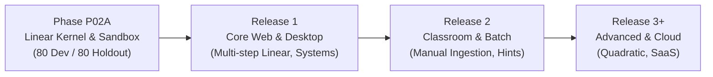

# PRODUCT-01 Roadmap & Acceptance Gates: Math Knowledge Engine (MKE)

**Document Version:** 0.3 (Review Draft - Contract Freeze Remediation)  
**Status:** Under Review (Remediated per R1-R7 Directives)  
**Author:** Anty (Implementation Agent)  
**Reviewer:** ChatGPT (Chief Architect & Independent Reviewer)  
**Approval Authority:** Project Owner  
**Date:** September 2026  

---

## 1. Release Roadmap Overview (Directive R3)

The Math Knowledge Engine progresses through four disciplined phases. Each phase expands mathematical capabilities and deployment scope while strictly maintaining backwards compatibility and mathematical soundness.

### Phase P02A: Exact Linear Kernel & Verification Harness (Current Baseline)
- **Mathematical Scope:** Single-variable affine linear equations ($ax + b = 0$ over $\mathbb{Q}$).
- **Interface:** Local CLI stdio & local loopback HTTP testbed.
- **Security:** Win32 Job Object sandbox with hard memory limits and zero outbound network egress.
- **Testing:** Stratified 160-case offline evaluation suite (80 Dev / 80 Holdout).

### Release 1: Core Web & Desktop Application
- **Mathematical Scope:** Multi-step linear equations, systems of 2 linear equations, parentheses nesting.
- **Interface:** Single-user packaged desktop application (Tauri / Electron shell) and browser-based UI.
- **Output:** Mathematical step-by-step trace formatted in LaTeX.
- **Protocol:** Stateful local session management, WebSockets introduction for interactive solving.

### Release 2: Classroom & Batch Workflows
- **Mathematical Scope:** Systems of 3 equations, piecewise linear equations, basic polynomial arithmetic.
- **Document Ingestion:** Manual image and PDF document ingestion via audited OCR pipeline (pending Project Owner approval and licensing clearance).
- **Pedagogical Features:** Step-by-step diagnostic hint trees, error analysis for student submissions.
- **Auditing:** Batch grading harness and classroom roster management.

### Release 3+: Advanced CAS & Cloud Platform
- **Mathematical Scope:** Quadratic equations ($ax^2 + bx + c = 0$), polynomial factorization, complex roots.
- **Deployment:** Multi-tenant cloud service, containerized worker clusters, microvm isolation.

---

## 2. Phase P02A Acceptance Gates & Verification Milestones (Directive R6)

To proceed from specification freeze to full delivery, Phase P02A must satisfy five formal sequential acceptance gates:

| Gate ID | Milestone Name | Gate Criteria & Deliverables | Verification Authority | Gate Status |
| :--- | :--- | :--- | :--- | :--- |
| **GATE-P02A-01** | **Contract & Spec Freeze** | All seven PRODUCT-01 documents updated to Rev 0.3, strictly remediating R1–R7; independent architectural audit passed. | Project Owner & ChatGPT | **Pending Approval** |
| **GATE-P02A-02** | **Pre-Implementation Auth** | Owner explicitly authorizes creation of external sibling workspace `../mke-product`; core repository remains frozen. | Project Owner | **Pending Gate 01** |
| **GATE-P02A-03** | **Development Suite Verification** | 100% pass on 80 Dev test cases; exact rational arithmetic verified; zero implicit multiplication regressions. | ChatGPT (Independent Auditor) | Planned |
| **GATE-P02A-04** | **Sealed Holdout Verification**| Blind execution on 80 Holdout test cases; zero failures; deterministic error taxonomy confirmed. | Project Owner & ChatGPT | Planned |
| **GATE-P02A-05** | **Security & Isolation Audit** | Win32 Job Object creation lifecycle verified; 0 network egress; memory quota enforced; Host header validation confirmed. | Independent Security Review | Planned |

---

## 3. Stratified Evaluation Protocol (Directive R6)

The Phase P02A evaluation suite consists of **160 strictly specified offline test cases**, divided into an 80-case Development Split (open for debugging) and an 80-case Holdout Split (sealed for final verification):

| Test Family | Family Scope & Objective | Dev Cases | Holdout Cases | Total Cases |
| :--- | :--- | :--- | :--- | :--- |
| **FAM-01: Canonical Solvable** | Standard affine linear equations with unique roots in $\mathbb{Q}$. | 20 | 20 | 40 |
| **FAM-02: Boundary & Degenerate** | Contradictions ($0x = 5$), identities ($0x = 0$), large integers. | 15 | 15 | 30 |
| **FAM-03: Syntactic Rejections** | Implicit multiplication (`2x`), exponents $\ge 2$, invalid symbols. | 15 | 15 | 30 |
| **FAM-04: Semantic Undefinedness** | Division by zero ($E/0$), indeterminate forms ($0^0$), rational fractions. | 15 | 15 | 30 |
| **FAM-05: Security & Stress** | Parser bombs, deep nesting, memory limits, breakaway attempts. | 15 | 15 | 30 |
| **Total** | | **80** | **80** | **160** |

---

## 4. Governance & Change Control

1. **No Code Implementation Prior to Gate 02:** Absolutely no implementation code, harness execution, or test running is permitted until Gate P02A-01 and Gate P02A-02 are formally approved.
2. **Workspace Isolation:** All P02A code will be authored strictly in the proposed sibling directory `../mke-product`.
3. **Audit Trail:** Any modification to accepted contracts requires a formal revision increment and unanimous approval from the Project Owner and Chief Architect.
