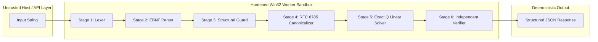
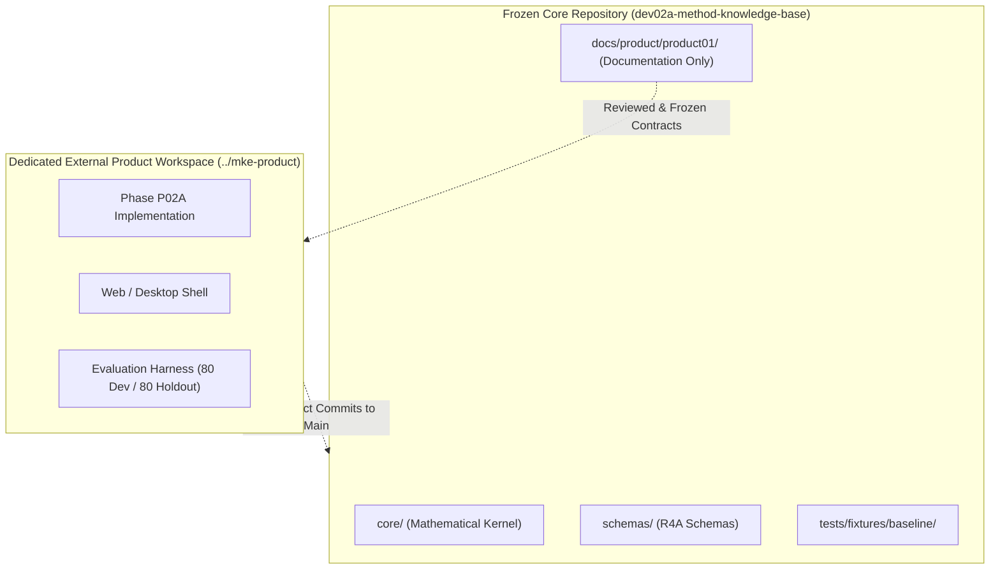
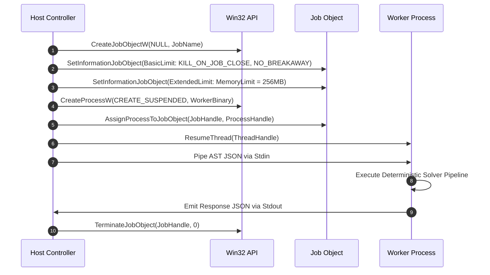

# PRODUCT-01 System Architecture: Math Knowledge Engine (MKE)

**Document Version:** 0.3 (Review Draft - Contract Freeze Remediation)  
**Status:** Under Review (Remediated per R1-R7 Directives)  
**Author:** Anty (Implementation Agent)  
**Reviewer:** ChatGPT (Chief Architect & Independent Reviewer)  
**Approval Authority:** Project Owner  
**Date:** September 2026  

---

## 1. System Overview & Architectural Objectives

The Math Knowledge Engine (MKE) is designed as a high-assurance, mathematically sound, and rigorously sandboxed symbolic reasoning system. The architecture separates untrusted input handling, deterministic mathematical reasoning, independent candidate verification, and sandboxed process execution.

In strict compliance with **Directives R1, R4, R5, and R7**, this document establishes:
1. A 6-stage deterministic mathematical reasoning pipeline.
2. A dual-boundary workspace and repository protection architecture.
3. A hardened Win32 Job Object execution harness with strict process lifecycle constraints and network egress blocking.
4. A secure local HTTP/JSON communication protocol with session bootstrap and Host/Origin validation (deferring WebSockets to future releases).
5. RFC 8785 canonical serialization for all Abstract Syntax Trees (AST) and verification artifacts.

---

## 2. End-to-End Mathematical Reasoning Pipeline (Directive R1)

### Stage 1: Lexical Analysis (Lexer)
- Converts raw input strings into a bounded stream of typed tokens.
- Enforces strict input size limits ($N_{chars} \le 256$, max token count 64).
- Rejects non-ASCII/unsupported characters with explicit position diagnostics.

### Stage 2: EBNF Parsing
- Constructs an Abstract Syntax Tree (AST) strictly governed by the authoritative Phase P02A grammar.
- Rejects implicit multiplication (`2x`, `(x)(x+1)`) and multi-character variable identifiers.
- Rejects exponents outside $\{0, 1\}$ and variable exponents.

### Stage 3: Structural Guard & Semantic Validation
- **Pre-simplification Rational Guard:** Inspects the raw AST to guarantee that no variable symbol `x` exists in any denominator or divisor node. Rational expressions such as $\frac{x^2-1}{x-1}$ are rejected immediately as `OUT_OF_SCOPE_RATIONAL_FRACTION`.
- **Definedness Checker:** Verifies that no literal zero divisor exists ($E/0$) and that the indeterminate form $0^0$ does not occur.

### Stage 4: Canonicalization (RFC 8785)
- Transforms the AST into a deterministic, canonical JSON representation conforming to RFC 8785 (JSON Canonicalization Scheme - JCS).
- Generates a SHA-256 digest of the canonical AST (`ast_sha256`) to establish immutable provenance.

### Stage 5: Exact $\mathbb{Q}$ Linear Solver
- Transforms the affine equation into standard canonical form $ax + b = 0$ using arbitrary-precision rational arithmetic (`fractions.Fraction`).
- **Completeness Proof via Field Algebra:** For $ax + b = 0$ with $a, b \in \mathbb{Q}$:
  - If $a \neq 0$, then because $\mathbb{Q}$ is a field, $a$ has a unique multiplicative inverse $a^{-1} \in \mathbb{Q}$. Multiplying both sides by $a^{-1}$ yields $x + a^{-1}b = 0 \iff x = -a^{-1}b = -\frac{b}{a}$. Existence and uniqueness are mathematically guaranteed without relying on the Fundamental Theorem of Algebra.
  - If $a = 0$ and $b \neq 0$, the statement $0 \cdot x + b = 0 \iff b = 0$ contradicts $b \neq 0$; thus the solution set is empty ($\emptyset$).
  - If $a = 0$ and $b = 0$, $0 \cdot x + 0 = 0$ holds for all $x \in \mathbb{Q}$; the solution set is $\mathbb{Q}$.

### Stage 6: Independent Candidate Verifier
- The verifier operates independently from the solver logic.
- Takes the computed candidate root $c \in \mathbb{Q}$ and substitutes it directly into the unreduced left-hand side ($L(c)$) and right-hand side ($R(c)$).
- Evaluates both sides independently using rational arithmetic. The solution is certified valid if and only if $L(c) - R(c) = 0$.

---

## 3. Workspace & Repository Protection Architecture (Directive R4)

To prevent corruption or accidental modification of the frozen MKE repository baseline (`PhanHoangKe/math-knowledge-engine`), all product development is decoupled:

1. **External Sibling Workspace (`../mke-product`):**
   - Proposed subject to Project Owner approval.
   - All Phase P02A implementation code, test runners, and build artifacts will reside outside the core repository working tree.
2. **Protected Paths in Core Repository:**
   - `core/`, `schemas/`, and `tests/fixtures/baseline/` are write-protected and strictly frozen.
   - Any proposed changes to shared schemas require explicit Owner authorization and formal cryptographic delta verification.
3. **Workspace Integrity Policy:**
   - Prohibits destructive operations such as `git clean -fdx`.
   - Requires automated pre-commit and post-commit SHA-256 manifests for all staging directories.

---

## 4. Hardened Win32 Execution Architecture (Directive R5)

For local execution on Windows, worker processes are executed within a strictly constrained operating system sandbox.

### 4.1 Strict Creation Lifecycle
1. The host controller creates an anonymous Win32 Job Object via `CreateJobObjectW`.
2. Sets `JOBOBJECT_BASIC_LIMIT_INFORMATION`:
   - `JOB_OBJECT_LIMIT_KILL_ON_JOB_CLOSE` is strictly asserted.
   - `JOB_OBJECT_LIMIT_BREAKAWAY_OK` is **strictly cleared** to prevent child processes from breaking away from the job.
3. Sets `JOBOBJECT_EXTENDED_LIMIT_INFORMATION`:
   - Hard memory ceiling enforced: `ProcessMemoryLimit = 256 MB`, `JobMemoryLimit = 512 MB`.
4. Spawns worker process via `CreateProcessW` with flag `CREATE_SUSPENDED`.
5. Binds process to Job Object using `AssignProcessToJobObject` *before* execution starts.
6. Calls `ResumeThread` to begin execution.

### 4.2 Network Egress Blocking
- Worker processes have zero network access requirement.
- Enforced by launching worker under an unprivileged user token or restricting loopback socket creation.
- Explicit outbound firewall policy blocks any TCP/UDP connection attempts initiated by the worker.

### 4.3 HTTP/JSON Communication Contract (FastAPI)
- **Localhost Binding:** Local API services bind strictly to `127.0.0.1` (never `0.0.0.0`).
- **Host / Origin Validation:** Strict middleware rejects any incoming request whose `Host` header does not match `127.0.0.1:<port>` or `localhost:<port>`, mitigating DNS rebinding attacks.
- **Session Bootstrap:** Local sessions generate a cryptographic token at startup; client requests must supply this token in the `X-MKE-Session-Token` header.
- **WebSocket Protocol Deferred:** In accordance with Directive R5, WebSockets are explicitly deferred from Phase P02A to Release 1+ to minimize attack surface; all P02A interactions utilize synchronous HTTP POST / JSON.
- **Client-Side PDF Sandbox:** The security limits of browser-based client-side PDF rendering sandboxes are explicitly classified as **Unresolved** in P02A and deferred to Release 2.

---

## 5. Provenance & Serialization Architecture (Directive R7)

1. **RFC 8785 Canonical JSON:** All structured data exchanged between stages is canonicalized via RFC 8785 (JCS) before hashing. Python floats and arbitrary dictionary ordering are strictly forbidden.
2. **Deterministic Error Schemas:** Every failure mode produces a schema-valid error response containing:
   - `error_code`: Machine-readable enum string (e.g., `AMBIGUOUS_IMPLICIT_MULTIPLICATION_REJECTED`).
   - `message`: Deterministic, non-leaking English description.
   - `position`: Optional integer offset indicating error location in raw input.
   - `schema_version`: Semantic version of the error payload schema.
