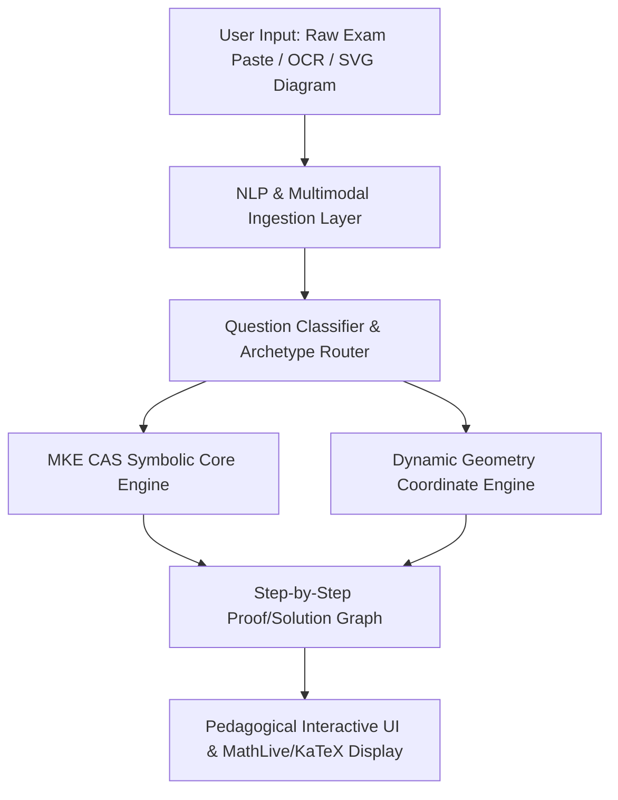
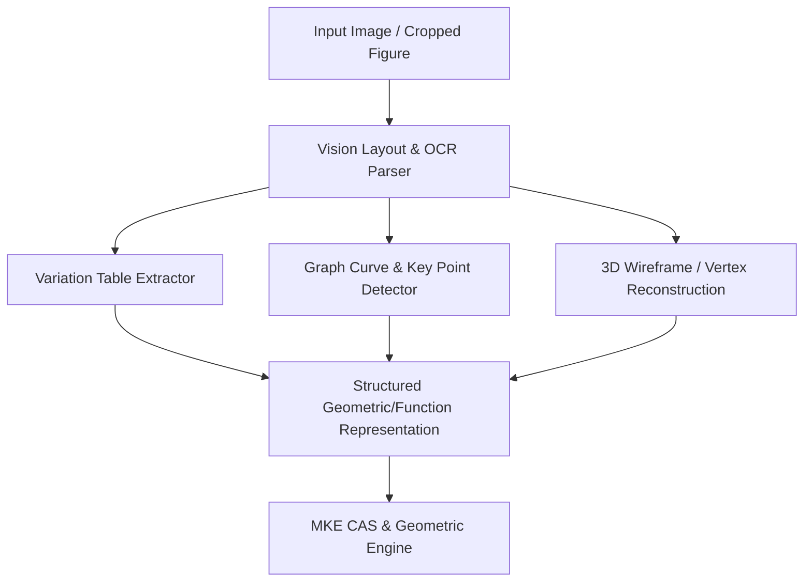
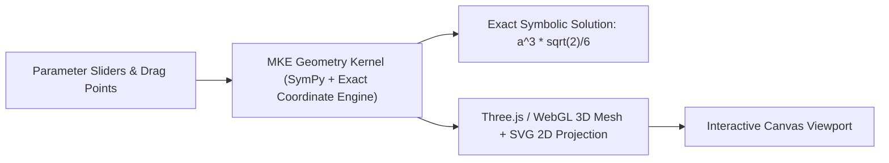
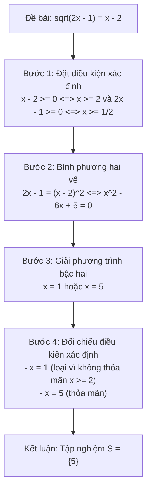

# MKE Product Architecture Proposal: Future User Interfaces and Multimodal Problem-Solving

**Document ID:** `PROP-P03C-UI-001`  
**Status:** PROPOSAL & SPECIFICATION  
**Author:** Antigravity (Implementation Engineer)  
**Project Owner:** Kế Phan Hoàng  
**Coordinator / Independent Auditor:** ChatGPT  
**Target Milestone:** PRODUCT-03C / PRODUCT-04  

---

## 1. Executive Summary & Vision

As Math Knowledge Engine (MKE) expands from core symbolic algebra to complete Vietnamese High School Mathematics (GDPT 2018 Grades 10–12), user interactions must evolve beyond simple single-expression input boxes. Authentic national exams (Đề thi Tốt nghiệp THPT) and school assessments feature:
1. Multi-part natural language problem statements with Vietnamese word contexts.
2. Geometric figures, coordinate graphs, statistical charts, and diagrammatic figures.
3. Multi-step reasoning requiring interactive pedagogical navigation (từng bước giải chi tiết).
4. Parametric and dynamic geometric constructions that update interactively upon changing parameters.

This proposal outlines the interface architecture, data contracts, and pipeline designs for four future UI pillars:
- **Pillar 1:** Full Exam Question Pasting & Natural Language Ingestion.
- **Pillar 2:** Multimodal Diagram & Graph Ingestion.
- **Pillar 3:** Dynamic Geometry & Coordinate Recomputation.
- **Pillar 4:** Pedagogical Step Navigation & Explanation Trees.



---

## 2. Pillar 1: Full Exam Question Pasting & Natural Language Ingestion

### 2.1 Problem Description
High school students and educators often copy and paste entire questions directly from Word/PDF documents or websites, including question prefixes, context paragraphs, and formatting markers:
```text
Câu 35. Cho hàm số y = f(x) có bảng biến thiên như sau. Tìm số điểm cực trị của hàm số g(x) = f(2x - 1) + 3.
A. 1
B. 2
C. 3
D. 4
```

### 2.2 Ingestion Pipeline


1. **Text Normalization:**
   - Strips non-standard Word/PDF ligatures (`fi`, `fl`, `–`, `—`, `“`, `”`).
   - Normalizes Vietnamese diacritics into canonical Unicode NFC form.
2. **Structural Segmentation:**
   - Detects question headers (`Câu 1`, `Bài 2`, `Ví dụ 3`).
   - Separates the problem statement stem from MCQ options (`A. ...`, `B. ...`, `C. ...`, `D. ...`) or 4-statement True/False items (`a) ...`, `b) ...`, `c) ...`, `d) ...`).
3. **Mathematical Expression Extraction:**
   - Recognizes inline math, LaTeX fragments (`$...$`, `$$...$$`, `\(...\)`), and plain-text mathematical notation (`y = x^2 - 4*x + 3`).
   - Converts standard Vietnamese math terms (ví dụ: `nghiệm nguyên`, `tập xác định`, `đồng biến trên`, `khoảng nghịch biến`) into structured intent objects.

### 2.3 Data Contract: `QuestionIngestionRequest`
```json
{
  "raw_text": "Câu 12. Tìm tập nghiệm S của phương trình \\sqrt{2x - 1} = x - 2.",
  "format_override": null,
  "options": {
    "extract_steps": true,
    "language": "vi-VN"
  }
}
```

---

## 3. Pillar 2: Multimodal Diagram & Graph Ingestion

### 3.1 Diagram Modalities in GDPT 2018
Vietnamese high school exams incorporate three major graphical modalities:
1. **2D Function Graphs & Variations Tables (Bảng biến thiên):**
   - Tables showing intervals of $x$, sign of $f'(x)$, and variation arrows of $f(x)$.
   - Function graphs showing local extrema, asymptotes ($x = a, y = b$), intercepts, and inflection points.
2. **Synthetic & Solid Geometry Diagrams (Hình học không gian):**
   - Pyramids ($S.ABCD$), prisms ($ABC.A'B'C'$), cones, cylinders, and spheres.
   - Solid edge dashed line conventions (hidden lines vs visible lines).
3. **Coordinate Geometry Diagrams (Oxy and Oxyz):**
   - Circles, ellipses, lines, planes, and normal/direction vectors.

### 3.2 Multimodal Processing Architecture


- **Variation Table Representation:**
  ```json
  {
    "table_type": "BANG_BIEN_THIEN",
    "x_points": ["-oo", "-1", "1", "+oo"],
    "f_prime_signs": ["+", "0", "-", "0", "+"],
    "f_values": ["-oo", "3", "-1", "+oo"],
    "asymptotes": []
  }
  ```
- **3D Solid Topology Representation:**
  ```json
  {
    "solid_type": "PYRAMID",
    "base": {"vertices": ["A", "B", "C", "D"], "geometry": "SQUARE", "side": "a"},
    "apex": "S",
    "altitude": {"from": "S", "to_point": "A", "length": "a*sqrt(3)"}
  }
  ```

---

## 4. Pillar 3: Dynamic Geometry & Coordinate Recomputation

### 4.1 Interactive Dynamic Geometry
For spatial geometry and analytic geometry (Oxy, Oxyz), users benefit from manipulating parameters (e.g., slider for parameter $m$ in $y = x^3 - 3mx + 1$, or moving vertex $S$ along the perpendicular line) and seeing real-time recalculated geometric quantities:
- Distance between skew lines: $d(AB, CD)$.
- Angle between line and plane: $(SA, (ABCD))$.
- Volume and cross-sectional surface area: $V_{S.ABCD}$, $S_{\text{thiết diện}}$.

### 4.2 Interactive Geometric Engine Architecture


### 4.3 Key Engine Requirements
1. **Exact Symbolic Precision:**
   - Coordinates maintained in terms of base unit $a$, radicals ($\sqrt{2}, \sqrt{3}$), and fractions ($a/2$), never premature floating-point truncations.
2. **Self-Consistency & Constraint Propagation:**
   - If $SA \perp (ABCD)$, moving base vertex $A$ automatically updates coordinates of $S$ maintaining perpendicularity.
3. **Cross-Platform Vector Rendering:**
   - Lightweight SVG for 2D plane geometry and WebGL (Three.js/Babylon.js) for 3D spatial geometry with orbit, pan, and zoom.

---

## 5. Pillar 4: Pedagogical Step Navigation & Explanation Trees

### 5.1 Step-by-Step Pedagogical Model
Vietnamese educational standards require transparent, step-by-step reasoning following official grading rubrics (Biểu điểm chấm thi). Each solution step must specify:
1. **Step Objective:** What sub-problem is being addressed (e.g., "Bước 1: Tìm điều kiện xác định", "Bước 2: Bình phương hai vế").
2. **Mathematical Transformation:** From State $k$ to State $k+1$.
3. **Pedagogical Justification:** Mathematical theorem or rule applied (e.g., "Áp dụng định lý: $\sqrt{A} = B \iff B \ge 0 \text{ và } A = B^2$").
4. **Verification Guard:** Confirming no extraneous root or division by zero was introduced.



### 5.2 Interactive UI Components
- **Step Accordion & Stepper:**
  - Forward/Back step navigation buttons allowing students to test themselves on the next step before revealing it.
- **Why This Step? (Tại sao lại làm bước này?):**
  - Tooltip or expandable side panel explaining common pitfalls (e.g., "Lỗi thường gặp: Quên đặt điều kiện $x \ge 2$ dẫn đến nhận nhầm nghiệm ngoại lai $x = 1$").
- **Alternative Method Tabs (Các cách giải khác):**
  - Tab 1: Phương pháp biến đổi đại số (Algebraic).
  - Tab 2: Phương pháp đặt ẩn phụ (Substitution).
  - Tab 3: Phương pháp hàm số / Đánh giá đồ thị (Functional / Graphical).

---

## 6. Implementation Roadmap & Milestones

| Phase | Milestone | Focus Areas | Target Capabilities |
|---|---|---|---|
| **Phase 1** | `PRODUCT-03C-P1A` | Core Algebra Expansion | Radicals, Absolute Values, Rational equations, Extraneous root elimination *(Completed)* |
| **Phase 2** | `PRODUCT-03C-P1B` | High School Polynomials & Trig | Cubic, Quartic, Trigonometric basic equations, Set intervals |
| **Phase 3** | `PRODUCT-03C-P2` | Calculus & Coordinate Geometry | Derivatives, Limits, Tangent lines, 2D/3D vectors, Analytic Geometry (Oxy, Oxyz) |
| **Phase 4** | `PRODUCT-04` | Multimodal & Pedagogical UI | Exam Question Pasting, 3D Spatial Geometry Canvas, Interactive Step Navigator |

---

## 7. Conclusion & Alignment

This interface specification ensures that as MKE achieves full GDPT 2018 curriculum mathematical mastery across Grades 10–12, the product interface is directly positioned to provide students, teachers, and developers with transparent, verifiable, and pedagogically sound tools.
