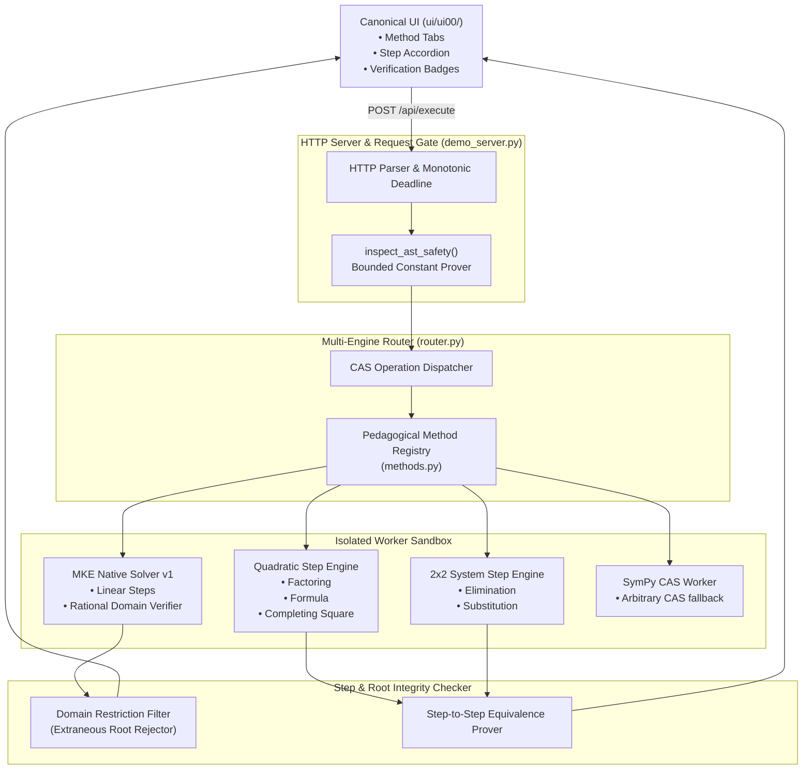

# MKE PRODUCT-03C — PHASE 0 DESIGN PROPOSAL
## Pedagogical Method Explainability & Rational Equation Soundness Engine

**Document Version:** 1.0.0 (Design Only — Pre-Implementation)  
**Milestone:** PRODUCT-03C-P0  
**Author:** Antigravity (Implementation Engineer)  
**Reviewers:** ChatGPT (Independent Auditor), Kế Phan Hoàng (Project Owner)  
**Target Release:** PRODUCT-03C  

---

## 1. Executive Summary & Context

With the successful completion and release freeze of **PRODUCT-03B** (`v0.3.0-p03b-accepted`), the MKE product platform has established:
1. Hardened Windows sandbox containment and handle quarantine lifecycle.
2. Multi-engine CAS router (`mke_native_v1` and `sympy_cas_v0`).
3. Strict domain certainty tracking (`PROVEN_REALS`, `EXPLICIT_EXCLUSIONS`, `NOT_FULLY_DETERMINED`).
4. Bounded constant arithmetic reasoning and wall-clock HTTP execution deadlines.
5. Canonical, trust-first bilingual UI (`ui/ui00/`) with KaTeX mathematical rendering.

However, a fundamental gap exists between the current CAS computation capabilities and **MKE's core product vision**:
> *"MKE is not merely a computation calculator, but an intelligent, transparent, and trustworthy mathematical learning and problem-solving engine that provides rigorous pedagogical explanations, verifies steps independently, and supports multiple solution methods."*

Currently in Product 03B:
- **`mke_native_v1`** provides step-by-step explanations only for univariate linear equations ($ax + b = c$).
- **`sympy_cas_v0`** solves quadratics, linear systems, inequalities, and calculus, but returns *opaque final results* without intermediate algebraic steps or method alternatives.
- **Rational Equations** with algebraic denominators (e.g. $\frac{1}{x-1} + \frac{2}{x+2} = 3$) are currently out of scope or lack structured extraneous root validation.

**PRODUCT-03C** proposes a tightly scoped, high-impact milestone to close these gaps with verified mathematical integrity.

---

## 2. Inventory of Existing Product Capabilities & Evidence Base

| Capability | Engine | Verification Status | Domain Certainty | Current Limitation |
| :--- | :--- | :--- | :--- | :--- |
| **Linear Equations ($ax + b = c$)** | `mke_native_v1` | `VERIFIED_WITH_EVIDENCE` | `PROVEN_REALS` / `EXPLICIT_EXCLUSIONS` | Only 1 method (standard algebraic isolation). |
| **Quadratic Equations ($ax^2 + bx + c = 0$)** | `sympy_cas_v0` | `COMPUTED` | `PROVEN_REALS` | No pedagogical step breakdown (e.g. factoring vs quadratic formula vs completing square). |
| **2x2 Linear Systems** | `sympy_cas_v0` | `COMPUTED` | `PROVEN_REALS` | No method choice (substitution vs elimination). |
| **Univariate Degree $\le 2$ Inequalities** | `sympy_cas_v0` | `COMPUTED` | `PROVEN_REALS` | Direct interval output; no sign table or critical point explanation. |
| **Calculus (Derivatives & Integrals)** | `sympy_cas_v0` | `COMPUTED` | `NOT_FULLY_DETERMINED` | No rule-based steps (product, quotient, chain rule). |
| **2D Cartesian Plotting** | `sympy_cas_v0` | `COMPUTED` | `NOT_APPLICABLE` | Discrete 200-point numerical raster. |
| **Constant Domain Safety** | Static + Worker | `COMPUTED` / `ERROR` | `PROVEN_REALS` / `NOT_FULLY_DETERMINED` | Exact rational budgets ($MAX\_EXP=256, MAX\_BITS=1024$). |

---

## 3. Problem Statement & User Use Cases

### A. The Core Problems
1. **The "Black Box" Trust Deficit:** High school and university students, educators, and technical professionals do not trust raw CAS answers without understandable intermediate steps that match standard curriculum methodologies.
2. **Missing Multiple Methods:** Real-world mathematics education emphasizes solving the same problem through distinct lenses (e.g. Factoring, Quadratic Formula, Completing the Square; Substitution vs Elimination). Current CAS engines offer only one opaque path.
3. **Extraneous Root Vulnerability in Rational Equations:** Clearing algebraic denominators often introduces false roots that violate initial domain restrictions. Without structured domain tracking and step-level root screening, calculators produce invalid solutions.

### B. Target User Personas & Use Cases
- **High School & College Algebra Students:**
  - *Use Case 1:* Enter $x^2 - 5x + 6 = 0 \implies$ View solution by **Factoring** $(x-2)(x-3)=0$, by **Quadratic Formula** $x = \frac{5 \pm \sqrt{1}}{2}$, and by **Completing the Square** $(x - 5/2)^2 = 1/4$.
  - *Use Case 2:* Solve rational equation $\frac{x}{x-2} + \frac{1}{x+1} = \frac{6}{x^2-x-2} \implies$ See common denominator multiplication, quadratic reduction, identification of candidate roots $x=2$ and $x=-2$, and explicit step disqualifying $x=2$ due to domain violation $x \ne 2$.
- **Mathematics Educators & Self-Learners:**
  - *Use Case 3:* Compare pedagogical steps across **Substitution** vs **Elimination (Addition Method)** for a 2x2 linear system.

---

## 4. Proposed Scope & Boundaries for PRODUCT-03C

### In-Scope Features (P03C Core)
1. **Multi-Method Step Explanation Engine for Quadratic Equations:**
   - **Method A (Factoring):** Finding rational factor pairs $(px + q)(rx + s) = 0$ when discriminant is a perfect square.
   - **Method B (Quadratic Formula):** Explicit substitution into $x = \frac{-b \pm \sqrt{b^2 - 4ac}}{2a}$ with step-by-step simplification.
   - **Method C (Completing the Square):** Step-by-step monic normalization, vertex shift $(x + p)^2 = q$, and square root extraction.
2. **Multi-Method Step Explanation Engine for 2x2 Linear Systems:**
   - **Method A (Elimination / Linear Combination):** Multiplier selection, equation addition/subtraction, single-variable solve, back-substitution.
   - **Method B (Substitution):** Variable isolation, algebraic substitution into second equation, single-variable solve, back-substitution.
3. **Rational Equation Solver with Explicit Domain Screening:**
   - Single-variable equations with degree $\le 2$ polynomial denominators.
   - Automatic domain restriction extraction ($x \ne r_i$).
   - Common denominator clearing $\implies$ algebraic polynomial reduction $\implies$ root solving.
   - Explicit candidate root screening against restrictions with formal provenance: `VALID_ROOT` vs `EXTRANEOUS_ROOT (excluded by domain)`.
4. **UI Pedagogical Step Viewer & Method Selector:**
   - Tabbed or accordion method switcher in `ui/ui00/` (e.g. *[Factoring | Quadratic Formula | Completing the Square]*).
   - Rendered using existing KaTeX mathematical formatting with bilingual English/Vietnamese step explanations.
   - Verification status badge updated to `VERIFIED_WITH_EVIDENCE` when each step is algebraically validated by native step checker.

### Explicit Out-of-Scope Exclusions (Preserving Focus & Stability)
- **Cubic and higher-degree polynomial equations ($n \ge 3$).**
- **Non-linear systems (e.g. circle-line intersection).**
- **Step-by-step calculus rules (deferred to PRODUCT-03D).**
- **Trigonometric, logarithmic, and radical equations.**
- **Integration of unverified Research G4 neural components.**

---

## 5. Architectural Design & Component Diagram



### Data Contract Expansion (`contracts.py`)
Add support for structured pedagogical steps and multiple method alternatives:
```python
@dataclass
class ExplanationStep:
    step_number: int
    rule_name: str
    description_en: str
    description_vi: str
    latex_expression: str
    is_algebraically_verified: bool = True

@dataclass
class SolutionMethod:
    method_id: str
    method_name_en: str
    method_name_vi: str
    is_primary: bool
    steps: List[ExplanationStep]
    final_solution: str

# In ExecutionResponse:
methods: List[SolutionMethod] = field(default_factory=list)
extraneous_roots: List[str] = field(default_factory=list)
```

---

## 6. Mathematical Oracle & Public Reproducible Benchmark Strategy

To guarantee absolute mathematical accuracy and prevent regressions:
1. **Public Dual-Oracle Validation:**
   - Every quadratic and rational equation benchmark problem will be cross-validated against both **SymPy CAS** (analytic oracle) and **MKE Exact Rational Solver**.
   - Step equivalence is verified by checking that $\text{LHS}_k - \text{RHS}_k \equiv \text{LHS}_{k+1} - \text{RHS}_{k+1}$ under exact rational arithmetic.
2. **Curated Pedagogical Benchmark Dataset (`tests/benchmarks/p03c_algebra_benchmark.json`):**
   - 100 Quadratic Equations (integer, rational roots, irreducible real roots, complex conjugate roots).
   - 50 Rational Equations (including 25 adversarial cases with extraneous roots).
   - 50 Linear Systems 2x2 (unique solutions, dependent infinite systems, inconsistent systems).
   - Automated benchmark runner reporting step correctness, domain screening accuracy, and execution timings.

---

## 7. Security, Resource Bounds & Threat Model

1. **Pre-Dispatch Constant & Step Ceiling:**
   - Maximum intermediate algebraic steps: `MAX_EXPLANATION_STEPS = 50`.
   - Maximum integer coefficient bit-length during factoring: 256 bits.
   - Rejection of combinatorial step explosions.
2. **Worker Sandbox Confinement:**
   - All method generation and step checks execute inside the existing Windows AppContainer / Job Object sandbox with 5.0s timeout and 256MB memory cap.
3. **Input Sanitization:**
   - Strict validation of method selection parameter (`options: {"preferred_method": "factoring"}`).

---

## 8. Measurable Acceptance Criteria & Implementation Phases

| Phase | Milestone Name | Objective & Acceptance Gate |
| :--- | :--- | :--- |
| **P03C-P1** | Core Quadratic Multi-Method Engine | Factoring, Formula, and Completing Square step engines implemented and verified against 100 benchmark equations; unit test pass rate = 100%. |
| **P03C-P2** | 2x2 System Multi-Method Engine | Elimination and Substitution step engines implemented and verified against 50 benchmark systems. |
| **P03C-P3** | Rational Equation & Extraneous Root Solver | Strict domain screening, clearing denominator steps, and extraneous root identification with 100% precision on adversarial benchmark suite. |
| **P03C-P4** | Canonical UI Integration & Bilingual Steps | UI method switcher, KaTeX step rendering, English/Vietnamese localization, full browser Selenium automation test suite. |
| **P03C-P5** | Release Freeze & Audit Evidence | Full regression test suite execution (550+ tests), Windows handle telemetry verification, audit report publication. |

---

## 9. Risk Analysis, Dependencies & Rollback Plan

- **Risk 1 (Step Generation Performance):** Factoring large integer coefficients could time out.
  - *Mitigation:* Restrict factoring search to integer roots bounded by rational root theorem with step budgets; fall back immediately to Quadratic Formula if factoring exceeds 20 operations.
- **Risk 2 (Extraneous Root Miss):** Subtle domain violations in multi-step rational simplification.
  - *Mitigation:* Explicit final step evaluates candidate roots directly against the unsimplified original AST denominator.
- **Rollback Strategy:** All changes remain isolated on branch `product/p03c-development`. If any architectural flaw is discovered, rollback to frozen baseline `v0.3.0-p03b-accepted` (`e207efcfd4d1af31e4e94202174f5d98e0bb5692`) is immediate and zero-risk.

---

## 10. Research / Product Boundary Governance

- **Zero Research Contamination Rule:** P03C utilizes strictly deterministic symbolic and rule-based algorithms. No machine learning models, heuristics, or unverified research code from `Research G4/` will be imported.
- **Independent Verification Requirement:** Every newly introduced method must provide algebraic evidence verifiable by the native proof checker.
