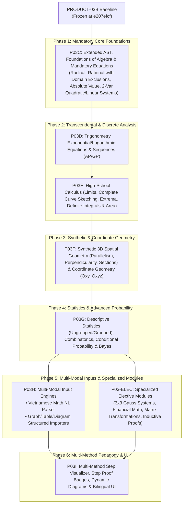

# MKE PRODUCT ROADMAP — REVISED THPT COVERAGE-FIRST STRATEGY (R1)
## Dependency-Aware Phasing & Core-First Architectural Execution Plan

**Author:** Antigravity (Implementation Engineer)  
**Curriculum Standard:** GDPT 2018 Secondary Mathematics (Grades 10–12)  
**Planning Baseline:** `d31d51ecdf8eff0e5890b76dae3f0d9e386c1eb7`  
**Version:** 1.1.0 (Reconciled & Prioritized)  

---

## 1. Architectural Strategy & Phasing Principles

### Strategic Rebalancing Principles:
1. **Mandatory Core First, Electives Decoupled:** 90 Core archetypes are prioritized over the 10 Elective archetypes. Electives (like 3x3 Gauss systems or financial annuities) are scheduled in parallel track `P03-ELEC` or subsequent stages without blocking mandatory high-school graduation algebra.
2. **Parser & AST Representation as Strict Prerequisite:** Milestone P03C establishes the unified algebraic AST supporting radical expressions, rational fractions, absolute values, and piecewise conditions before building high-level solvers.
3. **Synthetic Geometry Alongside Coordinates:** P03F is expanded to support synthetic spatial geometry (proof of parallelism, perpendicularity, plane intersections, and distance/angle invariants) alongside analytic Cartesian geometry ($Oxy$ and $Oxyz$).
4. **Multi-Modal Realism:** Acknowledges that rule-based NLP cannot parse drawings, geometric figures, or variation tables. Distinct structured importers and multi-modal graph encodings are designed in P03H.

---

## 2. Detailed Milestone Specifications

---

### MILESTONE P03C: Extended AST, Foundations of Algebra & Mandatory Equations

- **Primary Objective:** Build the foundational algebraic AST representation, extend the parser, and implement verified solvers for mandatory Grade 10 algebra (Rational equations with domain exclusions, Radical equations with squaring conditions, Absolute value equations, Quadratic inequalities, and 2-variable systems).
- **Core Archetypes Addressed (15 Core Archetypes):**
  - `ARCH-10.1.2`, `ARCH-10.1.3` (Set intervals & operations)
  - `ARCH-10.2.1`, `ARCH-10.2.2`, `ARCH-10.2.3` (Linear inequalities & 2D polygon optimization)
  - `ARCH-10.3.1`, `ARCH-10.3.2`, `ARCH-10.3.3` (Quadratic parabola properties & vertex Min/Max)
  - `ARCH-10.4.1`, `ARCH-10.4.2`, `ARCH-10.4.3` (Quadratic sign tables, parametric sign, rational sign tables)
  - `ARCH-10.5.1`, `ARCH-10.5.2`, `ARCH-10.5.3` (Radical $\sqrt{f} = \sqrt{g}, \sqrt{f} = g$, Absolute value $|f| = g$)
- **Input Grammar Extensions:**
  - Extended LaTeX & ASCII AST: `\sqrt{f(x)}`, `|f(x)|`, `\frac{A(x)}{B(x)}`, `\in [a, b]`, `\cup`, `\cap`.
- **Output Data Contract:**
  - `symbolic_result`: Solution set string (e.g. `{-4}`)
  - `domain_restrictions`: Formally verified exclusions (e.g. `["x != 2", "x != -1"]`)
  - `extraneous_roots`: Rejected candidates with domain justification
  - `verification_status`: `VERIFIED_WITH_EVIDENCE`
- **Verification Strategy:**
  - Exact rational back-substitution + unsimplified AST denominator non-zero checks + radicand non-negativity checks.
- **Benchmark Target:** 100 Algebra problems (50 rational with extraneous roots, 30 radical, 20 absolute value/systems). Target pass rate: 100%.

---

### MILESTONE P03D: Transcendental & Discrete Mathematics (Trigonometry, Log/Exp, Sequences)

- **Primary Objective:** Implement verified solvers for periodic trigonometric equations, exponential and logarithmic equations/inequalities with domain tracking, and arithmetic/geometric progression engines.
- **Core Archetypes Addressed (15 Core Archetypes):**
  - `ARCH-10.6.1`, `ARCH-10.6.3` (Combinatorial equations & Binomial expansion $n \le 5$)
  - `ARCH-11.1.1`, `ARCH-11.1.2`, `ARCH-11.1.3`, `ARCH-11.1.4` (Trigonometric expressions, domains, periodic families $x_0 + k2\pi$, $a\sin x + b\cos x = c$)
  - `ARCH-11.2.1`, `ARCH-11.2.2`, `ARCH-11.2.3` (Sequences, AP general term & sum, GP general term & sum, infinite GP sum)
  - `ARCH-11.4.1`, `ARCH-11.4.2`, `ARCH-11.4.3`, `ARCH-11.4.4` (Log/Exp simplification, log domain tracking $f(x)>0$, log equations and inequalities)
- **Verification Strategy:**
  - Analytic periodic set equivalence + log domain candidate screening + exact rational sequence recurrence evaluation.
- **Benchmark Target:** 100 Transcendental & Sequence problems. Target pass rate: $\ge 98\%$.

---

### MILESTONE P03E: High-School Calculus Engine (Limits, Curve Analysis, Integrals)

- **Primary Objective:** Build a complete high-school calculus engine covering limits of sequences and functions (indeterminate forms $[0/0], [\infty/\infty]$), complete curve analysis (monotonicity, extrema, vertical/horizontal/slant asymptotes), and single-variable integration (antiderivatives, definite integrals, areas between curves, volumes of revolution).
- **Core Archetypes Addressed (18 Core Archetypes):**
  - `ARCH-11.3.1`, `ARCH-11.3.2`, `ARCH-11.3.3`, `ARCH-11.3.4` (Limits of sequences, limit $[0/0]$, one-sided limits & continuity, intermediate value theorem)
  - `ARCH-11.5.1`, `ARCH-11.5.2`, `ARCH-11.5.3`, `ARCH-11.5.4` (Derivatives, tangent lines at point / with slope $k$, second derivative)
  - `ARCH-12.1.1`, `ARCH-12.1.2`, `ARCH-12.1.3`, `ARCH-12.1.5` (Monotonicity intervals, extrema classification, vertical/horizontal/slant asymptotes, parametric calculus)
  - `ARCH-12.2.1`, `ARCH-12.2.2`, `ARCH-12.2.3`, `ARCH-12.2.4`, `ARCH-12.2.5` (Antiderivatives, substitution $u(x)$, by-parts $u, v$, area between curves, solid of revolution)
- **Verification Strategy:**
  - Dual-engine symbolic cross-check + analytical derivative checks ($\frac{d}{dx} F(x) \equiv f(x)$) + adaptive numerical quadrature ($|I_{sym} - I_{num}| < 10^{-6}$).
- **Benchmark Target:** 150 Calculus problems. Target pass rate: $\ge 98\%$.

---

### MILESTONE P03F: Synthetic & Coordinate Geometry (2D Oxy & 3D Spatial/Oxyz)

- **Primary Objective:** Implement spatial synthetic geometry engines (parallelism proofs, perpendicularity proofs, plane sections, 3D angles and distances) and analytic coordinate geometry in 2D ($Oxy$: lines, circles, conics) and 3D ($Oxyz$: vectors, cross products, lines, planes, spheres).
- **Core Archetypes Addressed (24 Core Archetypes):**
  - `ARCH-10.7.1`, `ARCH-10.7.2` (Triangle metric formulas, Heron, sin area)
  - `ARCH-10.8.1`, `ARCH-10.8.2`, `ARCH-10.8.3` (2D Vectors, dot product, angles)
  - `ARCH-10.9.1`, `ARCH-10.9.2`, `ARCH-10.9.3`, `ARCH-10.9.4` (2D Lines, distances, circles, conics)
  - `ARCH-11.6.1`, `ARCH-11.6.2`, `ARCH-11.6.3` (3D Line/plane intersections, parallelism proofs, cross sections)
  - `ARCH-11.7.1`, `ARCH-11.7.2`, `ARCH-11.7.3`, `ARCH-11.7.4` (3D Perpendicularity, line-plane angles, dihedral angles, distances in space)
  - `ARCH-12.3.1`, `ARCH-12.3.2`, `ARCH-12.3.3`, `ARCH-12.3.4`, `ARCH-12.3.5` (3D Oxyz vectors, spheres, planes, lines, metric distances/angles)
- **Verification Strategy:**
  - Vector dot/cross product invariants, point-plane incidence substitutions, exact radical metric evaluation.
- **Benchmark Target:** 150 Geometry problems (50 in 2D Oxy, 40 in 3D Synthetic, 60 in 3D Oxyz). Target pass rate: 100%.

---

### MILESTONE P03G: Descriptive Statistics, Combinatorial Analysis & Advanced Probability

- **Primary Objective:** Implement statistical analysis for ungrouped and grouped frequency tables, discrete combinatorics ($A_n^k, C_n^k$), classical probability, conditional probability trees, total probability, and Bayes' theorem.
- **Core Archetypes Addressed (18 Core Archetypes):**
  - `ARCH-10.6.2` (Combinatorial counting rules)
  - `ARCH-10.10.1`, `ARCH-10.10.2`, `ARCH-10.10.3` (Ungrouped statistics: mean, median, quartiles, IQR, variance, std dev)
  - `ARCH-10.11.1`, `ARCH-10.11.2`, `ARCH-10.11.3` (Sample spaces, classical probability, complement rule)
  - `ARCH-11.8.1`, `ARCH-11.8.2`, `ARCH-11.8.3` (Grouped statistics: mean, median, quartiles, mode)
  - `ARCH-11.9.1`, `ARCH-11.9.2`, `ARCH-11.9.3` (Independent events, product rule, union rule)
  - `ARCH-12.4.1`, `ARCH-12.4.2`, `ARCH-12.4.3`, `ARCH-12.4.4` (Conditional probability $P(A|B)$, tree diagrams, total probability, Bayes formula)
  - `ARCH-12.5.1`, `ARCH-12.5.2`, `ARCH-12.5.3` (Grouped variance, standard deviation, distribution comparison)
- **Verification Strategy:**
  - Multi-pass exact accumulator checks, probability boundary constraints ($0 \le P \le 1, \sum P = 1$).
- **Benchmark Target:** 100 Statistics & Probability problems. Target pass rate: 100%.

---

### MILESTONE P03H: Multi-Modal Input Engines (Vietnamese Math NL & Diagram Importers)

- **Primary Objective:** Build structured entity extractors and translators for Vietnamese word problems (financial math, physics kinematics, applied geometry) and structured importers for graphs (bảng biến thiên encodings, coordinate geometric diagram specifications).
- **Scope:**
  - Rule-based & pattern-directed Vietnamese math entity extractor (`ARCH-10.7.3`, `ARCH-11.2.4`, `ARCH-12.1.6`).
  - Structured JSON/SVG graph format parser for variation tables and curve recognition (`ARCH-12.1.4`).
- **Benchmark Target:** 100 Word problems and diagram-dependent items. Target pass rate: $\ge 90\%$.

---

### MILESTONE P03-ELEC: Specialized Elective Modules (Chuyên đề học tập)

- **Primary Objective:** Dedicated parallel track for the 10 Elective archetypes.
- **Elective Archetypes Covered (10 Elective Archetypes):**
  - `ARCH-10.E1.1` (3x3 Gauss linear systems)
  - `ARCH-10.E1.2` (Mathematical induction proofs)
  - `ARCH-10.E1.3` (Generalized binomial expansions)
  - `ARCH-10.E2.1` (Applied conics)
  - `ARCH-11.E1.1` (2D Geometric transformations)
  - `ARCH-11.E2.1` (Financial annuities & compound interest)
  - `ARCH-11.E3.1` (Basic graph theory)
  - `ARCH-12.E1.1` (Applied physics integrals)
  - `ARCH-12.E2.1` (3D Spatial planning)
  - `ARCH-12.E3.1` (Binomial & normal probability distributions)
- **Benchmark Target:** 50 Elective problems. Target pass rate: $\ge 95\%$.

---

### MILESTONE P03I: Pedagogical Multi-Method Steps, Interactive UX & Badges

- **Primary Objective:** Deliver transparent multi-method step generation (Factoring vs Quadratic Formula vs Completing Square; Elimination vs Substitution; Integration methods), step-level verification proof badges (`VERIFIED_WITH_EVIDENCE`), interactive curve/geometry visualizers, and bilingual English/Vietnamese rendering in `ui/ui00/`.
- **Benchmark Target:** 200 Multi-method interactive test cases with full Selenium browser automated test suite.

---

## 3. Curriculum Archetype to Milestone Traceability Matrix

| Milestone | Total Archetypes | Core Archetypes | Elective Archetypes | Target Benchmark Items | Phasing Sequence |
| :--- | :---: | :---: | :---: | :---: | :---: |
| **`P03C`** | 15 | 15 | 0 | 100 | **Phase 1 (Immediate)** |
| **`P03D`** | 15 | 15 | 0 | 100 | **Phase 2** |
| **`P03E`** | 18 | 18 | 0 | 150 | **Phase 3** |
| **`P03F`** | 24 | 24 | 0 | 150 | **Phase 4** |
| **`P03G`** | 18 | 18 | 0 | 100 | **Phase 5** |
| **`P03H`** | Multi-Modal | Multi-Modal | 0 | 100 | **Phase 6** |
| **`P03-ELEC`**| 10 | 0 | 10 | 50 | **Parallel Track** |
| **`P03I`** | UX/Pedagogy | UX/Pedagogy | UX/Pedagogy | 200 | **Phase 7** |
| **Total** | **100 Archetypes** | **90 Core** | **10 Elective** | **950+ Items** | |
