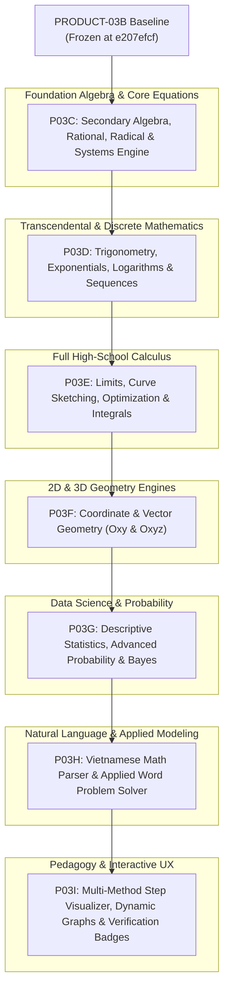

# MKE PRODUCT ROADMAP — REVISED THPT COVERAGE-FIRST STRATEGY
## Architectural Phasing & Multi-Milestone Execution Plan (P03C Through P03I)

**Author:** Antigravity (Implementation Engineer)  
**Standard:** GDPT 2018 Secondary Mathematics Curriculum  
**Primary Goal:** Comprehensive High-School Problem-Solving Coverage Across Grades 10–12  
**Version:** 1.0.0 (Design Proposal)  

---

## 1. Architectural Strategy & Phasing Principles

---

## 2. Milestone Details

---

### MILESTONE P03C: Secondary Algebra, Rational, Radical & System Engine

- **User Problem:** Secondary school students need to solve rational equations with domain restrictions, radical equations with squaring conditions, absolute value equations, and 3x3 linear systems without false extraneous roots.
- **Input Forms & Grammar Extensions:**
  - `\sqrt{f(x)} = g(x)`, `\sqrt{f(x)} = \sqrt{g(x)}`
  - Rational equations: $\frac{A(x)}{B(x)} + \frac{C(x)}{D(x)} = E(x)$
  - Absolute value: $|ax + b| = cx + d$
  - 3x3 Linear Systems: $a_1 x + b_1 y + c_1 z = d_1, \dots$
- **Output Data Contract:**
  - `symbolic_result`: Solution set string (e.g. `{-4}`)
  - `extraneous_roots`: List of rejected candidate roots with reason (e.g. `[{"root": "2", "reason": "Violates domain x != 2"}]`)
  - `domain_restrictions`: Exact point and interval restrictions (e.g. `["x != 2", "x != -1"]`)
  - `verification_status`: `VERIFIED_WITH_EVIDENCE`
- **Supported Scope:**
  - Univariate rational equations with degree $\le 2$ denominators.
  - Radical equations with quadratic/linear radicands.
  - Linear systems of 2 and 3 variables.
  - Quadratic inequalities and rational sign tables.
- **Explicit Exclusions:** Higher-degree radical equations ($\sqrt[3]{x}$), non-linear systems, trigonometric/log equations.
- **Algorithm & Engine Selection:**
  - MKE Native Rational Reducer + Polynomial Root Solver.
  - SymPy Gaussian Elimination for 3x3 Linear Systems.
  - Domain Screening Filter: Evaluates candidate roots directly against unsimplified AST denominators and radicand non-negativity conditions ($g(x) \ge 0$).
- **Independent Verification Oracle:**
  - Exact rational back-substitution into original AST: $LHS(r_i) - RHS(r_i) = 0$.
  - Domain validation: $Denom(r_i) \ne 0 \land Radicand(r_i) \ge 0$.
- **Benchmark Target:** 100 Algebra problems (50 rational with extraneous roots, 25 radical, 25 3x3 systems). Target pass rate: 100%.
- **Security & Resource Budgets:** Max AST depth: 30, worker timeout: 3.0s, memory: 128MB.
- **Acceptance Criteria:** 100% precision on extraneous root rejection; 0 false positive solutions on adversarial rational benchmark.
- **Rollback Plan:** Revert to `product/stable-p03b`.

---

### MILESTONE P03D: Trigonometry, Exponentials, Logarithms & Sequences

- **User Problem:** Grade 11 students need to simplify trigonometric expressions, solve periodic trigonometric equations on intervals, solve exponential/logarithmic equations/inequalities, and calculate terms/sums of arithmetic and geometric progressions.
- **Input Forms & Grammar Extensions:**
  - Trigonometric: `\sin(ax+b)`, `\cos`, `\tan`, `\cot`
  - Exponential & Logarithmic: `a^{f(x)} = b`, `\log_a(f(x)) = \log_a(g(x))`, `\ln(x)`
  - Sequence queries: `AP(u_1=3, d=2, find=u_10)`, `GP(u_1=2, q=3, sum=S_5)`
- **Output Data Contract:**
  - `symbolic_result`: Solution set (periodic family $x = \alpha + k2\pi$ or bounded interval set)
  - `sequence_summary`: `{ "u_n": "2*n + 1", "S_n": "n*(n+2)", "is_increasing": true }`
- **Supported Scope:**
  - Trigonometric equations: basic, quadratic in single trig function, $a\sin x + b\cos x = c$.
  - Exponential/Logarithmic equations and inequalities with base change and domain tracking ($f(x) > 0$).
  - Arithmetic and Geometric progression solvers (general term, sum, infinite sum).
- **Explicit Exclusions:** Transcendental equations without closed-form analytic solutions; non-elementary special functions.
- **Algorithm & Engine Selection:**
  - SymPy Trigonometric/Logarithmic solver wrapped with custom secondary-school periodic set formatter.
  - Native Exact Rational Sequence Engine for AP/GP.
- **Independent Verification Oracle:**
  - Numerical interval test points for inequalities.
  - Exact symbolic substitution for log/trig roots.
- **Benchmark Target:** 100 Transcendental & Sequence problems. Target pass rate: $\ge 98\%$.
- **Security & Resource Budgets:** Max trigonometric expansion depth: 10, worker timeout: 4.0s.

---

### MILESTONE P03E: Functions, Limits & Complete High-School Calculus

- **User Problem:** Grade 11–12 students need to evaluate limits (including $[0/0]$ and $[\infty/\infty]$ indeterminate forms), analyze function monotonicity, find local/global extrema, compute vertical/horizontal/slant asymptotes, and calculate definite integrals, areas between curves, and volumes of revolution.
- **Input Forms & Grammar Extensions:**
  - `\lim_{x \to a} f(x)`, `\lim_{x \to a^+} f(x)`, `\lim_{x \to \infty} f(x)`
  - `EXTREMA(f(x), [a, b])`, `ASYMPTOTES(f(x))`
  - `AREA_BETWEEN(f(x), g(x), a, b)`, `VOLUME_REVOLUTION(f(x), a, b)`
- **Output Data Contract:**
  - `asymptotes`: `{ "vertical": ["x = 1"], "horizontal": ["y = 2"], "slant": ["y = x + 3"] }`
  - `extrema`: `{ "local_max": [{"x": 1, "y": 4}], "local_min": [{"x": 3, "y": 0}], "global_max": 4, "global_min": 0 }`
  - `integral_result`: `{ "antiderivative": "F(x)", "definite_value": "16/3", "latex": "\\frac{16}{3}" }`
- **Supported Scope:**
  - Polynomial, rational, and basic radical/trig/exp/log functions.
  - Limits of sequences and functions with L'Hôpital and algebraic factoring.
  - Complete curve analysis (intervals of increase/decrease, critical points, asymptotes).
  - Single-variable integration by parts and substitution.
- **Explicit Exclusions:** Multi-variable calculus, differential equations (beyond simple $y' = ky$).
- **Algorithm & Engine Selection:**
  - Dual Engine: SymPy Calculus Worker + Native Derivative/Asymptote Analyzer.
  - Multi-root intersection finder for Area Between Curves.
- **Independent Verification Oracle:**
  - Derivative check: $\frac{d}{dx} \text{Antiderivative} \equiv \text{Integrand}$.
  - Numerical quadrature verification for definite integrals ($|I_{sym} - I_{num}| < 10^{-6}$).
- **Benchmark Target:** 150 Calculus & Curve Sketching problems. Target pass rate: $\ge 98\%$.

---

### MILESTONE P03F: Coordinate & Vector Geometry (2D Oxy & 3D Oxyz)

- **User Problem:** High school students need to write equations of lines, planes, circles, spheres, and conics; compute angles, distances, projections, and geometric intersections in 2D and 3D.
- **Input Forms & Grammar Extensions:**
  - `PLANE(point=(1,2,3), normal=(2,-1,1))`
  - `LINE_3D(point=(0,1,2), direction=(1,1,-1))`
  - `SPHERE(center=(1,1,1), radius=3)`
  - `DISTANCE(point=(1,0,2), plane="2x - y + 2z - 1 = 0")`
  - `ANGLE(line1="...", plane1="...")`
- **Output Data Contract:**
  - `geometric_entity`: `{ "type": "PLANE", "equation": "2*x - y + z - 3 = 0", "normal": [2, -1, 1] }`
  - `metric_result`: `{ "distance": "7/3", "angle_rad": 0.7853, "angle_deg": "45^\\circ" }`
- **Supported Scope:**
  - 2D: Lines, Circles, Conics (Ellipse, Hyperbola, Parabola).
  - 3D: Vectors, Dot/Cross Product, Lines, Planes, Spheres, Distance & Angle metrics, Intersections.
- **Explicit Exclusions:** Non-Euclidean geometry, general quadric surfaces beyond spheres and conics.
- **Algorithm & Engine Selection:**
  - Native Exact Vector & Matrix Geometry Engine (determinants, cross products, dot products).
- **Independent Verification Oracle:**
  - Invariant cross-checking: Vector perpendicularity $\vec{n} \cdot \vec{u} = 0$, Point incidence substitution $A(x_0, y_0, z_0) \in (\alpha)$.
- **Benchmark Target:** 120 Geometry problems (50 in 2D, 70 in 3D). Target pass rate: 100%.

---

### MILESTONE P03G: Statistics, Probability & Combinatorial Modeling

- **User Problem:** Students need to compute descriptive statistics for ungrouped and grouped data tables, evaluate permutations/combinations, and compute conditional probabilities using tree diagrams, total probability, and Bayes' formula.
- **Input Forms & Grammar Extensions:**
  - `GROUPED_DATA(intervals=[[0,10], [10,20], [20,30]], frequencies=[5, 12, 8])`
  - `COMBINATORICS(C(10, 3) * A(5, 2))`
  - `PROBABILITY(P(A)=0.3, P(B|A)=0.8, P(B|notA)=0.1, find=P(A|B))`
- **Output Data Contract:**
  - `statistics`: `{ "mean": 16.2, "median": 15.83, "quartiles": [10.5, 15.83, 21.25], "variance": 42.16, "std_dev": 6.49 }`
  - `probability`: `{ "P_target": "0.7742", "formula_used": "BAYES_THEOREM", "exact_fraction": "24/31" }`
- **Supported Scope:**
  - Ungrouped & grouped data tables.
  - Permutations, combinations, binomial theorem.
  - Classical probability, independent events, conditional probability, total probability, Bayes.
- **Explicit Exclusions:** Continuous probability density functions beyond standard normal tables; advanced inferential hypothesis testing ($t$-test, ANOVA).
- **Algorithm & Engine Selection:**
  - Native Exact Rational Statistics & Probability Engine.
- **Independent Verification Oracle:**
  - Exact fraction arithmetic; probability bound invariant checks ($0 \le P \le 1$, $\sum P(B_i) = 1$).
- **Benchmark Target:** 80 Statistics & Probability problems. Target pass rate: 100%.

---

### MILESTONE P03H: Vietnamese Math Natural-Language Parser & Word Problem Solver

- **User Problem:** Exam problems are frequently phrased as Vietnamese word problems (e.g. "Một người gửi 100 triệu vào ngân hàng...", "Cho hình chóp S.ABC có đáy là tam giác vuông...").
- **Input Forms:** Full Vietnamese sentence input and mixed text/math markdown.
- **Architecture:** Rule-based and pattern-directed mathematical entity extractor that translates Vietnamese problem descriptions into typed MKE AST requests without hallucinatory LLM computation.
- **Independent Verification Oracle:** Dual-pass check against formal symbolic specification.
- **Benchmark Target:** 100 Vietnamese word problems from official THPT exams. Target pass rate: $\ge 90\%$.

---

### MILESTONE P03I: Pedagogical Multi-Method Steps, Interactive Graphs & Verification Badges

- **User Problem:** Once full solving capabilities exist across all THPT topics, students and teachers need transparent pedagogical multi-method steps, interactive SVG/KaTeX visual graphs, and verifiable step badges in the canonical UI.
- **Scope:**
  - Multi-method selector (Factoring vs Formula vs Completing Square; Elimination vs Substitution).
  - Step-by-step equivalence proof badges (`VERIFIED_WITH_EVIDENCE`).
  - Interactive coordinate geometry visualizer and curve sketches.
- **Acceptance Criteria:** Full Selenium browser test suite with 100% pass rate on all interactive workflows.

---

## 3. Milestone Summary & Resource Allocation

| Milestone | Curriculum Focus | Primary Deliverables | Benchmark Target | Phasing Order |
| :--- | :--- | :--- | :---: | :---: |
| **P03C** | Algebra & Core Equations | Rational, Radical, Absolute Value, 3x3 Systems | 100 items | **Phase 1 (Immediate)** |
| **P03D** | Transcendental & Discrete | Trigonometry, Log/Exp, Sequences (AP/GP) | 100 items | **Phase 2** |
| **P03E** | High-School Calculus | Limits, Asymptotes, Extrema, Optimization, Integrals | 150 items | **Phase 3** |
| **P03F** | 2D & 3D Geometry | Oxy Conics, Oxyz Vectors, Lines, Planes, Spheres | 120 items | **Phase 4** |
| **P03G** | Statistics & Probability | Grouped Data, Permutations, Bayes Theorem | 80 items | **Phase 5** |
| **P03H** | Vietnamese NL Solver | Natural Language Word Problem Entity Extractor | 100 items | **Phase 6** |
| **P03I** | Pedagogy & UI Polish | Multi-Method Steps, Interactive Diagrams, Badges | 200 items | **Phase 7** |
| **Total** | **Full GDPT 2018 Coverage** | **Complete High-School Mathematics Engine** | **850+ items** | |
